

  

<h3 align="center">
Universidad Peruana de Ciencias Aplicadas
</h3>

<h3 align="center">
Ingeniería de Software  
  
Periodo: 202620
  
1ASI0657 - Fundamentos de Arquitectura de Software
  
NRC: 9199
  
Docente: Daniel Enrique Mori Yzaguirre
  
<strong>Informe de AV2</strong>
  
Startup: StayBits
  
Producto: GigMap
  
<strong>Integrantes</strong>
  
Acosta Elera, Abraam Bernabe (u202219199)
  
Collantes Carrillo, Diego Mateo (u202311823)
  
Lizarbe Alvarez, Ariana Nickole (u202311704) 
  
 

**Octubre, 2026**

</h3>

## Registro de Versiones del Informe

<table>
  <thead>
    <tr>
      <th>Versión</th>
      <th>Fecha</th>
      <th>Autor</th>
      <th>Descripción de modificación</th>
    </tr>
  </thead>
  <tbody>
    <tr>
      <td>TB1</td>
      <td>07/09/2026</td>
      <td>
        - Acosta Elera, Abraam Bernabe  
        - Collantes Carrillo, Diego Mateo  
        - Lizarbe Alvarez, Ariana Nickole  
      </td>
      <td>
     En esta entrega se avanzaron los siguientes puntos:  
  <b>Capítulo I: Introducción</b> 
  - 1.1. Startup Profile 
  - 1.1.1. Descripción de la Startup 
  - 1.1.2. Perfiles de integrantes del equipo 
  - 1.2. Solution Profile 
  - 1.2.1. Antecedentes y problemática 
  - 1.2.2. Lean UX Process 
  - 1.2.2.1. Lean UX Problem Statements 
  - 1.2.2.2. Lean UX Assumptions 
  - 1.2.2.3. Lean UX Hypothesis Statements 
  - 1.2.2.4. Lean UX Canvas 
  - 1.3. Segmentos objetivo  
  <b>Capítulo II: Requirements Elicitation & Analysis</b> 
  - 2.1. Competidores 
  - 2.1.1. Análisis competitivo 
  - 2.1.2. Estrategias y tácticas frente a competidores 
  - 2.2. Entrevistas 
  - 2.2.1. Diseño de entrevistas 
  - 2.2.2. Registro de entrevistas 
  - 2.2.3. Análisis de entrevistas 
  - 2.3. Needfinding 
  - 2.3.1. User Personas 
  - 2.3.2. User Task Matrix 
  - 2.3.3. User Journey Mapping 
  - 2.3.4. Empathy Mapping 
  - 2.3.5. As-is Scenario Mapping 
  - 2.4. Ubiquitous Language  
  <b>Capítulo III: Requirements Specification</b> 
  - 3.1. To-Be Scenario Mapping 
  - 3.2. User Stories 
  - 3.3. Product Backlog 
  - 3.4. Impact Mapping  
  <b>Capítulo IV: Product Architecture Design</b> 
  - 4.1. Desing Concepts, ViewPoints & ER Diagrams
  - 4.1.1. Principles Statements 
  - 4.1.2. Approaches Statements Architectural Styles & Patterns 
  - 4.1.2.1. Selected Architectural Styles & Patterns 
  - 4.1.3. Context Diagram 
  - 4.1.4. Approach driven ViewPoints Diagrams 
  - 4.1.5. Relational/Non Relational Database Diagram 
  - 4.1.6. Design Patterns 
  - 4.1.7. Tactics 
  - 4.2. Architectural Drivers 
  - 4.2.1. Design Purpose 
  - 4.2.2. Primary Functionality (Primary User Stories) 
  - 4.2.3. Quality Attribute Scenarios 
  - 4.2.4. Constraints 
  - 4.2.5. Architectural Concerns 
  - 4.3. ADD Iterations 
  - 4.3.1. Iteration 0: Initial Architecture 
  - 4.3.1.1. Architectural Design Backlog 1 
  - 4.3.1.2. Establish Iteration Goal by Selecting Drivers 
  - 4.3.1.3. Choose One or More Elements of the System to Refine 
  - 4.3.1.4. Choose One or More Design Concepts That Satisfy the Selected Drivers 
  - 4.3.1.5. Instantiate Architectural Elements, Allocate Responsibilities, and Define Interfaces 
  - 4.3.1.6. Sketch Views (C4 & UML) and Record Design Decisions 
  - 4.3.1.7. Analysis of Current Design and Review Iteration Goal (Kanban Board)  
    </tr>
  </tbody>
</table>

## Project Report Collaboration Insights

URL de repositorio del reporte del proyecto: `https://github.com/fundamentos202620/report`

**TB1 (07/09/2026):**

  

## **Contenido**

- [STUDENT OUTCOME](#student-outcome)
- [CAPÍTULO I: Introducción](#capítulo-i-introducción)
  - [1.1. Startup Profile](#11-startup-profile)
    - [1.1.1. Descripción de la Startup](#111-descripción-de-la-startup)
    - [1.1.2. Perfiles de integrantes del equipo](#112-perfiles-de-integrantes-del-equipo)
  - [1.2. Solution Profile](#12-solution-profile)
    - [1.2.1. Nombre del producto](#121-nombre-del-producto)
    - [1.2.2. Antecedentes y problemática](#122-antecedentes-y-problemática)
    - [1.2.3. Lean UX Process](#123-lean-ux-process)
      - [1.2.3.1. Lean UX Problem Statements](#1231-lean-ux-problem-statements)
      - [1.2.3.2. Lean UX Assumptions](#1232-lean-ux-assumptions)
      - [1.2.3.3. Lean UX Hypothesis Statements](#1233-lean-ux-hypothesis-statements)
      - [1.2.3.4. Lean UX Canvas](#1234-lean-ux-canvas)
  - [1.3. Segmentos objetivo](#13-segmentos-objetivo)
- [CAPÍTULO II: Requirements Elicitation \& Analysis](#capítulo-ii-requirements-elicitation--analysis)
  - [2.1. Competidores](#21-competidores)
    - [2.1.1. Análisis competitivo](#211-análisis-competitivo)
    - [2.1.2. Estrategias y tácticas frente a competidores](#212-estrategias-y-tácticas-frente-a-competidores)
  - [2.2. Entrevistas](#22-entrevistas)
    - [2.2.1. Diseño de entrevistas](#221-diseño-de-entrevistas)
    - [2.2.2. Registro de entrevistas](#222-registro-de-entrevistas)
    - [2.2.3. Análisis de entrevistas](#223-análisis-de-entrevistas)
  - [2.3. Needfinding](#23-needfinding)
    - [2.3.1. User Personas](#231-user-personas)
    - [2.3.2. User Task Matrix](#232-user-task-matrix)
    - [2.3.3. User Journey Mapping](#233-user-journey-mapping)
    - [2.3.4. Empathy Mapping](#234-empathy-mapping)
    - [2.3.5. As-is Scenario Mapping](#235-as-is-scenario-mapping)
  - [2.4. Ubiquitous Language](#24-ubiquitous-language)
- [CAPÍTULO III: Requirements Specification](#capítulo-iii-requirements-specification)
  - [3.1. To-Be Scenario Mapping](#31-to-be-scenario-mapping)
  - [3.2. User Stories](#32-user-stories)
  - [3.3. Impact Mapping](#33-impact-mapping)
  - [3.4. Product Backlog](#34-product-backlog)
- [Capítulo IV: Product Architecture Design](#capítulo-iv-product-architecture-design)
  - [4.1. Desing Concepts, ViewPoints & ER Diagrams](#41-desing-concepts-viewpoints--er-diagrams)
    - [4.1.1. Principles Statements](#411-principles-statements)
    - [4.1.2. Approaches Statements Architectural Styles & Patterns](#412-approaches-statements-architectural-styles--patterns)
    - [4.1.2.1. Selected Architectural Styles & Patterns](#4121-selected-architectural-styles--patterns)
    - [4.1.3. Context Diagram](#413-context-diagram)
    - [4.1.4. Approach driven ViewPoints Diagrams](#414-approach-driven-viewpoints-diagrams)
    - [4.1.5. Relational/Non Relational Database Diagram](#415-relationalnon-relational-database-diagram)
    - [4.1.6. Design Patterns](#416-design-patterns)
    - [4.1.7. Tactics](#417-tactics)
  - [4.2. Architectural Drivers](#42-architectural-drivers)
    - [4.2.1. Design Purpose](#421-design-purpose)
    - [4.2.2. Primary Functionality (Primary User Stories)](#422-primary-functionality-primary-user-stories)
    - [4.2.3. Quality Attribute Scenarios](#423-quality-attribute-scenarios)
    - [4.2.4. Constraints](#424-constraints)
    - [4.2.5. Architectural Concerns](#425-architectural-concerns)
  - [4.3. ADD Iterations](#43-add-iterations)
    - [4.3.1. Iteration 0: Initial Architecture](#431-iteration-0-initial-architecture)
      - [4.3.1.1. Architectural Design Backlog 1](#4311-architectural-design-backlog-1)
      - [4.3.1.2. Establish Iteration Goal by Selecting Drivers](#4312-establish-iteration-goal-by-selecting-drivers)
      - [4.3.1.3. Choose One or More Elements of the System to Refine](#4313-choose-one-or-more-elements-of-the-system-to-refine)
      - [4.3.1.4. Choose One or More Design Concepts That Satisfy the Selected Drivers](#4314-choose-one-or-more-design-concepts-that-satisfy-the-selected-drivers)
      - [4.3.1.5. Instantiate Architectural Elements, Allocate Responsibilities, and Define Interfaces](#4315-instantiate-architectural-elements-allocate-responsibilities-and-define-interfaces)
      - [4.3.1.6. Sketch Views (C4 & UML) and Record Design Decisions](#4316-sketch-views-c4--uml-and-record-design-decisions)
      - [4.3.1.7. Analysis of Current Design and Review Iteration Goal (Kanban Board)](#4317-analysis-of-current-design-and-review-iteration-goal-kanban-board)

## **Student Outcome**

ABET – EAC - Student Outcome 4:  
La capacidad de reconocer responsabilidades éticas y profesionales en situaciones de ingeniería y hacer juicios informados, considerando el impacto social, económico, cultural y tecnológico de GigMap.

<table border="1">
  <thead>
    <tr>
      <th>Criterio específico</th>
      <th>Acciones realizadas hasta la entrega parcial</th>
      <th>Conclusiones</th>
    </tr>
  </thead>
  <tbody>
    <tr>
      <td>4.c.1 Reconoce responsabilidad ética y profesional en situaciones de ingeniería de software</td>
      <td>
        <strong>Acosta Elera, Abraam Bernabe</strong> 
        TB1: Participó en la consolidación del análisis de requisitos, la revisión de historias de usuario y la organización del informe. TP1: Colaboró en la revisión de criterios de aceptación y en la integración de evidencias de verificación del producto, procurando que los requisitos fueran trazables y comprensibles.  
        <strong>Collantes Carrillo, Diego Mateo</strong> 
        TB1: Participó en el desarrollo del Capítulo IV y en la revisión de las historias de usuario, buscando que las decisiones arquitectónicas fueran claras y coherentes con las necesidades del producto. TP1: Colaboró en la revisión de la documentación técnica y en la consistencia entre requisitos, arquitectura y diseño.  
        <strong>Lizarbe Alvarez, Ariana Nickole</strong> 
        TB1: Participó en la mejora de las historias de usuario y en la revisión de la experiencia de los usuarios finales. TP1: Desarrolló escenarios BDD en Gherkin para apoyar la verificación de historias de usuario y promover criterios de aceptación claros.
      </td>
      <td>
        Hasta la entrega parcial, el equipo demostró responsabilidad profesional al organizar el trabajo, revisar los requisitos y relacionar las necesidades de fans y artistas con decisiones de diseño y verificación. La colaboración permitió mantener una base trazable para el desarrollo de GigMap.
      </td>
    </tr>
    <tr>
      <td>4.c.2 Emite juicios informados considerando el impacto de las soluciones de ingeniería de software en contextos globales, económicos, ambientales y sociales</td>
      <td>
        <strong>Acosta Elera, Abraam Bernabe</strong> 
        TB1: Analizó cómo GigMap puede mejorar el acceso a conciertos locales y la visibilidad de artistas emergentes. TP1: Participó en la revisión de las funcionalidades priorizadas considerando su valor para fans y artistas.  
        <strong>Collantes Carrillo, Diego Mateo</strong> 
        TB1: Evaluó el impacto social y cultural de centralizar el descubrimiento de música en vivo. TP1: Contribuyó a relacionar atributos como seguridad, rendimiento y disponibilidad con la experiencia de los usuarios.  
        <strong>Lizarbe Alvarez, Ariana Nickole</strong> 
        TB1: Aportó una perspectiva empática sobre las dificultades de fans y artistas para encontrar y difundir eventos. TP1: Analizó cómo las pruebas y criterios de aceptación ayudan a reducir errores que afectarían la confianza de los usuarios.
      </td>
      <td>
        El equipo emitió juicios informados al considerar que GigMap no solo debe funcionar técnicamente, sino también proteger los datos de ubicación, facilitar el acceso cultural y generar valor para artistas independientes y comunidades locales.
      </td>
    </tr>
  </tbody>
</table>

<!-- Legacy Student Outcome content retained below for version-history reference.

ABET – EAC - Student Outcome 4:  
La capacidad de reconocer responsabilidades éticas y profesionales en situaciones de ingeniería y hacer juicios informados, que deben considerar el impacto de las soluciones de ingeniería en contextos globales, económicos, ambientales y sociales.

<table border="1">
  <thead>
    <tr>
      <th>Criterio específico</th>
      <th>Acciones realizadas</th>
      <th>Conclusiones</th>
    </tr>
  </thead>
  <tbody>
    <tr>
      <td> 4.c.1 Reconoce responsabilidad ética y profesional en situaciones de ingeniería de software </td>
      <td>
        Bejarano Martinez, Alvaro Leandro   
        TB1:   Se encargó de organizar la estructura del capítulo 3, manteniendo un enfoque ordenado y coherente en el desarrollo del contenido. Además, promovió un ambiente de trabajo colaborativo, asegurando que cada integrante pueda aportar sus ideas y que estas se integren adecuadamente en la revisión de las historias de usuario.   
        TP1:   Desarrolló la sección de Continuous Delivery y las pruebas del sistema (Core System Tests) para las US21, US22, US23 y US24. Aseguró que el pipeline de entrega sea robusto y que las funcionalidades críticas del sistema estén validadas para garantizar un producto seguro y confiable para el usuario final.   
        TB2:   Desarrolló las secciones de Static Testing & Verification (Coding Standard & Code Conventions, Code Quality & Code Security, Reviews) y Continuous Monitoring (Tools and Practices, Monitoring Pipeline Components, Alerting Pipeline Components, Notification Pipeline Components). Implementó análisis estático de código para garantizar estándares de calidad y seguridad, y configuró pipelines de monitoreo, alertas y notificaciones para asegurar la estabilidad operativa de la plataforma.   
		TF:  
Desarrolló la historia de usuario US36, orientada a que los fans puedan seguir y dejar de seguir artistas dentro de GigMap, además de visualizar actualizaciones relacionadas con nuevos eventos, publicaciones y cambios de fechas. Asimismo, elaboró la tarea técnica TS-25, definiendo los endpoints necesarios para gestionar las operaciones de seguimiento y dejar de seguir artistas mediante el backend, incluyendo la actualización del contador de seguidores. Además, participó en el diseño de las entrevistas de validación To-Be para los segmentos de fans de la música y artistas emergentes, estableciendo preguntas orientadas a evaluar la comprensión, utilidad y facilidad de uso de las nuevas funcionalidades implementadas. Su trabajo evidenció responsabilidad ética y profesional al asegurar la trazabilidad entre las necesidades de los usuarios, la implementación técnica y la validación directa con los segmentos objetivo.   
        Collantes Carrillo, Diego Mateo   
        TB1:   Participó en el desarrollo del capítulo 4, aportando principalmente en la redacción del contenido para que sea claro, entendible y bien estructurado. Asimismo, colaboró en la revisión de las historias de usuario, buscando que estas comuniquen correctamente las necesidades del usuario.  
        TP1:   
        TB2:   Participó en el diseño de experimentos (Experiment Design) contribuyendo en la definición de hipótesis, métricas de dominio, medidas, condiciones, cálculos de escala, selección de métodos, analítica de datos y plan de tracking. Además, desarrolló las secciones de Experimentation (To-Be User Stories, To-Be Product Backlog), asegurando que las historias de usuario y el backlog reflejen un enfoque basado en evidencia y responsabilidad profesional.   
		TF:    
        Lizarbe Alvarez, Ariana Nickole   
        TB1:  Contribuyó en el desarrollo del capítulo 3, aplicando pensamiento crítico y habilidades de trabajo en equipo. Participó en la mejora de las historias de usuario, procurando que estén bien definidas y considerando siempre la experiencia del usuario final.  
        TP1:   Desarrolló la sección de Core Behavior-Driven Development, utilizando Gherkin para analizar distintas historias de usuario   
        TB2:   Participó en el diseño de experimentos (Experiment Design), contribuyendo en la definición de hipótesis, métricas de dominio, medidas, condiciones y la selección de métodos de experimentación. Su trabajo garantizó que el diseño experimental sea riguroso y éticamente responsable, considerando el impacto en los usuarios finales y artistas emergentes.   
		TF:  
Desarrolló las secciones 8.2. Experiment Design correspondientes a 8.2.1. Hypotheses, 8.2.3. Measures y 8.2.4. Conditions, definiendo de manera clara y estructurada las hipótesis a validar, las medidas necesarias para evaluar los resultados y las condiciones bajo las cuales se ejecutarían los experimentos. Su trabajo evidenció responsabilidad ética y profesional al garantizar que el diseño experimental fuera riguroso, transparente y estuviera correctamente fundamentado antes de su aplicación con los usuarios.   
        Ortiz Cardenas, Johanna Antuanete   
        TB1:  
        Desarrolló el capítulo 4 con un enfoque en la calidad y cumplimiento de los entregables. Además, investigó información relevante y aportó ideas que ayudaron a fortalecer las historias de usuario y el contenido del informe.  
        TP1: Desarrolló la sección de Continuous Deployment, documentando las herramientas, prácticas y componentes del pipeline de despliegue a producción. Además, se aseguró de seguir buenas prácticas que garanticen la estabilidad del producto.  
        TB2:   Desarrolló conjuntamente la sección de Experiment Planning, incluyendo el As-Is Summary, Raw Material (assumptions, knowledge gaps, ideas, claims), Experiment-Ready Questions, Question Backlog y Experiment Cards. Su trabajo reflejó una planificación cuidadosa y responsable del proceso experimental, asegurando que los experimentos respondan a necesidades auténticas del ecosistema musical.   
		TF:  Apoyó en el desarrollo de las Experiment Cards, así como en completar y consolidar la documentación correspondiente a la sección de Experiment Planning, asegurando que la información esté completa, ordenada y sea consistente con el resto del capítulo.   
        Sarmiento Medina, Loreley   
        TB1:   Se encargó del desarrollo del capítulo 1, asegurando una base sólida y bien estructurada para el proyecto. También realizó una revisión general del informe y de las historias de usuario, verificando la coherencia, organización y alineación con los objetivos planteados.  
        TP1:   Desarrolló las pruebas unitarias de las entidades principales (Core Entities Unit Tests) y las pruebas del sistema para las historias de usuario US01, US02, US04 y US05. Su trabajo garantizó que la lógica de negocio base sea sólida y que los procesos de registro y búsqueda funcionen correctamente bajo estándares de calidad profesional.   
        TB2:   Desarrolló conjuntamente la sección de Experiment Planning, cubriendo el As-Is Summary, Raw Material, Experiment-Ready Questions, Question Backlog y Experiment Cards. Demostró responsabilidad profesional al estructurar el plan experimental de manera organizada y alineada con los objetivos del producto y las necesidades de los usuarios.   
		TF:  
Se encargó de la elaboración y consolidación de la sección Experiment Aftermath & Analysis, incluyendo el análisis e interpretación de los resultados obtenidos mediante el formulario de validación aplicado a fans de la música y artistas emergentes. Organizó las evidencias estadísticas, interpretó los resultados de cada funcionalidad y desarrolló el Re-scored and Re-prioritized Question Backlog. Su trabajo evidenció responsabilidad ética y profesional al presentar los resultados de manera transparente, reconocer las limitaciones de la muestra y evitar afirmar como comprobados aquellos incrementos que todavía requieren datos longitudinales de analítica.   
        Zegarra López, Renato Sebastián Rubber   
        TB1:   Desarrolló el capítulo 2 aplicando sus habilidades de análisis y creatividad, aportando ideas que enriquecieron la propuesta. Asimismo, participó en la revisión de las historias de usuario, mejorando su claridad y consistencia.  
        TP1:  Aplique informacion de pruebas automatizadas con herramientas como JUnit, Mockito y Selenium para asegurar la calidad y correcto funcionamiento del software, demostrando responsabilidad profesional y compromiso con buenas prácticas de desarrollo. 
        TB2:   Participó en el diseño de experimentos (Experiment Design), contribuyendo a la definición de hipótesis, métricas de dominio, medidas, condiciones, cálculos de escala, selección de métodos, analítica de datos y plan de tracking web y móvil. Su trabajo aseguró un enfoque experimental riguroso basado en evidencia y responsabilidad profesional.  
		TF:   Durante el desarrollo del Shareback Session Artifacts: Learning Workflow, participé de manera responsable compartiendo los hallazgos obtenidos, escuchando la retroalimentación de mis compañeros y respetando las opiniones del equipo. Esto permitió mejorar los artefactos del proyecto y asegurar que las decisiones tomadas fueran éticas, colaborativas y orientadas a las necesidades de los usuarios. 
      </td>
      <td> TB1: A lo largo del desarrollo del trabajo, el equipo demostró una adecuada comprensión de sus responsabilidades éticas y profesionales, reflejada en la forma en que organizaron sus tareas y colaboraron entre sí. Cada integrante asumió su rol con compromiso, asegurando la calidad del contenido y el cumplimiento de los objetivos establecidos. Además, se priorizó la comunicación y el respeto por las ideas de todos, lo que permitió integrar diferentes aportes de manera ordenada. Esto evidencia una práctica responsable dentro del proceso de desarrollo del proyecto.   
      TP1: Durante esta entrega, el equipo demostró responsabilidad ética y profesional al implementar prácticas rigurosas de verificación, validación y DevOps. La elaboración de pruebas unitarias (Entities), de integración, BDD y de sistema (US01-US24) refleja un compromiso con la integridad de los datos y la fiabilidad de las funciones core. Asimismo, la configuración de pipelines de CI/CD evidencia una práctica profesional orientada a proteger la experiencia del usuario y mantener la estabilidad del producto.  
      TB2: En esta entrega, el equipo reforzó su compromiso ético y profesional mediante la implementación de pruebas estáticas de código (análisis de estándares, calidad y seguridad) y la configuración de un sistema de monitoreo continuo con alertas y notificaciones, garantizando la estabilidad operativa de la plataforma. Asimismo, la planificación y diseño de experimentos (Experiment Planning, Experiment Design y Experimentation) se realizó con rigor metodológico, asegurando que las decisiones sobre el producto se basen en evidencia y consideren el impacto en los usuarios finales y artistas emergentes.  
		TF: Durante esta entrega, el equipo demostró responsabilidad ética y profesional al implementar el ciclo de vida experimental soportado por pipelines (Pipeline-supported, Experiment-Driven To-Be Software Platform Lifecycle), asegurando que el desarrollo de los Sprint Backlogs y la implementación de la landing page, la aplicación web, la aplicación móvil y el backend RESTful se realicen de manera ordenada, trazable y alineada con las buenas prácticas de ingeniería de software. Asimismo, la ejecución de entrevistas de validación (To-Be Validation Interviews) reflejó un compromiso con la obtención de retroalimentación honesta por parte de los usuarios reales, mientras que el análisis e interpretación de resultados, junto con la reprocesamiento del Question Backlog, evidenciaron rigurosidad en la toma de decisiones basada en evidencia. Finalmente, el equipo atendió de manera responsable las correcciones señaladas en la auditoría, incorporando las mejoras necesarias para garantizar la calidad y consistencia del informe.   
      </td>
    </tr>
    <tr>
      <td> 4.c.2 Emite juicios informados considerando el impacto de las soluciones de ingeniería de software en contextos globales, económicos, ambientales y sociales </td>
      <td>
        Bejarano Martinez, Alvaro Leandro   
        TB1:   Se aseguró de que las decisiones tomadas dentro del equipo sigan un enfoque organizado y responsable, considerando la importancia de mantener un trabajo estructurado que permita un desarrollo sostenible del proyecto.  
        TP1:   Evaluó el impacto de la Entrega Continua y las pruebas del sistema en la estabilidad operativa de la plataforma, asegurando que la automatización de procesos minimice fallos técnicos que podrían afectar negativamente la experiencia social de los usuarios.   
        TB2:   Evaluó el impacto del análisis estático de código y del monitoreo continuo en la estabilidad y seguridad de la plataforma. Implementó herramientas de análisis que garantizan que el código cumpla con estándares de calidad y seguridad, considerando cómo estas prácticas contribuyen a un entorno digital confiable para los usuarios y artistas emergentes.   
		TF:  
Evaluó el impacto de la funcionalidad de seguimiento de artistas en la conexión entre fans y músicos emergentes, considerando que esta característica permite a los usuarios mantenerse informados sobre nuevos eventos y publicaciones, mientras contribuye a mejorar la visibilidad de los artistas dentro de la plataforma. También analizó la necesidad de implementar endpoints de seguimiento y dejar de seguir de manera consistente, garantizando una experiencia confiable y una correcta actualización del número de seguidores. Asimismo, mediante el diseño de las entrevistas de validación To-Be, formuló preguntas que permitieron recoger evidencia sobre la utilidad real de las funcionalidades para fans y artistas. A partir de ello, contribuyó a tomar decisiones informadas sobre el valor social, cultural y tecnológico de GigMap dentro del ecosistema musical.   
        Collantes Carrillo, Diego Mateo   
        TB1:  Aportó a que el contenido del proyecto sea comprensible y accesible, considerando el impacto social de la solución en la forma en que las personas descubren y acceden a la música en vivo.  
        TP1:   
        TB2:   Emitió juicios informados al diseñar los experimentos (Experiment Design) y la fase de Experimentación, considerando cómo las hipótesis, métricas y condiciones definidas impactan en la toma de decisiones del producto. Las To-Be User Stories y el Product Backlog reflejan una comprensión del contexto social y económico de los usuarios y artistas emergentes.   
		TF:    
        Lizarbe Alvarez, Ariana Nickole   
        TB1:   Incorporó una perspectiva empática en el desarrollo del proyecto, analizando cómo la solución puede mejorar la experiencia del usuario y fortalecer la conexión entre los fans y la comunidad musical.  
        TP1:   Aportó para que el contenido del proyecto sea organizado y analítico, considerando plenamente las importancia de las pruebas funcionales en el código fuente   
        TB2:   Aportó una perspectiva analítica en el diseño experimental, evaluando cómo las hipótesis, métricas y condiciones seleccionadas impactan en la experiencia del usuario y en la efectividad de las soluciones propuestas, asegurando que el diseño de experimentos esté alineado con las necesidades reales del público objetivo.   
		TF:  
Emitió juicios informados al desarrollar las secciones de Hypotheses, Measures y Conditions dentro de Experiment Design, evaluando cómo cada hipótesis planteada y las medidas seleccionadas permitirían obtener evidencia confiable sobre el comportamiento real de los usuarios. Consideró el contexto y las condiciones bajo las cuales debían ejecutarse los experimentos, asegurando que las decisiones derivadas de los resultados reflejaran un impacto social y tecnológico real para los fans y artistas emergentes dentro del ecosistema musical.   
        Ortiz Cardenas, Johanna Antuanete   
        TB1: Investigó y consideró tendencias tecnológicas actuales, con el objetivo de asegurar que la solución propuesta sea viable y tenga un impacto positivo tanto en el entorno digital como en el ámbito cultural.  
        TP1: Investigó y seleccionó herramientas de despliegue continuo, con el objetivo de asegurar que la solución sea escalable y tenga un impacto positivo en la disponibilidad del servicio para los usuarios.   
        TB2:   Investigó y documentó el plan experimental (Experiment Planning), evaluando cómo las preguntas de investigación y las Experiment Cards impactan en la dirección del producto. Consideró el contexto social de los usuarios para asegurar que los experimentos respondan a necesidades auténticas del ecosistema musical.   
		TF:  Contribuyó en la revisión y complementación de las Experiment Cards, evaluando que las preguntas e hipótesis planteadas respondan a necesidades reales del ecosistema musical, y aseguró que la documentación final refleje adecuadamente el impacto esperado de los experimentos en los usuarios y artistas emergentes.   
        Sarmiento Medina, Loreley   
        TB1:   Analizó la problemática considerando su impacto en el contexto social y cultural, asegurando que la propuesta esté alineada con necesidades reales y aporte valor tanto a los usuarios como a los artistas.  
        TP1:   Analizó la importancia de las pruebas unitarias y de sistema iniciales para garantizar que el acceso a la plataforma (US01-US05) sea inclusivo y eficiente, permitiendo que artistas emergentes tengan una puerta de entrada confiable a la visibilidad digital.   
        TB2:   Analizó la problemática actual (As-Is Summary) e identificó los materiales base para la experimentación, evaluando cómo las preguntas experimentales y el backlog pueden guiar decisiones informadas que mejoren la experiencia de los usuarios y la visibilidad de los artistas emergentes en la plataforma.   
		  TF:  
Analizó los resultados de la validación considerando el impacto de GigMap en sus dos segmentos objetivo. Identificó que el mapa interactivo y las comunidades generan valor para los fans, mientras que los perfiles, la publicación de conciertos y las herramientas de visibilidad representan beneficios relevantes para los artistas emergentes. A partir de la evidencia recopilada, formuló juicios informados sobre las mejoras necesarias en la información de los conciertos, los perfiles artísticos y la creación de eventos asociados, contribuyendo a orientar las siguientes iteraciones de la plataforma desde una perspectiva social, cultural, económica y tecnológica.   
        Zegarra López, Renato Sebastián Rubber   
        TB1:  Evaluó la solución desde un enfoque analítico y creativo, considerando su impacto en la difusión de artistas emergentes y en la mejora de la experiencia de los usuarios dentro del ecosistema musical. 
        TP1:  Utilice pruebas automatizadas para garantizar un software más confiable y eficiente, reduciendo errores y mejorando la experiencia del usuario, lo que contribuye positivamente al impacto social y tecnológico de la aplicación. 
        TB2:   Evaluó el diseño experimental desde un enfoque analítico, considerando cómo las hipótesis, métricas, condiciones y el plan de tracking impactan en la validación de la solución y en la generación de valor para los usuarios y artistas dentro del ecosistema musical. 
    TF:   En el Shareback Session Artifacts: Learning Workflow, analicé junto con el equipo el impacto de GigMap en la conexión entre fans y artistas emergentes. La retroalimentación obtenida permitió tomar decisiones fundamentadas para mejorar el descubrimiento de conciertos, la visibilidad de los artistas y la experiencia de la comunidad musical. 
      </td>
      <td>El equipo logró considerar el impacto de la solución propuesta desde una perspectiva más amplia, tomando en cuenta aspectos sociales, culturales y tecnológicos. A través del análisis de la problemática, se evidenció una intención clara de generar valor tanto para los usuarios como para los artistas emergentes. Asimismo, se evaluó cómo la solución puede influir en la forma en que las personas acceden a la música en vivo y participan en la escena local. Esto demuestra una capacidad para tomar decisiones informadas, alineadas con el contexto y las necesidades reales del entorno.  
      TP1: El equipo emitió juicios informados al diseñar las suites de testing (unitarias y de sistema) y los pipelines de DevOps, considerando cómo la robustez técnica se traduce en confianza social. La validación rigurosa de las entidades y flujos de usuario asegura que la plataforma sea una herramienta sostenible económicamente para los artistas y socialmente valiosa para los fans. La automatización garantiza que los cambios lleguen al usuario de forma rápida, segura y con un uso eficiente de recursos tecnológicos.   
      TB2: El equipo emitió juicios informados al integrar prácticas de verificación estática y monitoreo continuo que protegen la experiencia del usuario y la sostenibilidad del servicio. Además, el enfoque de Experiment-Driven Development permitió evaluar críticamente el impacto de las soluciones propuestas, considerando aspectos sociales (conexión entre fans y artistas), económicos (visibilidad de artistas emergentes) y tecnológicos (eficiencia de la plataforma), demostrando una comprensión integral del contexto en el que opera GigMap.  
		TF: El equipo emitió juicios informados al analizar los resultados obtenidos durante el ciclo experimental, evaluando cómo la implementación de la plataforma (landing page, aplicación web, aplicación móvil y backend) impacta en la accesibilidad y experiencia de los usuarios y artistas emergentes dentro del ecosistema musical. Las entrevistas de validación y el análisis de resultados permitieron identificar hallazgos relevantes que fueron utilizados para reprocesar el Question Backlog, demostrando una toma de decisiones fundamentada en evidencia real. Asimismo, la sesión de Shareback y los artefactos de aprendizaje continuo reflejaron una capacidad de reflexión crítica sobre el proceso seguido, mientras que la elaboración del video introductorio para la etapa de pre-lanzamiento evidenció un juicio informado sobre la importancia de comunicar de manera clara y responsable las funcionalidades del producto a los futuros usuarios. Las correcciones derivadas de la auditoría fortalecieron la calidad global del entregable, reflejando un compromiso constante del equipo con la mejora continua y la responsabilidad profesional.   
      </td>
    </tr>
  </tbody>
</table>

-->

# CAPÍTULO I: Introducción

## 1.1. Startup Profile

### 1.1.1. Descripción de la Startup

StayBits es una startup creativa y tecnológica dedicada a transformar la manera en que las personas descubren, conectan y disfrutan la música en vivo, convencidos de que cada concierto, sin importar su escala, tiene la capacidad de despertar emociones únicas y generar lazos duraderos entre artistas y fans. Nuestro esfuerzo se centra en GigMap, una aplicación mobile interactiva que funciona como un puente entre los amantes de la música y los escenarios de su ciudad, ofreciendo un mapa dinámico con geolocalización donde los usuarios pueden explorar eventos en tiempo real, seguir a sus artistas preferidos, conocer las fechas de sus giras, registrar su asistencia en conciertos y compartir experiencias con otros fans. Además, proporcionamos herramientas de visibilidad y promoción para bandas emergentes, impulsando así el crecimiento de la escena musical independiente. En StayBits creemos en el poder de la comunidad, el descubrimiento espontáneo y la tecnología como motores para enriquecer la vida cultural, con la visión de crear una red global en la que cada presentación en vivo "desde un pequeño bar hasta un gran festival internacional" pueda ser encontrada, compartida y disfrutada al máximo, celebrando la div ersidad y el dinamismo del mundo musical. Con pasión, innovación y compromiso social, desde el corazón de StayBits impulsamos proyectos como GigMap, que reinventan la manera de vivir la música en directo y la acercan a quienes más la disfrutan.

Nuestra misión es conectar a las personas con la música en vivo mediante tecnología innovadora, facilitando el descubrimiento de eventos y fortaleciendo la relación entre artistas y fans. Y la vision que tenemos es ser la plataforma líder a nivel global en el descubrimiento de música en vivo, impulsando comunidades musicales y dando visibilidad a artistas de todo tipo de estilos.

### 1.1.2. Perfiles de integrantes del equipo

| Estudiante                                                                                                                | Descripción                                                                                                                                                                                                                                                                                                                                                                                                                                                                                                                                                                                                                                                                                                                                                                 |
| ------------------------------------------------------------------------------------------------------------------------- | --------------------------------------------------------------------------------------------------------------------------------------------------------------------------------------------------------------------------------------------------------------------------------------------------------------------------------------------------------------------------------------------------------------------------------------------------------------------------------------------------------------------------------------------------------------------------------------------------------------------------------------------------------------------------------------------------------------------------------------------------------------------------- |
| **Acosta Elera, Abraam Bernabe (u202219199)** | Soy estudiante de Ingeniería de Software en la Universidad Peruana de Ciencias Aplicadas. Me interesa el análisis, el diseño y la construcción de soluciones tecnológicas. En este proyecto aporto al trabajo colaborativo, la organización de los requisitos y la revisión de la calidad del informe, con compromiso y responsabilidad. |
|  **Collantes Carrillo, Diego Mateo (u202311823)** | Mi nombre es Diego Collantes. Tengo 20 años. Soy estudiante de octavo ciclo en la Universidad Peruana de Ciencias Aplicadas (UPC). Disfruto de leer, redactar y escuchar música en mi tiempo libre. Elegí esta carrera, ya que me interesó todo el proceso que hay detrás de cada aplicación o programa que usamos en nuestro día a día. Personalmente, espero ampliar mis conocimientos en este ámbito a lo largo de este curso. Además, estoy comprometido a contribuir en todo lo que sea posible con el equipo y a desempeñarme de manera adecuada.                                                                                                                                                                                                                     |
|  **Lizarbe Alvarez, Ariana Nickole (u202311704)**  | Mi nombre es Ariana Lizarbe, tengo 21 años y estoy cursando el octavo ciclo de la carrera de ingeniería de software en la Universidad Peruana de Ciencias Aplicadas. En mi tiempo libre fuera de la universidad, procuro mejorar mis habilidades blandas, como la empatía o inteligencia emocional. También, me esfuerzo en adquirir conocimientos que pueden ayudarme a desarrollarme como futura profesional, como distintos lenguajes de programación. A su vez, disfruto de escuchar música, podcasts, leer y ver series de televisión. Me comprometo a colaborar de manera activa y responsable en la creación de esta startup, aportando mis habilidades en pensamiento crítico, trabajo en equipo y adaptabilidad para alcanzar un trabajo de calidad sobresaliente. |

## 1.2. Solution Profile

### 1.2.1. Nombre del producto

GigMap es una solución pensada para facilitar la forma en que las personas descubren y viven la música en vivo. Permite encontrar conciertos cercanos en tiempo real a partir de los gustos e intereses de cada usuario, ofreciendo una experiencia más personalizada. Además, ayuda a seguir artistas, conocer sus próximos eventos y descubrir nuevas propuestas musicales. Así, convierte cada salida en una oportunidad para conectar con la escena local de manera más natural y dinámica.

### 1.2.2. Antecedentes y problemática

**What**:

Las personas experimentan dificultad para descubrir y encontrar conciertos en vivo, en especial aquellos no tan conocidos. Esto reduce la visibilidad de artistas emergentes, limita el acceso a experiencias musicales auténticas y debilita el impacto de la música local en la rutina de los fans.
Por ejemplo, Chartmetric (2023) reporta que el 99,9 % de los artistas añadidos a la aplicación ese año permanecieron en las categorías de "no descubiertos" o "en desarrollo", mientras solo el 0,1 % alcanzó niveles medios o de éxito, destacando la extrema saturación de talento y la falta de visibilidad

**When**:

Esta problemática surge especialmente justo cuando las personas están dispuestas a disfrutar de música en vivo pero no tienen acceso a información confiable en tiempo real. Este escenario ocurre con frecuencia durante salidas espontáneas en fin de semana, cuando los fans intentan seguir a artistas emergentes pero desconocen sus fechas locales, y también en el caso de turistas que desean explorar la vida cultural de nuevas ciudades sin herramientas adecuadas de difusión. La evidencia de comportamiento en la recopilacion de Google (2016) sobre búsquedas locales que indica que el 76% de quienes buscan “algo cerca” en su smartphone visitan un lugar relacionado en 24 horas, subrayando la relevancia de la inmediatez móvil.

**Where**:

Ocurre en diversos entornos: - En la rutina diaria de los usuarios - Al viajar o buscar actividades fuera de la zona habitual - En barrios con oferta musical pero escasa visibilidad digital - En ciudades donde los medios tradicionales no alcanzan al público digital o joven

La UNESCO (2022) advierte que los marcos e infraestructuras digitales son claves para ampliar el acceso y la participación cultural.

**Why**:

Porque asistir a conciertos en vivo genera valor cultural, emocional y social. No solo fortalece el sentido de comunidad y apoya directamente a los artistas, sino que también fomenta el descubrimiento de propuestas novedosas. La ausencia de una herramienta eficaz que conecte al público con eventos locales, especialmente independientes o espontáneos, impide el acceso a experiencias significativas y perjudica tanto a los músicos como al público.

**Who**:

Las personas más afectadas son: - Fans de música en vivo, tanto jóvenes como adultos, que buscan conciertos interesantes cerca de su ubicación pero carecen de información centralizada y actualizada. - Artistas emergentes y bandas independientes, que enfrentan enormes barreras para lograr visibilidad y difusión en un entorno competitivo.

La literatura sobre industrias culturales documenta desigualdades estructurales que dificultan a los independientes alcanzar audiencias sin mediación tecnológica (Hesmondhalgh, 2019).

**How**:

GigMap resuelve esta necesidad mediante una aplicación móvil que centraliza, personaliza y geolocaliza información sobre conciertos en tiempo real. La tecnología se apoya en: preferencias del usuario, ubicación, filtros de género, fechas y tipo de evento, alertas personalizadas, acceso a shows independientes, y funciones de recomendación y compartición social. Integra múltiples fuentes (publicaciones de artistas, registros de eventos, recomendaciones sociales) para ofrecer una experiencia fluida, espontánea y enriquecedora.

**How much:**

Si no se interviene: - Artistas pierden oportunidades para darse a conocer, generar ingresos y construir una base de seguidores. - La asistencia a conciertos disminuye, afectando la economía de espacios culturales, bares y promotores locales. - La vida cultural urbana se empobrece al invisibilizar propuestas valiosas. - Hay frustración entre los fans que desean experiencias auténticas y no encuentran cómo acceder a ellas.

En cambio, una solución como GigMap tiene un alto potencial de impacto positivo, ya que puede fomentar la cultura local, promover el descubrimiento musical y apoyar el ecosistema artístico independiente, directamente conectando al público con la música en vivo.

### 1.2.3. Lean UX Process

#### 1.2.3.1. Lean UX Problem Statement

Nuestros usuarios son personas apasionadas por la música en vivo: jóvenes, adultos que buscan experiencias auténticas y desean conectar con la escena musical de cada ciudad. Para ellos, encontrar conciertos cercanos en tiempo real y con información adaptada a sus intereses es una necesidad real, ya que muchos eventos, sobre todo los de menor escala, pasan desapercibidos por la falta de difusión. Esta brecha provoca que el público no logre descubrir a los artistas emergentes y que la escena independiente vea limitado su alcance y crecimiento. Sabremos que hemos respondido a este desafío cuando los usuarios utilicen GigMap para asistir a más conciertos, se incremente la visibilidad de músicos independientes y exista una participación activa en funciones como la geolocalización, las alertas personalizadas y la exploración de eventos.

Por este motivo, GigMap asume el compromiso de ofrecer una aplicación accesible, intuitiva y pensada en las necesidades reales del usuario, que sirva de puente directo entre los fans y la música en vivo. A través de herramientas inteligentes de descubrimiento, personalización y notificación, GigMap busca fortalecer el vínculo entre artistas y público, impulsando una cultura musical más diversa, cercana e inclusiva. El propósito es empoderar tanto a quienes crean como a quienes disfrutan la música, construyendo una comunidad que valore, comparta y mantenga viva la experiencia única de los conciertos en directo.

#### 1.2.3.2. Lean UX Assumptions

Creemos que los usuarios de GigMap son principalmente jóvenes y adultos que disfrutan de la música en vivo y valoran experiencias auténticas, tanto en su ciudad como durante sus viajes. Detectamos que estas personas enfrentan dificultades para descubrir conciertos de pequeña y mediana escala debido a la falta de canales de difusión efectivos, lo que genera una desconexión con los artistas emergentes y los hace perderse de eventos significativos. Consideramos que valorarán una aplicación móvil que les permita recibir notificaciones personalizadas, explorar conciertos cercanos en tiempo real y descubrir propuestas locales de manera sencilla y atractiva. Una solución efectiva debe ser intuitiva, basada en la geolocalización, personalizable según gustos musicales y capaz de visibilizar eventos independientes que no suelen aparecer en medios tradicionales.

**Assumptions Worksheet**

**¿Quién es el usuario?**

- Personas que disfrutan de la música en vivo y buscan nuevas experiencias culturales.
- Artistas emergentes que desean difundir su música y conectar con la comunidad.

**¿Dónde encaja nuestro producto en su trabajo o vida?**

- GigMap funcionará como una herramienta esencial en el día a día de los usuarios, ayudándoles a tomar decisiones rápidas y seguras sobre qué conciertos asistir.
- Puede utilizarse al planificar una salida, durante un viaje o incluso en recorridos cotidianos, sirviendo como guía personalizada para descubrir experiencias musicales alineadas con su estilo de vida.
- Será un acompañante constante en el teléfono móvil, facilitando la exploración urbana y el acceso a la escena musical local.

**¿Qué problemas tiene nuestro producto?**

- Falta de información confiable y en tiempo real sobre conciertos y eventos musicales independientes.
- Dificultad para acceder a opciones culturales en zonas desconocidas o con baja difusión digital.
- Escasez de soluciones intuitivas que integren mapas, recomendaciones y experiencias personalizadas en una sola aplicación móvil.

**¿Cuándo y cómo es nuestro producto utilizado?**

- GigMap se usa cuando los usuarios quieren salir y explorar opciones musicales cercanas.
- Puede utilizarse a lo largo del día, ya sea en el trabajo, en caminatas, paseos o al organizar actividades sociales.
- Disponible en dispositivos móviles, debe ser intuitiva y accesible incluso para usuarios con poca experiencia tecnológica.

**¿Qué características son importantes?**

- Mapas interactivos que muestren eventos musicales según los géneros favoritos del usuario.
- Información en tiempo real sobre afluencia, accesibilidad y cambios en la programación de los conciertos.
- Alertas personalizadas con recordatorios y novedades relevantes.
- Recomendaciones basadas en ubicación, historial de asistencia y gustos musicales.
- Perfiles diferenciados para fans y artistas, con beneficios adaptados a cada rol.

**Objetivos**

- Facilitar el descubrimiento de conciertos: ayudar a los usuarios a encontrar eventos cercanos de manera personalizada y rápida.
- Fortalecer la conexión entre fans y artistas: generar una red activa de interacción y apoyo mutuo.
- Transformar la movilidad urbana en una experiencia cultural: vincular la exploración de la ciudad con la música en vivo.
- Impulsar la participación en la escena local: promover la asistencia a eventos, el descubrimiento de nuevos talentos y la difusión de la música independiente.

**Alcances**

Asistencia personalizada en tiempo real

- Recomendaciones adaptadas a los intereses, ubicación y contexto del usuario.
- Actualizaciones en vivo sobre horarios, cambios y disponibilidad de entradas.
- Mapas interactivos que indiquen rutas claras hacia los eventos.

Accesibilidad y usabilidad

- Interfaz intuitiva, moderna y clara.
- Optimizada para smartphones y tablets, incluso en condiciones de conectividad limitada.

Conexión con comunidad y expertos

- Espacios para recomendaciones de expertos y experiencias compartidas por otros usuarios.
- Valoraciones y comentarios que fortalezcan la confianza y la participación activa.

**Escalabilidad**

- Adaptable a diferentes ciudades y contextos culturales.
- Capacidad para integrar datos locales y expandirse globalmente.

**Business Outcomes**

- Convertirse en la aplicación móvil de referencia para el descubrimiento de música en vivo.
- Generar datos anónimos útiles para políticas culturales y desarrollo urbano.
- Posicionarse como pionera en una categoría de aplicaciones de exploración cultural móvil.
- Crear un ecosistema en el que GigMap sea el punto de conexión entre usuarios, artistas y ciudades.

**User Outcomes**

- Acceso rápido a conciertos cercanos y alineados con los gustos del usuario.
- Mayor participación en eventos de artistas emergentes e independientes.
- Incremento en la visibilidad de músicos locales y diversidad cultural.
- Interacción directa entre fans y artistas a través de notificaciones y herramientas de descubrimiento.
- Reducción de la desconexión entre la oferta musical local y los posibles asistentes.

**Features**

- Mapas interactivos de conciertos filtrados por género, fecha y ubicación.
- Buscador inteligente con filtros avanzados y autocompletado.
- Sección para fans con beneficios exclusivos y recomendaciones personalizadas.
- Sección para artistas con herramientas de promoción y análisis de audiencia.
- Recomendaciones basadas en ubicación y gustos musicales previos.
- Experiencia de uso fluida, confiable y centrada en el usuario.

#### 1.2.3.3. Lean UX Hypothesis

Creemos que, si GigMap cuenta con una interfaz intuitiva y está optimizada para dispositivos móviles, incluso los usuarios con poca experiencia tecnológica podrán utilizar la aplicación con facilidad para orientarse y descubrir nuevos conciertos en su entorno.

Creemos que, si GigMap ofrece recomendaciones de conciertos basadas en los intereses y preferencias del usuario, así como en la proximidad de los eventos, se logrará una experiencia más personalizada y una exploración más fluida de la oferta musical disponible.

Creemos que, si GigMap integra una comunidad activa en la que los usuarios puedan compartir experiencias y reportar incidencias, se fomentará la confianza colectiva y la participación constante, reforzando el valor colaborativo de la aplicación.

Creemos que, si GigMap proporciona una aplicación móvil para que los artistas emergentes publiquen sus conciertos y conecten con un público local, aumentarán sus oportunidades de visibilización, crecimiento y fidelización de seguidores, fortaleciendo así su carrera artística a largo plazo.

Creemos que, si GigMap permite a los usuarios dejar reseñas y comentarios sobre conciertos y presentaciones, los artistas obtendrán retroalimentación constructiva que les permitirá mejorar su desempeño y consolidar su éxito en futuros eventos.

Creemos que, si GigMap destaca a artistas emergentes y facilita su participación en conciertos junto a músicos ya consolidados, se incrementarán sus posibilidades de ser reconocidos por profesionales de la industria, contribuyendo a su desarrollo y proyección en la escena musical.

#### 1.2.3.4. Lean UX Canvas

<table border="1">
  <tr>
    <th>Business Problem</th>
    <th>Solutions</th>
    <th>Business Outcomes</th>
  </tr>
  <tr>
    <td>
      Muchas personas que disfrutan de la música en vivo, así como artistas y cantantes, tanto independientes como formales, enfrentan dificultades para descubrir o difundir conciertos, especialmente los de pequeña o mediana escala. Esta desconexión limita el crecimiento de la escena musical local, reduce la visibilidad de los artistas y hace que los fans se pierdan experiencias auténticas.
    </td>
    <td>
      GigMap es una aplicación móvil que conecta a los amantes de la música con conciertos en tiempo real, permitiendo descubrir eventos cercanos mediante geolocalización, recibir notificaciones personalizadas según gustos musicales y acceder a la agenda de presentaciones de artistas locales. Además, ofrece una aplicación para que los músicos puedan publicar sus eventos y llegar a su público ideal.
    </td>
    <td>
      Esperamos que GigMap incremente la asistencia a conciertos, visibilice a más artistas independientes y fomente una comunidad musical más conectada. El éxito se medirá por el aumento de usuarios activos, la cantidad de eventos compartidos en la aplicación y el crecimiento en la interacción entre fans y artistas.
    </td>
  </tr>
  <tr>
    <th>Users</th>
    <th colspan="2">User Benefits</th>
  </tr>
  <tr>
    <td>
      Nuestros usuarios son personas apasionadas por la música en vivo, así como artistas y cantantes, tanto independientes como formales, que buscan descubrir o difundir eventos musicales con mayor facilidad. Comparten el objetivo de vivir experiencias musicales únicas o de hacer crecer su audiencia.
    </td>
    <td colspan="2">
      <ul>
        <li>Descubrimiento de conciertos cercanos en tiempo real gracias a la geolocalización.</li>
        <li>Notificaciones personalizadas según el estilo musical de interés.</li>
        <li>Para artistas: herramienta efectiva y accesible para promocionar sus presentaciones.</li>
        <li>Mayor conexión entre músicos y fans en escenarios culturales reales.</li>
      </ul>
    </td>
  </tr>
  <tr>
    <th>Hypotheses</th>
    <th>What’s the most important thing we need to learn first?</th>
    <th>What’s the least amount of work we need to do to learn the most important thing?</th>
  </tr>
  <tr>
    <td>
      Creemos que, al ofrecer una solución que conecta a personas y artistas mediante conciertos geolocalizados y notificaciones personalizadas, los usuarios asistirán a más eventos y los músicos lograrán una mayor difusión, fortaleciendo la comunidad musical local y mejorando la experiencia para ambas partes.
    </td>
    <td>
      Es fundamental validar si los fans consideran útil la aplicación para descubrir conciertos relevantes y si los artistas encuentran valioso el canal para promover sus presentaciones.
    </td>
    <td>
      Desarrollar un prototipo funcional que muestre conciertos cercanos según ubicación e intereses musicales, incluyendo una opción para que los artistas registren sus eventos. Luego, probarlo con un grupo de usuarios y músicos para obtener retroalimentación directa sobre la utilidad y la experiencia.
    </td>
  </tr>
</table>

## 1.3. Segmentos objetivo

**Fans de la música (jóvenes y adultos jóvenes):**

De acuerdo con Duche Pérez y Andía Gonzales (2019), el 54 % de los estudiantes universitarios asiste a conciertos “de vez en cuando” (1 o 2 veces al año). Este dato respalda el comportamiento cultural de este segmento universitario

- Edad estimada: 16 a 35 años

- Ubicación: Principalmente en zonas urbanas con oferta cultural como Lima.

- Características demográficas y de comportamiento:
  - Incorporan la música como parte del día a día.
  - Consumen contenido en aplicaciones como Spotify, Apple Music.
  - Siguen a artistas en redes sociales como Instagram, TikTok o X.
  - Comparten sus preferencias musicales con amigos y buscan experiencias reales significativas.

- Necesidades principales:
  - Descubrir conciertos cercanos en tiempo real.
  - Recibir notificaciones sobre giras o presentaciones.
  - Compartir su asistencia en redes.
  - Encontrar fácilmente eventos pequeños o independientes poco promocionados.

**Artistas emergentes y bandas independientes:**

Según Chartmetric (2024), de los artistas añadidos en 2023, el 99.9 % terminó el año en las categorías “Undiscovered” o “Developing”, mientras que solo una minúscula proporción logró avanzar a niveles más altos como Mid-Level o Mainstream

Crecimiento económico del sector independiente:
El mercado global de artistas independientes alcanzó un valor estimado de USD 160.6 mil millones en 2025, y se espera que crezca a USD 219.93 mil millones para 2030, expandiéndose a una tasa anual compuesta del 6.49%

- Edad estimada: 18 a 40 años
- Ubicación: Zonas urbanas o semiurbanas con escena cultural dinámica, como Lima.

- Características demográficas y de comportamiento:
  - Generalmente son músicos autogestionados o integrantes de bandas independientes que no cuentan con el respaldo de grandes disqueras.
  - Utilizan redes sociales y aplicaciones como principales canales de promoción, interacción con su audiencia y difusión de eventos.
  - Buscan herramientas tecnológicas que les ofrezcan mayor visibilidad, autonomía en la gestión de sus actividades y una comunicación directa con sus seguidores.

- Necesidades principales:
  - Promocionar conciertos y aumentar su visibilidad en el ámbito local.
  - Construir y fidelizar su audiencia.
  - Disponer de herramientas simples de geolocalización y organización de calendario.
  - Medir y analizar la asistencia a sus presentaciones para mejorar su estrategia.

# CAPÍTULO II: Requirements Elicitation & Analysis

## 2.1. Competidores

### 2.1.1. Análisis competitivo

<table border="2" style="text-align: center;">
	<tbody>
		<tr >
			<td colspan="6">Competitive Analysis Landscape</td>
		</tr>
		<tr>
			<td colspan="2">¿Por que llevar a cabo este análisis?</td>
			<td colspan="4">Es fundamental para comprender cómo otras plataformas y/o aplicaciones gestionan el descubrimiento de eventos musicales, qué aspectos valoran los usuarios y en qué áreas aún hay oportunidades sin atender, especialmente en lo referente a la promoción de conciertos de pequeña y mediana escala. Al analizar a la competencia con mayor detalle, podremos tomar decisiones más acertadas sobre las funcionalidades, el modelo de negocio, los diferenciadores clave y las estrategias de crecimiento.
            </td>
		</tr>
		<tr>
			<td colspan="2"></td>
			<td>GigMap</td>
			<td>Songkick</td>
			<td>Bandsintown</td>
			<td>Fever</td>
		</tr>
		<tr>
			<td rowspan="2">Perfil</td>
			<td>Overview</td>
			<td>Conecta a los fans con conciertos en vivo a través de un mapa interactivo con geolocalización. Se enfoca en promover la escena musical y fortalecer el vínculo entre artistas y su público local.</td>
			<td>Permite descubrir conciertos de artistas favoritos y recibir alertas personalizadas según ubicación. Se enfoca principalmente en giras de artistas reconocidos.</td>
			<td>Conecta a fans con conciertos mediante recomendaciones basadas en gustos musicales. Incluye herramientas para que artistas promuevan sus eventos.</td>
			<td>Ayuda a descubrir eventos culturales locales, incluyendo conciertos, teatro y experiencias únicas. Su enfoque va más allá de la música en vivo.</td>
		</tr>
		<tr>
			<td>Ventaja competitiva ¿Que valor ofrece a los clientes?</td>
			<td>Facilita el descubrimiento espontáneo de conciertos mediante un mapa interactivo y geolocalizado, acercando a los fans a la música local en tiempo real.</td>
			<td>Ofrece a los usuarios alertas personalizadas sobre conciertos de sus artistas favoritos, permitiendo planificar asistencias con anticipación de forma sencilla.</td>
			<td>Combina recomendaciones personalizadas con herramientas de promoción para artistas, creando un ecosistema donde fans y músicos pueden interactuar directamente.</td>
			<td>Proporciona una experiencia cultural completa con recomendaciones curadas de eventos locales, destacando experiencias exclusivas y originales para cada usuario.</td>
		</tr>
		<tr>
			<td rowspan="2">Perfil de Marketing</td>
			<td>Mercado objetivo</td>
			<td>Personas jóvenes y amantes de la música que buscan descubrir conciertos y conectar con la escena local</td>
			<td>Fans de la música que siguen a artistas reconocidos y desean recibir alertas sobre giras y conciertos en su ciudad o alrededores</td>
			<td>Amantes de la música en general, desde fans de artistas emergentes hasta grandes estrellas, así como músicos que buscan promocionar sus eventos</td>
			<td>Personas urbanas interesadas en actividades culturales y de ocio variadas, que buscan planes originales y experiencias únicas en su ciudad</td>
		</tr>
		<tr>
			<td>Estrategias de marketing</td>
			<td>Se enfoca en el marketing comunitario y uso de redes sociales para promover conciertos en tiempo real y crear comunidad entre fans y artistas.</td>
			<td>Se apoya en integraciones con plataformas de streaming (como Spotify) y recomendaciones personalizadas para captar usuarios. También colabora con artistas reconocidos para promocionar giras y vender entradas.</td>
			<td>Utiliza notificaciones personalizadas, campañas por email y presencia activa en redes sociales. Además, ofrece una plataforma para que los propios artistas promocionen sus shows directamente.</td>
			<td>Realiza campañas digitales segmentadas, usa influencers locales y curaduría de eventos exclusivos para atraer a usuarios. También colabora con marcas para promocionar experiencias temáticas.</td>
		</tr>
		<tr>
			<td rowspan="3">Perfil de Producto</td>
			<td>Productos & Servicios</td>
			<td><ul>
				<li>Productos: Mapa interactivo de conciertos, geolocalización en tiempo real, notificaciones de eventos</li>
				<li>Servicios: Promoción de conciertos, visibilidad para artistas emergentes, creación de comunidad entre fans y artistas</li>
			</ul></td>
			<td><ul>
				<li>Productos: Alertas personalizadas sobre conciertos y recomendaciones basadas en preferencias musicales</li>
				<li>Servicios: Seguimiento de artistas, integración con Spotify y Apple Music, planificación de asistencia a conciertos</li>
			</ul></td>
			<td><ul>
				<li>Productos: Calendario de conciertos, alertas personalizadas, herramientas de promoción para artistas</li>
				<li>Servicios: Promoción de eventos para artistas emergentes, recomendaciones personalizadas, venta de entradas</li>
			</ul></td>
			<td><ul>
				<li>Productos: Descubrimiento de eventos locales, compra de entradas, experiencias exclusivas</li>
				<li>Servicios: Curaduría de eventos, recomendaciones basadas en ubicación, experiencias personalizadas</li>
			</ul></td>
		</tr>
		<tr>
			<td>Precios &amp; Costos</td>
			<td><ul>
				<li>Precios: Gratuito para los usuarios. Las entradas para conciertos se venden a través de otras páginas</li>
				<li>Costos: No tiene costos de suscripción para los usuarios.</li>
			</ul></td>	
			<td><ul>
				<li>Precios: Gratuito para los usuarios. Las entradas para conciertos se venden a través de la aplicación, con un costo asociado por evento.</li>
				<li>Costos: No tiene costos de suscripción para los usuarios. Las ganancias provienen de la venta de entradas y comisiones de los conciertos.</li>
			</ul></td>
			<td><ul>
				<li>Precios: Gratuito para los usuarios. Los conciertos se promocionan a través de la plataforma, con la posibilidad de comprar entradas directamente.</li>
				<li>Costos: Gratuito para los usuarios, pero Bandsintown cobra una tarifa por la venta de entradas y ofrece servicios premium a artistas para mejorar la visibilidad de sus conciertos.</li>
			</ul></td>	
			<td><ul>
				<li>Precios: Gratuito para los usuarios, con una tarifa adicional al comprar entradas para ciertos eventos exclusivos o experiencias premium.</li>
				<li>Costos: Los costos de Fever están principalmente asociados a las entradas y experiencias exclusivas. La plataforma también obtiene ingresos mediante asociaciones con marcas y experiencias temáticas.</li>
			</ul></td>	
		</tr>
		<tr>
			<td>Canales de distribución (Web y/o Móvil)</td>
			<td><ul>
				<li>Web: Landing page donde los usuarios tienen información sobre GigMap</li>
				<li>Móvil: Aplicación móvil para iOS y Android con geolocalización, alertas de eventos y la opción de seguir a artistas locales</li>
			</ul></td>
			<td><ul>
				<li>Web: Disponible a través de su página web para descubrimiento de conciertos y compra de entradas</li>
				<li>Móvil: Aplicación disponible para iOS y Android, donde los usuarios pueden recibir alertas personalizadas y comprar entradas</li>
			</ul></td>
			<td><ul>
				<li>Web: Plataforma web que permite descubrir conciertos y gestionar las preferencias de artistas</li>
				<li>Móvil: Aplicación para iOS y Android, con notificaciones personalizadas y la posibilidad de seguir a artistas y comprar entradas</li>
			</ul></td>
			<td><ul>
				<li>Web: Plataforma web donde los usuarios pueden explorar eventos y comprar entradas</li>
				<li>Móvil: Aplicación para iOS y Android que permite descubrir eventos locales y comprar entradas, con recomendaciones personalizadas</li>
			</ul></td>
		</tr>
		<tr>
			<td rowspan="4">Análisis SWOT</td>
			<td>Fortalezas</td>
			<td>Su enfoque en conciertos emergentes y locales le permite conectar con un público único y auténtico. La geolocalización en tiempo real facilita el descubrimiento de eventos cercanos.</td>
			<td>Tiene una gran base de usuarios gracias a su integración con plataformas como Spotify y Apple Music. Su enfoque en conciertos grandes le permite ofrecer una experiencia robusta en la compra de entradas.</td>
			<td>Ofrece alertas personalizadas para conciertos y promueve tanto artistas emergentes como establecidos. Su enfoque en la personalización le otorga una experiencia única a sus usuarios.</td>
			<td>Ofrece una amplia variedad de eventos, no solo conciertos, lo que atrae a un público diverso. Su enfoque en experiencias exclusivas le da un valor añadido.</td>
		</tr>
		<tr>
			<td>Debilidades</td>
			<td>Al ser una aplicación en crecimiento, su base de usuarios y oferta de conciertos son limitados. Depende de alianzas con locales y artistas para ampliar su alcance.</td>
			<td>Tiene una gran base de usuarios gracias a su integración con plataformas como Spotify y Apple Music. Su enfoque en conciertos grandes le permite ofrecer una experiencia robusta en la compra de entradas.</td>
			<td>Su interfaz puede ser confusa para nuevos usuarios debido a la gran cantidad de notificaciones y conciertos. Las recomendaciones no siempre son precisas ni relevantes para todos los usuarios.</td>
			<td>Su enfoque generalista puede no satisfacer a usuarios que buscan solo conciertos en vivo. El contenido musical no es tan profundo o especializado como en otras plataformas.</td>
		</tr>
		<tr>
			<td>Oportunidades</td>
			<td>Expandir su enfoque en mercados locales y nichos de conciertos emergentes podría fortalecer su propuesta. Ofrecer servicios premium para artistas podría atraer más usuarios y aumentar sus ingresos.</td>
			<td>Puede expandir su alcance hacia mercados más locales, promoviendo artistas emergentes. Colaborar con festivales locales y locales sería una buena forma de ampliar su base de usuarios.</td>
			<td>Puede ampliar sus funciones para vender entradas directamente y ofrecer experiencias exclusivas. Colaboraciones con festivales y marcas musicales podrían atraer a más usuarios.</td>
			<td>Expandir su oferta de conciertos locales podría atraer a un público más específico de fans de música en vivo. Crear contenido exclusivo y eventos personalizados podría aumentar la lealtad de los usuarios.</td>
		</tr>
		<tr>
			<td>Amenazas</td>
			<td>Competir con plataformas y/o aplicaciones consolidadas como Songkick y Bandsintown puede ser desafiante. La saturación del mercado de aplicaciones de conciertos podría dificultar la atracción de usuarios.</td>
			<td>La competencia creciente de aplicaciones como Bandsintown y Fever puede restarle usuarios. La dependencia de aplicación de streaming lo hace vulnerable a cambios en ese ecosistema.</td>
			<td>La competencia de aplicaciones especializadas en conciertos como Songkick y Fever podría reducir su cuota de mercado. Cambios en los hábitos de consumo de entretenimiento digital podrían afectar su relevancia.</td>
			<td>La competencia de aplicaciones como Songkick y Bandsintown podría restarle relevancia en el ámbito musical. La saturación del mercado de eventos y actividades culturales podría hacerle perder protagonismo.</td>
		</tr>
	</tbody>
</table>

### 2.1.2. Estrategias y tácticas frente a competidores

**- Enfoque en el descubrimiento de música en vivo diversa**

Estrategia: Diferenciarse de otras aplicaciones generalistas facilitando el acceso a una variedad de eventos musicales sin importar su escala

Táctica: Mostrar de forma equitativa tanto conciertos masivos como presentaciones más íntimas o alternativas y resaltar aquellos eventos que se alineen con los intereses del usuario mediante algoritmos de recomendación y geolocalización

**- Uso de geolocalización en tiempo real**

Estrategia: Facilitar el descubrimiento espontáneo de conciertos cercanos al usuario

Táctica: Implementar un mapa interactivo que muestre eventos activos cerca del usuario con filtros por género, horario y tipo de artista

**- Alianzas con agentes locales**

Estrategia: Fortalecer la oferta de eventos mediante colaboraciones directas con organizadores independientes

Táctica: Crear programas de colaboración con venues, colectivos culturales y artistas emergentes que les permitan promocionar sus eventos fácilmente dentro de la aplicación

**- Comunidad y participación de los fans**

Estrategia: Construir una comunidad sólida y activa alrededor de la música en vivo

Táctica: Permitir a los usuarios hacer check-in en eventos, compartir fotos y reseñas, seguir a otros fans y artistas, y recibir recompensas por su participación activa

**- Funcionalidades exclusivas para fidelización**

Estrategia: Aumentar la retención y lealtad de los usuarios frente a otras aplicaciones.

Táctica: Ofrecer funciones como seguimiento de giras, alertas personalizadas, y programas de recompensas por asistir a eventos frecuentes o apoyar a artistas locales

## 2.2. Entrevistas

### 2.2.1. Diseño de entrevistas

**Segmento objetivo #1: Fans de la música (16 a 35 años)**

Perfil demográfico y musical:

- ¿Cuál es tu nombre, qué edad tienes y a qué te dedicas?
- ¿Dónde vives actualmente? ¿Sueles asistir a conciertos en tu ciudad?
- ¿Qué géneros musicales disfrutas más?
- ¿Con qué frecuencia vas a conciertos o festivales?

Comportamiento digital y uso de apps:

- ¿Qué aplicaciones usas para descubrir nuevos eventos o artistas?
- ¿Sueles seguir a tus artistas favoritos por redes sociales?
- ¿Usas apps como Spotify, Instagram u otras para encontrar conciertos?

Expectativas y opinión sobre Gigmap:

- ¿Has tenido problemas para enterarte de conciertos cercanos a ti?
- Si tuvieras una app que te muestre conciertos en vivo cerca, ¿la usarías? ¿por qué?
- ¿Qué funciones te parecerían útiles en una app como GigMap? (por ejemplo: mapa de eventos, notificaciones, filtros por género)
- ¿Qué mejorarías de las apps que ya usas para buscar eventos musicales?
- ¿Te interesaría compartir los eventos a los que vas con tus amigos desde la app?

**Segmento objetivo #2: Artistas emergentes y bandas independientes (18 a 40 años)**

Perfil artístico y canales de promoción:

- ¿Cuál es tu nombre artístico o el de tu banda?
- ¿Qué estilo musical haces y cuántos años llevas en la música?
- ¿Cómo sueles promocionar tus eventos o lanzamientos?
- ¿Qué redes sociales o aplicaciones usas para difundir tus conciertos? (Instagram, TikTok, Spotify, etc.)
- ¿Tienes algún equipo que te apoya en la promoción (manager, community manager) o lo gestionas de manera independiente?

Herramientas digitales y desafíos:

- ¿Te resulta fácil o difícil difundir tus eventos entre el público local?
- ¿Has utilizado apps o aplicaciones para anunciar tus conciertos? ¿Cuál fue tu experiencia?
- ¿Qué barreras encuentras al intentar llenar tus shows o llegar a nuevos oyentes?
- ¿Consideras que las aplicaciones actuales son suficientes para que un artista emergente se dé a conocer?

Opinión y expectativas sobre GigMap:

- ¿Qué te parecería contar con una app donde los usuarios vean tu evento en un mapa musical local?
- ¿Te interesaría que GigMap te permita crear un perfil artístico y gestionar tus fechas de conciertos?
- ¿Qué funcionalidades te parecerían más útiles como artista? (por ejemplo: análisis de asistentes, publicación de eventos, integración con redes)
- ¿Qué te gustaría poder personalizar en la app?
- ¿Cómo crees que GigMap podría ayudarte a crecer como artista?
- ¿Recomendarías una app como GigMap a otros artistas emergentes? ¿Por qué sí o por qué no?
- ¿Te gustaría poder crear una comunidad dentro de la app para interactuar con tus seguidores (ejemplo: compartir contenido exclusivo, enviar notificaciones)?

### 2.2.2. Registro de entrevistas

URL del vídeo de las Entrevistas de segmento objetivo #1 publicado en OneDrive: `https://upcedupe-my.sharepoint.com/:v:/g/personal/u202310358_upc_edu_pe/IQBW9wdnSZYNQYOjTGEedNlgARvD3iSL6EAlvV4QNFBtbIY?e=Wp7N6F`

### Segmento objetivo #1: Fans de la música

#### Entrevista #1

- **Nombre completo:** Reina Ruiz
- **Edad:** 20 años
- **Distrito:** Cercado de Lima
- **Inicio de entrevista:** 00:01:00

  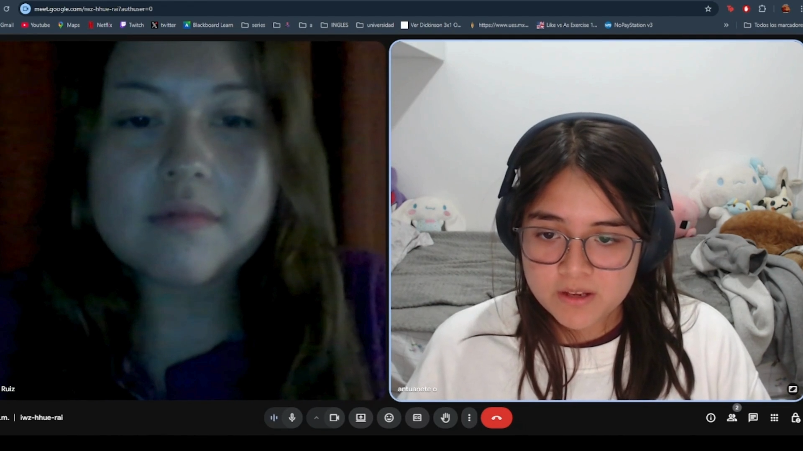

**Resumen:**

Reina Ruiz, de 20 años, es estudiante de la carrera de Hotelería y Turismo y reside actualmente en Cercado de Lima. Aunque no asiste frecuentemente a conciertos, se considera amante de la música y escucha principalmente pop en inglés y salsa.

Para enterarse de eventos musicales o lanzamientos, depende principalmente de las redes sociales de los artistas, aunque reconoce que en muchas ocasiones no ve la publicidad a tiempo o se entera demasiado tarde. Usa Instagram con mayor frecuencia para seguir a sus artistas, aunque también ha interactuado con Spotify.

En relación con la app GigMap, comentó que sí ha tenido dificultades para enterarse de conciertos cercanos, y que definitivamente usaría una aplicación como GigMap, ya que le permitiría descubrir eventos de sus artistas favoritos y organizar salidas con amigos.

Las funcionalidades que más le interesarían incluyen filtros por género musical, recibir información más personalizada y notificaciones automáticas sobre conciertos o eventos de interés. También, considera importante mejorar las apps existentes en cuanto a la efectividad de las notificaciones, ya que estas no siempre le llegan o no están bien configuradas. No utiliza muchas aplicaciones actualmente para buscar eventos, por lo que una solución como GigMap le parece muy útil y novedosa.

Finalmente, le gustaría poder compartir eventos con amigos desde la aplicación, algo que considera clave para socializar alrededor de la música. Esta función permitiría coordinar salidas y crear comunidad en torno a intereses musicales compartidos.

#### Entrevista #2

- **Nombre completo:** Rodrigo Chávez
- **Edad:** 19 años
- **Distrito:** San Martín de Porres
- **Inicio de entrevista:** 00:00:25

  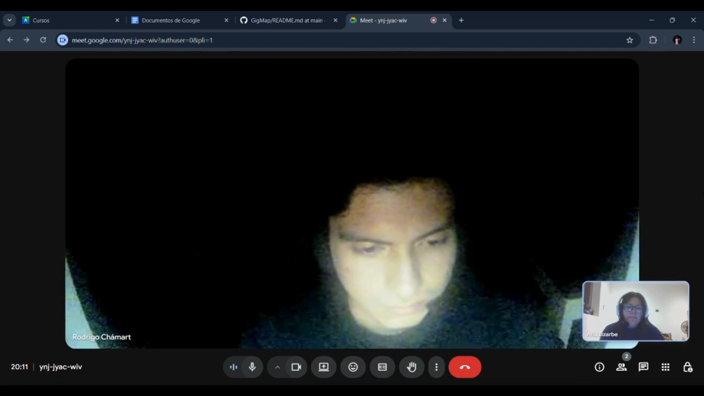

**Resumen:**

Rodrigo Chávez, de 19 años, es estudiante de Ingeniería de Sistemas y vive en San Martín de Porres. Tiene una vida activa como consumidor de música en vivo: asiste a conciertos todos los fines de semana o cada vez que se presenta un artista de su preferencia.

Su gusto musical es muy variado, abarcando desde rock, pop e indie hasta géneros tropicales como cumbia y salsa. Descubre nuevos artistas y eventos principalmente a través de Instagram y YouTube, y sigue activamente a sus artistas favoritos por redes sociales, sobre todo para enterarse de giras o lanzamientos.

Rodrigo ha tenido problemas anteriormente para enterarse de conciertos, como en el caso de Arctic Monkeys, a quienes no pudo ver porque no se enteró a tiempo del evento. Considera que una aplicación como GigMap sería muy útil, especialmente si puede mostrar conciertos cercanos en tiempo real y ayudarle a descubrir nuevos artistas según sus gustos personales.

Entre las funcionalidades que más le interesarían, se encuentran mapa de conciertos por ubicación, filtros por género musical, notificaciones sobre artistas de interés y recomendaciones personalizadas de artistas según gustos. También, sugiere mejorar el descubrimiento de artistas y la compra de entradas en las apps actuales, que le resultan limitadas o poco eficientes. Le gustaría que GigMap incluya una opción para compartir eventos con amigos y visualiza la app como una posible red social musical, en la que también pueda generar interacción con otros asistentes o fans.

#### Entrevista #3

- **Nombre completo:** Bianca Huertas
- **Edad:** 20 años
- **Distrito:** Ventanilla
- **Inicio de entrevista:** 00:00:12

  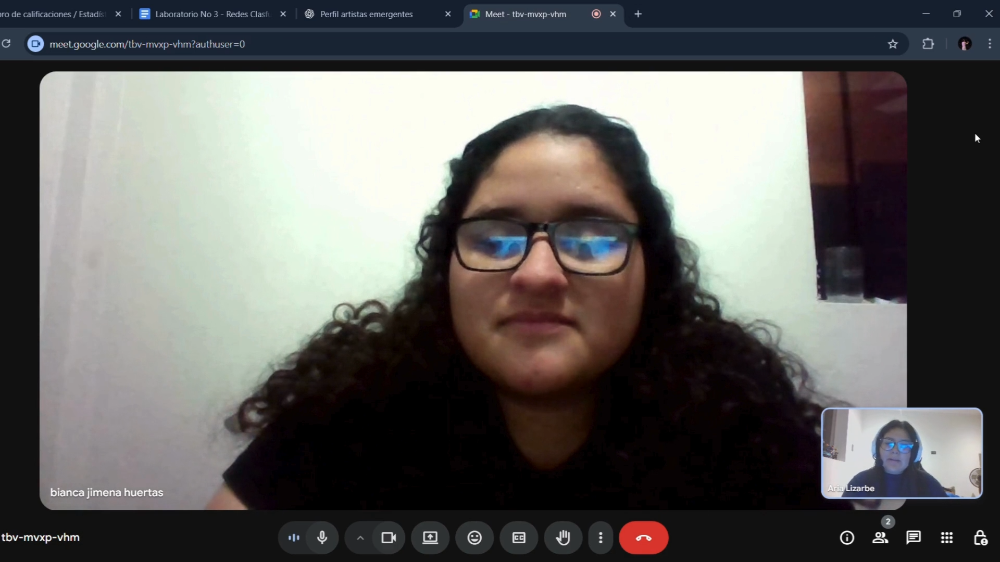

**Resumen:**

Bianca Huertas, de 20 años, es estudiante de Diseño de Interiores y vive en el distrito de Ventanilla, Callao. Es una usuaria muy activa en redes sociales, particularmente en TikTok e Instagram, donde sigue a sus artistas favoritos y se entera de nuevos eventos. Aunque no asiste a conciertos todas las semanas, menciona que va en promedio dos veces al mes, dependiendo de la cercanía y del tipo de evento.

Sus géneros musicales favoritos incluyen salsa, reguetón y K-pop, y muestra mucho entusiasmo por la experiencia de asistir a eventos musicales. Bianca admite que a veces no logra encontrar información clara o a tiempo sobre los conciertos que le interesan, lo cual considera una limitación importante en su experiencia.

Afirma que una aplicación como GigMap le parecería sumamente útil, ya que facilitaría el descubrimiento de eventos sin tener que buscarlos manualmente en diversas redes. Está especialmente interesada en funcionalidades como mapa de eventos cercanos, notificaciones de próximos conciertos, filtros por género musical y alertas sobre fechas próximas según ubicación. Además, valoraría mucho una función que le permita compartir eventos con sus amigos dentro de la misma app para poder asistir acompañada.

URL del vídeo de las Entrevistas de segmento objetivo #2 publicado en OneDrive: `https://upcedupe-my.sharepoint.com/:v:/g/personal/u202310358_upc_edu_pe/IQBvnjbC5qzIT5-5ywJQZEy-AeuNDp_LmMA3_PNbVtGuneo?e=gYmKpf`

### Segmento objetivo #2: Artistas emergentes y bandas independientes

#### Entrevista #1

- **Nombre completo:** Mathias Medina
- **Edad:** 20 años
- **Distrito:** La Molina
- **Inicio de entrevista:** 00:01:06

  

**Resumen:**

El entrevistado, Mathias Medina, es un joven artista de 20 años, residente en La Molina, Lima. Forma parte del dúo musical MYM y cuenta con aproximadamente cuatro años de trayectoria en la música.

Durante la conversación, Mathias comentó que utiliza principalmente redes sociales como Instagram, TikTok, estados de WhatsApp y Spotify para promocionar sus lanzamientos y eventos. Sin embargo, considera que estos medios tienen una limitación importante, ya que le permiten comunicarse sobre todo con personas que ya lo siguen, dificultando así el alcance hacia nuevos públicos.

Asimismo, mencionó que esta forma de difusión resulta insuficiente para crecer como artista emergente, ya que su visibilidad depende en gran medida de su red actual de seguidores. Esto hace que llegar a nuevas audiencias sea un proceso lento y complicado.

En cuanto a la propuesta de GigMap, Mathias mostró interés en la funcionalidad de comunidad dentro de la aplicación. Considera que la posibilidad de comunicarse directamente con sus seguidores en un espacio más personalizado sería un gran valor diferencial, ya que permitiría generar una conexión más cercana y auténtica con su público.

Finalmente, destacó que una herramienta como GigMap podría ayudar a superar las limitaciones actuales de las redes sociales, brindando nuevas formas de interacción y mayor alcance para artistas independientes como él.

#### Entrevista #2

- **Nombre completo:** Diego Zúñiga
- **Edad:** 20
- **Distrito:** Comas
- **Inicio de entrevista:** 00:00:10

  

**Resumen:**

Diego Zúñiga es un artista independiente de indie pop con influencias electrónicas que gestiona su carrera por su cuenta y promociona sus eventos principalmente en Instagram, TikTok y Spotify. Aunque estas plataformas le ayudan, considera que existe una gran dificultad para lograr visibilidad local y conectar con el público adecuado, ya que las herramientas actuales no están pensadas para artistas emergentes. Frente a esto, valora muy positivamente la idea de GigMap, ya que un mapa de eventos musicales permitiría descubrir conciertos cercanos, mejorar su exposición y facilitar la conexión con nuevas audiencias; además, destaca como clave contar con perfiles personalizables, notificaciones a usuarios cercanos, estadísticas y herramientas de interacción con seguidores, viendo la app como una solución útil para crecer sin grandes presupuestos.

#### Entrevista #3

- **Nombre completo:** Diego Andres Santos Espinoza
- **Edad:** 27 años
- **Distrito:** San Miguel
- **Inicio de entrevista:** 00:00:08

	 

**Resumen:**

En la entrevista, Diego Santos, conocido como Le Saint, artista independiente peruano con 10 años de trayectoria, comparte los desafíos que enfrenta para promocionar su propuesta musical de nicho, que fusiona reggae y reggaetón con instrumentos peruanos y requiere un público con gusto exquisito. Se muestra insatisfecho con las plataformas actuales, ya que no brindan las herramientas necesarias para un crecimiento real de artistas emergentes. Por ello, expresa gran entusiasmo por GigMap, a la que considera una solución disruptiva al integrar un mapa musical local. Propone funcionalidades como la gestión eficiente de perfiles y fechas de conciertos, análisis estratégicos de datos sobre satisfacción del público y retorno de inversión para elegir ciudades viables, y una experiencia personalizada que permita a los seguidores pedir comida y servicios directamente desde la app durante los shows. Finalmente, Le Saint afirma que recomendaría la plataforma a otros músicos y valora la creación de una comunidad para interactuar de forma cercana con sus seguidores.\*

### 2.2.3. Análisis de entrevistas

A continuación, se presenta el análisis cualitativo y cuantitativo de las entrevistas realizadas, agrupadas por segmento objetivo. Este análisis identifica las características más representativas de cada grupo, con el fin de sustentar la construcción de arquetipos de usuario. Las observaciones aquí descritas se fundamentan directamente en los resúmenes de las entrevistas aplicadas a un total de seis personas, distribuidas en dos segmentos clave.

### Segmento objetivo #1: Fans de la música

Este grupo está conformado por estudiantes universitarios entre los 19 y 20 años, residentes en distintos distritos de Lima Metropolitana. Son consumidores activos de música, aunque con distinta frecuencia de asistencia a conciertos. Representan el público objetivo final de la aplicación propuesta (GigMap).

#### Entrevistas incluidas

- Entrevista #1: Reina Ruiz (20 años, Cercado de Lima)
- Entrevista #2: Rodrigo Chávez (19 años, San Martín de Porres)
- Entrevista #3: Bianca Huertas (20 años, Ventanilla)

#### Características Objetivas

| Variable                                   | Valor común identificado                 | Frecuencia | Porcentaje (%) |
| ------------------------------------------ | ---------------------------------------- | ---------- | -------------- |
| **Edad**                                   | 19-20 años                               | 3/3        | 100%           |
| **Ocupación**                              | Estudiantes universitarios               | 3/3        | 100%           |
| **Distritos de residencia**                | Lima Metropolitana (zona norte y centro) | 3/3        | 100%           |
| **Frecuencia de asistencia a conciertos**  | Esporádica (1–2 veces al mes o menos)    | 2/3        | 66.7%          |
| **Uso de redes para enterarse de eventos** | Sí (Instagram, TikTok, YouTube, Spotify) | 3/3        | 100%           |
| **Dificultades para enterarse de eventos** | Sí                                       | 3/3        | 100%           |
| **Disposición a usar una app como GigMap** | Sí                                       | 3/3        | 100%           |

#### Características Subjetivas

**Motivaciones comunes:**

- Desean mejorar la experiencia de búsqueda de eventos
- Buscan socializar a través de la música (coordinación con amigos)
- Muestran interés por descubrir artistas nuevos

**Frustraciones frecuentes:**

- No reciben notificaciones a tiempo o de manera relevante
- La información está dispersa entre varias aplicaciones
- Poca personalización en las apps actuales de eventos

**Preferencias destacadas:**

- Mapa interactivo de conciertos por ubicación
- Filtros por género musical
- Notificaciones automáticas personalizadas
- Compartir eventos con amigos desde la app
- Integración con redes sociales y aplicaciones de música

#### Implicancias para el diseño

Este grupo representa un público digitalmente activo, con expectativas altas respecto a la experiencia de usuario. El hallazgo más relevante es la necesidad de centralizar y personalizar la información sobre conciertos, así como fomentar la interacción social entre asistentes. Las funcionalidades sugeridas están alineadas con una interfaz amigable, dinámica y conectada a las redes sociales que ya utilizan.

### Segmento objetivo #2: Artistas emergentes y bandas independientes

Está compuesto por jóvenes músicos independientes que gestionan su carrera de forma autónoma. Son creadores de contenido musical con experiencia en presentaciones en vivo, difusión en redes sociales y distribución digital. Constituyen el segundo público clave para GigMap, como usuarios generadores de eventos.

#### Entrevistas incluidas

- Entrevista #1: Mathias Medina (20 años, La Molina)
- Entrevista #2: Diego Zúñiga (20 años, Comas)
- Entrevista #3: Diego Santos (27 años, San Miguel)

#### Características Objetivas

| Variable                                                    | Valor común identificado               | Frecuencia | Porcentaje (%) |
| ----------------------------------------------------------- | -------------------------------------- | ---------- | -------------- |
| **Edad**                                                    | 19-27 años                             | 3/3        | 100%           |
| **Género musical principal**                                | Indie rock, pop alternativo, indie pop | 3/3        | 100%           |
| **Gestión independiente de eventos**                        | Sí                                     | 3/3        | 100%           |
| **Uso de redes para difusión**                              | Instagram, TikTok, Spotify             | 3/3        | 100%           |
| **Ha enfrentado dificultades de visibilidad**               | Sí                                     | 3/3        | 100%           |
| **Ha usado aplicaciones como Eventbrite o Facebook Events** | Sí                                     | 2/3        | 66.7%          |
| **Interés en usar una app como GigMap**                     | Sí                                     | 3/3        | 100%           |

#### Características Subjetivas

**Motivaciones comunes:**

- Aumentar visibilidad fuera de su red cercana
- Alcanzar públicos locales con mayor precisión
- Profesionalizar la gestión de sus eventos

**Frustraciones frecuentes:**

- Saturación de contenido en redes sociales
- Limitado alcance por algoritmos o falta de presupuesto
- Ausencia de aplicaciones dedicadas a artistas emergentes

**Preferencias destacadas:**

- Perfil artístico personalizado (logo, biografía, URL)
- Publicación de eventos y fechas de conciertos
- Estadísticas de visualización y asistencia
- Integración con Spotify y redes sociales
- Espacios de comunidad y contenido exclusivo

#### Implicancias para el diseño

Este segmento valora profundamente las herramientas de gestión profesional que, a la vez, faciliten la construcción de una comunidad auténtica. GigMap debe ofrecer funcionalidades pensadas desde el artista independiente, como la personalización del perfil, gestión de eventos, conexión directa con fans, y analítica simple y útil. La posibilidad de reducir la dependencia de algoritmos y redes sociales tradicionales es clave para ellos.

### Conclusión General del Análisis

Los hallazgos de ambas agrupaciones muestran una alineación clara entre los problemas identificados y la propuesta de valor de GigMap. Los usuarios finales demandan una aplicación que centralice, personalice y notifique sobre eventos musicales de forma proactiva. Por su parte, los artistas emergentes buscan una aplicaciones que les ofrezca visibilidad, herramientas de gestión y conexión directa con su audiencia, sin la saturación ni limitaciones de las redes sociales tradicionales.

## 2.3. Needfinding

### 2.3.1. User Personas

Los user personas son representaciones de los distintos tipos de usuarios que permiten entender con mayor claridad sus necesidades, motivaciones y formas de interactuar. En GigMap, estos perfiles sirven como referencia para orientar el diseño y la evolución de la aplicaciones, garantizando que se ajuste a lo que esperan nuestros principales públicos, como los aficionados a la música y los artistas en crecimiento.

  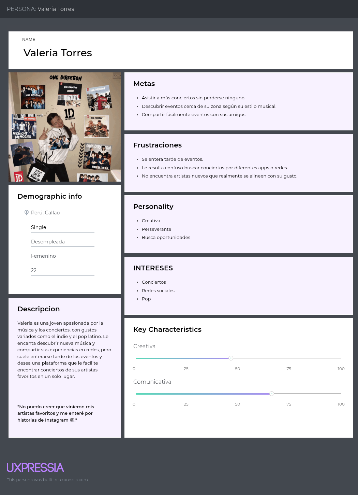

  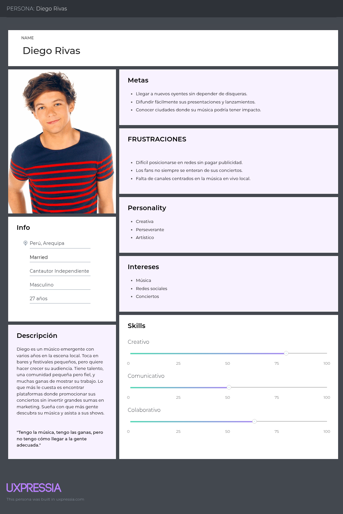

### 2.3.2. User Task Matrix

| Tareas                                                 | Frecuencia    | Importancia |
| ------------------------------------------------------ | ------------- | ----------- |
| Buscar conciertos cerca de su zona                     | Frecuente     | Alta        |
| Descubrir nuevos artistas y géneros                    | Frecuente     | Media       |
| Comparar información de eventos entre diferentes redes | Ocasional     | Media       |
| Consultas redes sociales para enterarse de eventos     | Muy frecuente | Alta        |

### Diego Rivas

| Tareas                                                      | Frecuencia | Importancia |
| ----------------------------------------------------------- | ---------- | ----------- |
| Promocionar sus conciertos                                  | Frecuente  | Muy alta    |
| Buscar aplicaciones gratuitas o de bajo costo para difusión | Frecuente  | Muy alta    |
| Organizar y coordinar presentaciones en bares o festivales  | Ocasional  | Alta        |
| Interactuar con su comunidad de seguidores                  | Frecuente  | Medio       |

### 2.3.3. User Journey Mapping

El User Journey Mapping representa la experiencia de los segmentos objetivo al intentar resolver sus necesidades actuales. Permite identificar los momentos de mayor frustración y relacionarlos con oportunidades concretas para GigMap.

**Journey del fan de música**

| Etapa | Acción del usuario | Pensamiento o expectativa | Dolor identificado | Oportunidad para GigMap |
| --- | --- | --- | --- | --- |
| Necesidad | Decide buscar un concierto para asistir. | "Quiero encontrar algo interesante y cercano." | No sabe dónde buscar y la información está dispersa. | Mostrar eventos cercanos en un mapa desde una sola aplicación. |
| Exploración | Revisa redes sociales, páginas de venues y recomendaciones. | "Espero encontrar información completa y actualizada." | Invierte tiempo comparando fuentes y puede perder eventos pequeños. | Centralizar fecha, lugar, género, artista y estado del evento. |
| Evaluación | Compara conciertos según género, fecha, distancia y precio. | "Necesito saber si realmente me conviene asistir." | Los datos pueden estar incompletos o desactualizados. | Incorporar filtros, detalle del evento y ubicación geográfica. |
| Decisión | Elige un evento y coordina con sus amigos. | "Quiero confirmar mi plan y compartirlo." | No cuenta con una lista personal de eventos ni coordinación integrada. | Permitir confirmar asistencia, guardar el evento y compartirlo. |
| Seguimiento | Espera el evento y revisa cambios o recordatorios. | "No quiero olvidar la fecha ni perder una actualización." | Las notificaciones de redes sociales no siempre son relevantes. | Enviar recordatorios y alertas personalizadas con consentimiento. |

**Journey del artista emergente**

| Etapa | Acción del usuario | Pensamiento o expectativa | Dolor identificado | Oportunidad para GigMap |
| --- | --- | --- | --- | --- |
| Planificación | Organiza una presentación y define sus datos. | "Necesito publicar mi evento de forma rápida." | Gestiona información en varias redes y herramientas. | Ofrecer un formulario único para crear conciertos. |
| Publicación | Comparte el evento con sus seguidores. | "Quiero llegar a personas nuevas, no solo a quienes ya me siguen." | El alcance depende de algoritmos y presupuesto. | Exponer el evento a fans cercanos mediante mapa y filtros. |
| Interacción | Responde consultas y busca conectar con su público. | "Quiero construir una comunidad alrededor de mi música." | Las redes mezclan contenido y no están enfocadas en eventos locales. | Proporcionar perfil artístico y comunidades temáticas. |
| Seguimiento | Revisa interés y asistencia al evento. | "Necesito saber si mi promoción está funcionando." | Tiene poca información centralizada sobre su audiencia. | Registrar visualizaciones, asistencias y métricas básicas. |
| Mejora | Usa los resultados para planificar próximas presentaciones. | "Quiero tomar mejores decisiones para crecer." | No dispone de datos simples y accionables. | Mostrar estadísticas de eventos y retroalimentación de usuarios. |

### 2.3.4. Empathy Mapping

**Diego Rivas**

    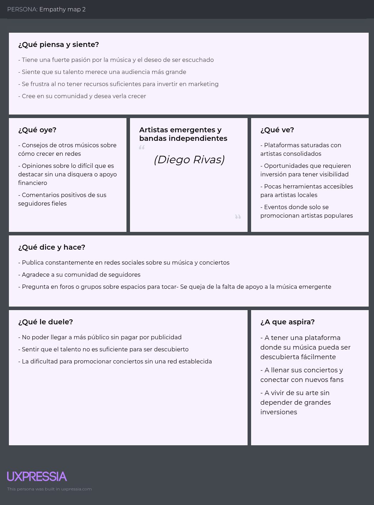

**Valeria Torres**

    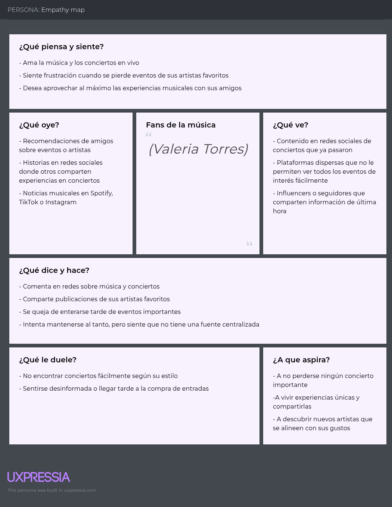

### 2.3.5. As-is Scenario Mapping

**Fans de la música:**

  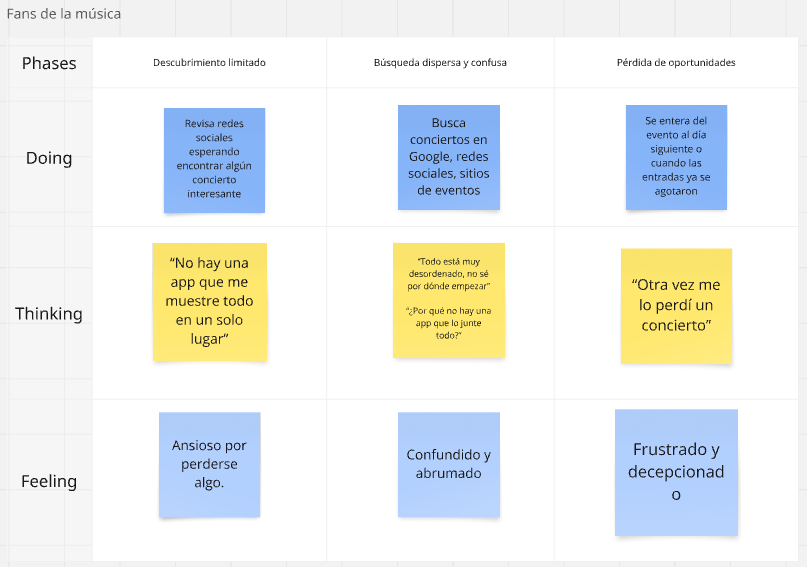

**Artistas emergentes y bandas independientes:**

  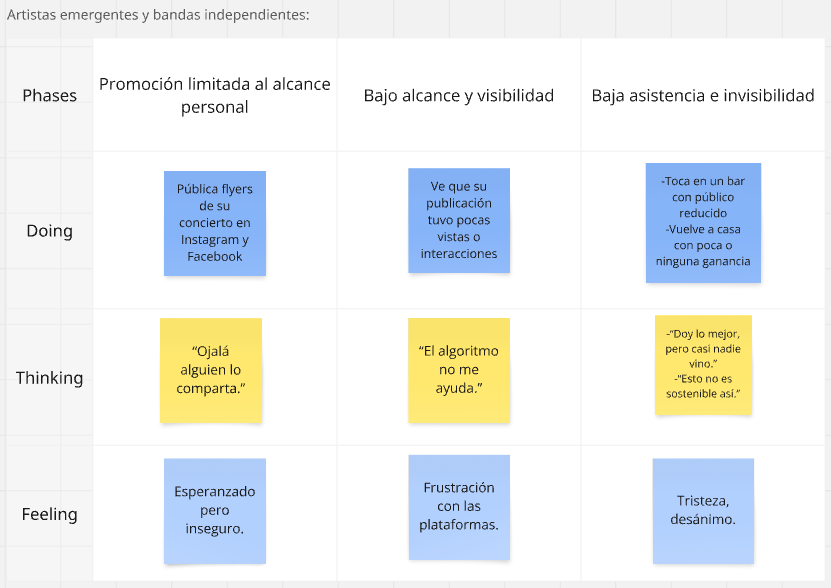

## 2.4. Ubiquitous Language

El lenguaje ubicuo establece los términos que el equipo utilizará de forma consistente en el análisis, el diseño, las historias de usuario, los endpoints y el código. Estos términos ayudan a mantener alineados el dominio del negocio y la arquitectura de GigMap.

| Término | Definición en GigMap | Uso en el sistema |
| --- | --- | --- |
| Fan | Usuario que descubre conciertos, sigue artistas y registra su intención de asistir. | Actor principal de US01, US05, US13 y US17. |
| Artista | Usuario que administra un perfil musical y publica conciertos. | Actor principal de US02 y US03. |
| Concierto | Evento musical principal publicado por un artista, con fecha, ubicación y estado. | Entidad central de Concert Service. |
| Evento asociado | Actividad vinculada a un concierto, como una reunión de fans o afterparty. | Gestionado mediante EP05 y US24-US34. |
| Asistencia | Registro de la intención de un usuario de asistir a un concierto. | Relación entre Fan y Concierto; debe ser única por usuario y evento. |
| Comunidad | Espacio temático donde los usuarios comparten publicaciones relacionadas con música o eventos. | Gestionado por Community Service. |
| Membresía | Relación que representa que un usuario pertenece a una comunidad. | Permite controlar el acceso a publicaciones e interacciones. |
| Publicación | Contenido creado por un usuario dentro de una comunidad, con texto o imagen. | Entidad `Post` y recurso `/api/v1/posts`. |
| Género musical | Clasificación utilizada para describir conciertos y preferencias de los usuarios. | Se usa para filtrar y recomendar eventos. |
| Ubicación | Coordenadas o dirección asociada al usuario o a un concierto. | Se utiliza con consentimiento y mediante el proveedor de mapas. |
| Notificación | Mensaje generado por un evento del sistema y enviado al usuario. | Incluye recordatorios, conciertos cercanos e interacciones sociales. |
| API Gateway | Punto de entrada que enruta solicitudes y aplica controles transversales. | Protege y versiona la API pública. |
| Servicio | Componente autónomo que administra una capacidad del dominio. | User and Identity, Concert, Attendance, Community y Notification Services. |
| Asistencia confirmada | Estado de una asistencia que fue registrada correctamente. | Produce el evento interno `AttendanceConfirmed`. |
| Concierto publicado | Estado de un concierto visible para los usuarios. | Puede ser consultado mediante exploración y mapa. |

# CAPÍTULO III: Requirements Specification

## 3.1. To-Be Scenario Mapping

**SEGMENTO #1: Fans de la música**

	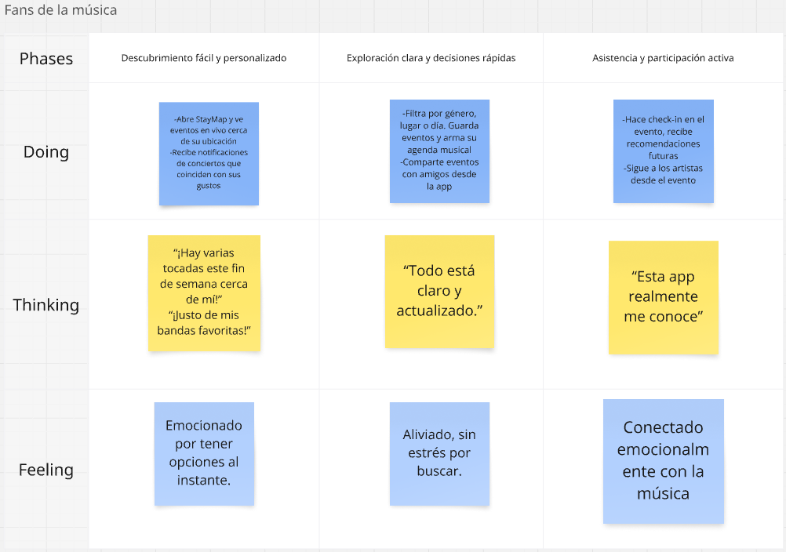

**SEGMENTO #2: Artistas emergentes y bandas independientes**

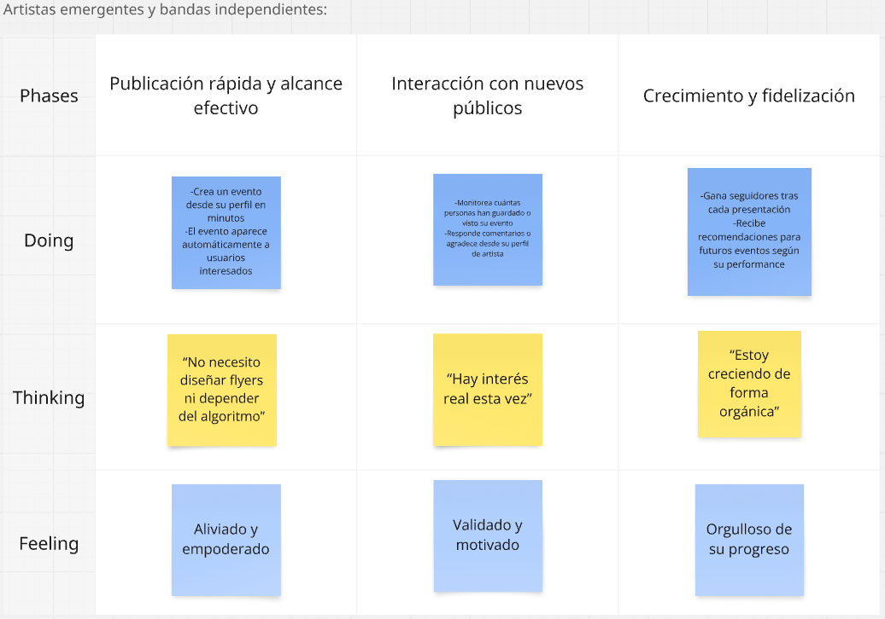

## 3.2. User Stories

**Epics:**

| Epic ID | Título                                                   | Descripción                                                                                                                                                                                                                                                                                                                                                                                                                                                                      |
| ------- | -------------------------------------------------------- | -------------------------------------------------------------------------------------------------------------------------------------------------------------------------------------------------------------------------------------------------------------------------------------------------------------------------------------------------------------------------------------------------------------------------------------------------------------------------------- |
| EP01    | Creación y descubrimiento de conciertos                  | Esta épica se centra en permitir a los artistas registrar y gestionar conciertos en la aplicación, mientras que los usuarios podrán descubrir nuevos eventos según su ubicación, género musical y artistas favoritos. Se busca optimizar la experiencia de búsqueda y exploración para que los fans encuentren fácilmente conciertos relevantes y personalizados.                                                                                                                |
| EP02    | Notificaciones personalizadas                            | Incluye el desarrollo de un sistema de alertas que informe a los usuarios sobre nuevos conciertos, cambios en eventos, promociones y recordatorios, todo basado en sus preferencias e historial de interacción. El objetivo es mantenerlos siempre actualizados y fomentar su participación activa en la aplicación.                                                                                                                                                             |
| EP03    | Interacción social y comunidades                         | Esta épica permitirá a los usuarios interactuar con otros fans a través de comunidades dentro de la aplicación. Se busca construir un espacio social donde los usuarios compartan experiencias, recomendaciones y opiniones, fortaleciendo el sentido de comunidad alrededor de la música en vivo.                                                                                                                                                                               |
| EP04    | Gestión de Identidad y Acceso (Registro y Autenticación) | Enfocada en el inicio de sesión y registro de usuarios, esta épica incluye autenticación mediante correo electrónico o redes sociales, recuperación de contraseñas y gestión de roles y permisos básicos. Su objetivo es garantizar la seguridad, privacidad y facilidad de acceso a la aplicación para todos los usuarios.                                                                                                                                                      |
| EP05    | Exploración y Gestión de Eventos Relacionados            | Esta épica se centra en permitir la creación y descubrimiento de eventos asociados a un concierto principal, como juntadas de fans en un parque, fiestas temáticas previas, actividades comunitarias o afterparties. Los usuarios podrán explorar, unirse y organizar este tipo de encuentros que enriquecen la experiencia musical más allá del show oficial. El objetivo es fomentar la interacción entre fans y ampliar el ecosistema de eventos alrededor de los conciertos. |
| EP06    | Desarrollo técnico del backend (RESTful API)             | Esta épica comprende la implementación de la infraestructura técnica que soportará la aplicación, incluyendo la base de datos, API, servicios en la nube y escalabilidad del sistema. El foco está en garantizar rendimiento, seguridad y estabilidad para manejar de manera eficiente las operaciones de usuarios y organizadores.                                                                                                                                              |
| EP07    | Plataforma informativa (Landing Page)                    | Se centra en el desarrollo de una landing page que funcione como punto de entrada informativo, presentando la propuesta de valor, características principales y beneficios de la aplicación. El objetivo es atraer nuevos usuarios, transmitiendo confianza y profesionalismo desde la primera interacción.                                                                                                                                                                      |
| EP01    | Creación y descubrimiento de conciertos                  | Esta épica se centra en permitir a los artistas registrar y gestionar conciertos en la aplicación, mientras que los usuarios podrán descubrir nuevos eventos según su ubicación, género musical y artistas favoritos. Se busca optimizar la experiencia de búsqueda y exploración para que los fans encuentren fácilmente conciertos relevantes y personalizados.                                                                                                                |
| EP02    | Notificaciones personalizadas                            | Incluye el desarrollo de un sistema de alertas que informe a los usuarios sobre nuevos conciertos, cambios en eventos, promociones y recordatorios, todo basado en sus preferencias e historial de interacción. El objetivo es mantenerlos siempre actualizados y fomentar su participación activa en la aplicación.                                                                                                                                                             |
| EP03    | Interacción social y comunidades                         | Esta épica permitirá a los usuarios interactuar con otros fans a través de comunidades dentro de la aplicación. Se busca construir un espacio social donde los usuarios compartan experiencias, recomendaciones y opiniones, fortaleciendo el sentido de comunidad alrededor de la música en vivo.                                                                                                                                                                               |
| EP04    | Gestión de Identidad y Acceso (Registro y Autenticación) | Enfocada en el inicio de sesión y registro de usuarios, esta épica incluye autenticación mediante correo electrónico o redes sociales, recuperación de contraseñas y gestión de roles y permisos básicos. Su objetivo es garantizar la seguridad, privacidad y facilidad de acceso a la aplicación para todos los usuarios.                                                                                                                                                      |
| EP05    | Exploración y Gestión de Eventos Relacionados            | Esta épica se centra en permitir la creación y descubrimiento de eventos asociados a un concierto principal, como juntadas de fans en un parque, fiestas temáticas previas, actividades comunitarias o afterparties. Los usuarios podrán explorar, unirse y organizar este tipo de encuentros que enriquecen la experiencia musical más allá del show oficial. El objetivo es fomentar la interacción entre fans y ampliar el ecosistema de eventos alrededor de los conciertos. |
| EP06    | Desarrollo técnico del backend (RESTful API)             | Esta épica comprende la implementación de la infraestructura técnica que soportará la aplicación, incluyendo la base de datos, API, servicios en la nube y escalabilidad del sistema. El foco está en garantizar rendimiento, seguridad y estabilidad para manejar de manera eficiente las operaciones de usuarios y organizadores.                                                                                                                                              |
| EP07    | Plataforma informativa (Landing Page)                    | Se centra en el desarrollo de una landing page que funcione como punto de entrada informativo, presentando la propuesta de valor, características principales y beneficios de la aplicación. El objetivo es atraer nuevos usuarios, transmitiendo confianza y profesionalismo desde la primera interacción.                                                                                                                                                                      |

**User Stories:**

<table>
  <thead>
    <tr>
      <th>Story ID</th>
      <th>User</th>
      <th>Priority</th>
      <th>Epic</th>
    </tr>
  </thead>
  <tbody>
    <tr>
      <td>US01</td>
      <td>Fan</td>
      <td>3</td>
      <td>EP01</td>
    </tr>
    <tr>
      <td><strong>Title</strong></td>
      <td colspan="3">Filtrar conciertos por género musical</td>
    </tr>
    <tr>
      <td colspan="4"><strong>Description</strong></td>
    </tr>
    <tr>
      <td colspan="4">Como fan, quiero filtrar conciertos por género para ver solo los que me interesan.</td>
    </tr>
    <tr>
      <td colspan="4"><strong>Acceptance Criteria</strong></td>
    </tr>
    <tr>
      <td colspan="4">
        <strong>Escenario 1: Filtrar conciertos por un género</strong> 
        Dado que el usuario se encuentra en la lista de conciertos 
        Cuando selecciona un género musical en el filtro 
        Entonces el sistema muestra únicamente los conciertos que pertenecen a ese género.  
        <strong>Escenario 2: No hay resultados para el género seleccionado</strong> 
        Dado que el usuario se encuentra en la lista de conciertos 
        Cuando selecciona un género musical que no tiene conciertos disponibles 
        Entonces el sistema muestra un mensaje indicando que no hay resultados.
      </td>
    </tr>
  </tbody>
</table>

<table>
  <thead>
    <tr>
      <th>Story ID</th>
      <th>User</th>
      <th>Priority</th>
      <th>Epic</th>
    </tr>
  </thead>
  <tbody>
    <tr>
      <td>US02</td>
      <td>Artista</td>
      <td>5</td>
      <td>EP01</td>
    </tr>
    <tr>
      <td><strong>Title</strong></td>
      <td colspan="3">Publicar nuevo concierto</td>
    </tr>
    <tr>
      <td colspan="4"><strong>Description</strong></td>
    </tr>
    <tr>
      <td colspan="4">Como artista, quiero crear un evento para promocionar mi presentación.</td>
    </tr>
    <tr>
      <td colspan="4"><strong>Acceptance Criteria</strong></td>
    </tr>
    <tr>
      <td colspan="4">
        <strong>Escenario: Acceso al formulario de creación de evento</strong> 
        Dado que el artista inicia sesión 
        Cuando presiona el boton para crear conciertos 
        Entonces puede ingresar datos y publicarlo en el mapa.  
        <strong>Escenario: Publicación inmediata y visible</strong> 
        Dado que los datos son válidos 
        Cuando se confirma la creación 
        Entonces el evento aparece visible en la aplicación.
      </td>
    </tr>
  </tbody>
</table>

<table>
  <thead>
    <tr>
      <th>Story ID</th>
      <th>User</th>
      <th>Priority</th>
      <th>Epic</th>
    </tr>
  </thead>
  <tbody>
    <tr>
      <td>US03</td>
      <td>Artista</td>
      <td>2</td>
      <td>EP03</td>
    </tr>
    <tr>
      <td><strong>Title</strong></td>
      <td colspan="3">Personalizar perfil de artista</td>
    </tr>
    <tr>
      <td colspan="4"><strong>Description</strong></td>
    </tr>
    <tr>
      <td colspan="4">Como artista, quiero personalizar mi perfil con mi nombre artístico y fotografía para conectar mejor con el público.</td>
    </tr>
    <tr>
      <td colspan="4"><strong>Acceptance Criteria</strong></td>
    </tr>
    <tr>
      <td colspan="4">
    <strong>Escenario 1: Actualizar nombre artístico y fotografía</strong> 
    Dado que el artista se encuentra en la sección de edición de perfil 
    Cuando ingresa un nombre artístico válido y selecciona una fotografía 
    Entonces el sistema guarda los cambios y muestra la información actualizada en su perfil.  
<strong>Escenario 2: Intentar guardar sin datos válidos</strong> 
    Dado que el artista se encuentra en la sección de edición de perfil 
    Cuando intenta guardar el perfil sin ingresar un nombre artístico o sin seleccionar una fotografía válida 
    Entonces el sistema muestra un mensaje de error indicando que los campos son obligatorios o inválidos.
      </td>
    </tr>
  </tbody>
</table>

<table>
  <thead>
    <tr>
      <th>Story ID</th>
      <th>User</th>
      <th>Priority</th>
      <th>Epic</th>
    </tr>
  </thead>
  <tbody>
    <tr>
      <td>US04</td>
      <td>Usuario</td>
      <td>5</td>
      <td>EP03</td>
    </tr>
    <tr>
      <td><strong>Title</strong></td>
      <td colspan="3">Crear comunidad</td>
    </tr>
    <tr>
      <td colspan="4"><strong>Description</strong></td>
    </tr>
    <tr>
      <td colspan="4">Como usuario, quiero crear una comunidad temática para reunir a otros usuarios en torno a intereses compartidos.</td>
    </tr>
    <tr>
      <td colspan="4"><strong>Acceptance Criteria</strong></td>
    </tr>
    <tr>
      <td colspan="4">
        <strong>Escenario: Acceso a la opción de crear comunidad</strong> 
		Dado que el usuario ha iniciado sesión 
		Cuando accede a la sección de comunidades 
		Entonces puede ver y seleccionar la opción para crear una nueva comunidad.  
        <strong>Escenario: Creación de comunidad correcta</strong> 
		Dado que el usuario ha accedido al formulario de creación 
		Cuando completa los campos requeridos y confirma la acción 
		Entonces se crea la comunidad y queda visible para otros usuarios.
      </td>
    </tr>
  </tbody>
</table>

<table>
  <thead>
    <tr>
      <th>Story ID</th>
      <th>User</th>
      <th>Priority</th>
      <th>Epic</th>
    </tr>
  </thead>
  <tbody>
    <tr>
      <td>US05</td>
      <td>Fan</td>
      <td>5</td>
      <td>EP01</td>
    </tr>
    <tr>
      <td><strong>Title</strong></td>
      <td colspan="3">Ver mapa con geolocalización</td>
    </tr>
    <tr>
      <td colspan="4"><strong>Description</strong></td>
    </tr>
    <tr>
      <td colspan="4">Como fan, quiero ver un mapa con mi ubicación y los conciertos cercanos marcados para explorar visualmente las opciones disponibles.</td>
    </tr>
    <tr>
      <td colspan="4"><strong>Acceptance Criteria</strong></td>
    </tr>
    <tr>
      <td colspan="4">
        <strong>Escenario: Visualización del mapa con eventos</strong> 
        Dado que el usuario está logueado y ha permitido el acceso a su ubicación 
        Cuando entra a la sección de mapa 
        Entonces visualiza su ubicación y los conciertos cercanos.  
        <strong>Escenario: Información de eventos en el mapa</strong> 
        Dado que el usuario interactúa con un marcador de evento 
        Cuando hace clic en un ícono del mapa 
        Entonces puede ver detalles del evento como nombre, fecha y lugar.
      </td>
    </tr>
  </tbody>
</table>

<table>
  <thead>
    <tr>
      <th>Story ID</th>
      <th>User</th>
      <th>Priority</th>
      <th>Epic</th>
    </tr>
  </thead>
  <tbody>
    <tr>
      <td>US06</td>
      <td>Usuario</td>
      <td>2</td>
      <td>EP01</td>
    </tr>
    <tr>
      <td><strong>Title</strong></td>
      <td colspan="3">Buscar conciertos</td>
    </tr>
    <tr>
      <td colspan="4"><strong>Description</strong></td>
    </tr>
    <tr>
      <td colspan="4">Como usuario, quiero buscar conciertos por nombre para encontrarlos fácilmente.</td>
    </tr>
    <tr>
      <td colspan="4"><strong>Acceptance Criteria</strong></td>
    </tr>
    <tr>
      <td colspan="4">
        <strong>Escenario: Búsqueda por palabra clave</strong> 
        Dado que el usuario accede al buscador de conciertos 
        Cuando escribe el nombre del concierto 
        Entonces se muestran los conciertos coincidentes.
      </td>
    </tr>
  </tbody>
</table>

<table>
  <thead>
    <tr>
      <th>Story ID</th>
      <th>User</th>
      <th>Priority</th>
      <th>Epic</th>
    </tr>
  </thead>
  <tbody>
    <tr>
      <td>US07</td>
      <td>Usuario</td>
      <td>2</td>
      <td>EP03</td>
    </tr>
    <tr>
      <td><strong>Title</strong></td>
      <td colspan="3">Buscar comunidades</td>
    </tr>
    <tr>
      <td colspan="4"><strong>Description</strong></td>
    </tr>
    <tr>
      <td colspan="4">Como usuario, quiero buscar comunidades por nombre para unirme a las que me interesen.</td>
    </tr>
    <tr>
      <td colspan="4"><strong>Acceptance Criteria</strong></td>
    </tr>
    <tr>
      <td colspan="4">
        <strong>Escenario: Búsqueda de comunidades</strong> 
        Dado que el usuario accede al buscador de comunidades 
        Cuando ingresa una palabra clave 
        Entonces ve las comunidades coincidentes.
      </td>
    </tr>
  </tbody>
</table>

<table>
  <thead>
    <tr>
      <th>Story ID</th>
      <th>User</th>
      <th>Priority</th>
      <th>Epic</th>
    </tr>
  </thead>
  <tbody>
    <tr>
      <td>US08</td>
      <td>Usuario registrado</td>
      <td>3</td>
      <td>EP04</td>
    </tr>
    <tr>
      <td><strong>Title</strong></td>
      <td colspan="3">Iniciar sesión en la app mobile</td>
    </tr>
    <tr>
      <td colspan="4"><strong>Description</strong></td>
    </tr>
    <tr>
      <td colspan="4">Como usuario registrado, quiero iniciar sesión desde la aplicación móvil para acceder a mi cuenta.</td>
    </tr>
    <tr>
      <td colspan="4"><strong>Acceptance Criteria</strong></td>
    </tr>
    <tr>
      <td colspan="4">
        <strong>Escenario: Ingreso exitoso desde app mobile</strong> 
        Dado que el usuario tiene una cuenta 
        Cuando accede al formulario de login y envía sus credenciales 
        Entonces accede correctamente a su perfil.
      </td>
    </tr>
  </tbody>
</table>

<table>
  <thead>
    <tr>
      <th>Story ID</th>
      <th>User</th>
      <th>Priority</th>
      <th>Epic</th>
    </tr>
  </thead>
  <tbody>
    <tr>
      <td>US09</td>
      <td>Artista</td>
      <td>3</td>
      <td>EP04</td>
    </tr>
    <tr>
      <td><strong>Title</strong></td>
      <td colspan="3">Registrarse como artista</td>
    </tr>
    <tr>
      <td colspan="4"><strong>Description</strong></td>
    </tr>
    <tr>
      <td colspan="4">Como nuevo usuario, quiero registrarme como artista para promocionar mis conciertos.</td>
    </tr>
    <tr>
      <td colspan="4"><strong>Acceptance Criteria</strong></td>
    </tr>
    <tr>
      <td colspan="4">
        <strong>Escenario: Registro como artista</strong> 
        Dado que el usuario accede al formulario de registro 
        Cuando selecciona la opción 'Artista' y completa sus datos 
        Entonces su cuenta es creada con perfil de artista.
      </td>
    </tr>
  </tbody>
</table>
<table>
  <thead>
    <tr>
      <th>Story ID</th>
      <th>User</th>
      <th>Priority</th>
      <th>Epic</th>
    </tr>
  </thead>
  <tbody>
    <tr>
      <td>US10</td>
      <td>Fan</td>
      <td>3</td>
      <td>EP04</td>
    </tr>
    <tr>
      <td><strong>Title</strong></td>
      <td colspan="3">Registrarse como fan</td>
    </tr>
    <tr>
      <td colspan="4"><strong>Description</strong></td>
    </tr>
    <tr>
      <td colspan="4">Como nuevo usuario, quiero registrarme como fan para participar en la comunidad y explorar conciertos.</td>
    </tr>
    <tr>
      <td colspan="4"><strong>Acceptance Criteria</strong></td>
    </tr>
    <tr>
      <td colspan="4">
        <strong>Escenario: Registro como fan</strong> 
        Dado que el usuario accede al formulario de registro 
        Cuando selecciona la opción 'Fan' y completa sus datos 
        Entonces su cuenta es creada con perfil de fan.
      </td>
    </tr>
  </tbody>
</table>

<table>
  <thead>
    <tr>
      <th>Story ID</th>
      <th>User</th>
      <th>Priority</th>
      <th>Epic</th>
    </tr>
  </thead>
  <tbody>
    <tr>
      <td>US11</td>
      <td>Fan</td>
      <td>2</td>
      <td>EP01</td>
    </tr>
    <tr>
      <td><strong>Title</strong></td>
      <td colspan="3">Zoom a concierto en el mapa</td>
    </tr>
    <tr>
      <td colspan="4"><strong>Description</strong></td>
    </tr>
    <tr>
      <td colspan="4">Como fan, quiero que al seleccionar un concierto en el mapa se haga zoom a su ubicación.</td>
    </tr>
    <tr>
      <td colspan="4"><strong>Acceptance Criteria</strong></td>
    </tr>
    <tr>
      <td colspan="4">
        <strong>Escenario: Zoom en mapa a concierto seleccionado</strong> 
        Dado que el usuario está en el mapa 
        Cuando hace touch en un concierto 
        Entonces el mapa se centra y hace zoom sobre su ubicación.
      </td>
    </tr>
  </tbody>
</table>
<table>
  <thead>
    <tr>
      <th>Story ID</th>
      <th>User</th>
      <th>Priority</th>
      <th>Epic</th>
    </tr>
  </thead>
  <tbody>
    <tr>
      <td>US12</td>
      <td>Usuario</td>
      <td>2</td>
      <td>EP01</td>
    </tr>
    <tr>
      <td><strong>Title</strong></td>
      <td colspan="3">Ver estado del concierto</td>
    </tr>
    <tr>
      <td colspan="4"><strong>Description</strong></td>
    </tr>
    <tr>
      <td colspan="4">Como usuario, quiero saber si un concierto está publicado o finalizado para decidir si puedo asistir.</td>
    </tr>
    <tr>
      <td colspan="4"><strong>Acceptance Criteria</strong></td>
    </tr>
    <tr>
      <td colspan="4">
        <strong>Escenario: Visualización de estado del concierto</strong> 
        Dado que el usuario revisa la lista de conciertos 
        Cuando observa el estado de disponibilidad 
        Entonces puede ver si el evento está 'Publicado' o 'Finalizado'.
      </td>
    </tr>
  </tbody>
</table>
<table>
  <thead>
    <tr>
      <th>Story ID</th>
      <th>User</th>
      <th>Priority</th>
      <th>Epic</th>
    </tr>
  </thead>
  <tbody>
    <tr>
      <td>US13</td>
      <td>Fan</td>
      <td>3</td>
      <td>EP01</td>
    </tr>
    <tr>
      <td><strong>Title</strong></td>
      <td colspan="3">Ver información detallada del concierto</td>
    </tr>
    <tr>
      <td colspan="4"><strong>Description</strong></td>
    </tr>
    <tr>
      <td colspan="4">Como fan, quiero ver la información completa de un concierto para decidir si asistir.</td>
    </tr>
    <tr>
      <td colspan="4"><strong>Acceptance Criteria</strong></td>
    </tr>
    <tr>
      <td colspan="4">
        <strong>Escenario: Acceso a detalles del concierto</strong> 
        Dado que el usuario selecciona un concierto 
        Cuando accede a su ficha de detalle 
        Entonces visualiza el nombre, ubicación, fecha, imagen, y descripción.
      </td>
    </tr>
  </tbody>
</table>
<table>
  <thead>
    <tr>
      <th>Story ID</th>
      <th>User</th>
      <th>Priority</th>
      <th>Epic</th>
    </tr>
  </thead>
  <tbody>
    <tr>
      <td>US14</td>
      <td>Fan</td>
      <td>3</td>
      <td>EP03</td>
    </tr>
    <tr>
      <td><strong>Title</strong></td>
      <td colspan="3">Unirse a una comunidad</td>
    </tr>
    <tr>
      <td colspan="4"><strong>Description</strong></td>
    </tr>
    <tr>
      <td colspan="4">Como fan, quiero unirme a una comunidad musical para interactuar con otros usuarios con intereses similares.</td>
    </tr>
    <tr>
      <td colspan="4"><strong>Acceptance Criteria</strong></td>
    </tr>
    <tr>
      <td colspan="4">
        <strong>Escenario: Unirse a comunidad</strong> 
        Dado que el fan accede a una comunidad disponible 
        Cuando presiona el botón 'Unirse' 
        Entonces queda registrado como miembro.
      </td>
    </tr>
  </tbody>
</table>
<table>
  <thead>
    <tr>
      <th>Story ID</th>
      <th>User</th>
      <th>Priority</th>
      <th>Epic</th>
    </tr>
  </thead>
  <tbody>
    <tr>
      <td>US15</td>
      <td>Fan</td>
      <td>3</td>
      <td>EP03</td>
    </tr>
    <tr>
      <td><strong>Title</strong></td>
      <td colspan="3">Publicar en la comunidad</td>
    </tr>
    <tr>
      <td colspan="4"><strong>Description</strong></td>
    </tr>
    <tr>
      <td colspan="4">Como fan, quiero crear publicaciones en la comunidades creadas, para compartir opiniones, fotos o recomendaciones con otros miembros.</td>
    </tr>
    <tr>
      <td colspan="4"><strong>Acceptance Criteria</strong></td>
    </tr>
    <tr>
      <td colspan="4">
        <strong>Escenario: Crear publicación exitosa</strong> 
        Dado que el usuario accede una comunidad, 
        Cuando le da al boton de agregar una nueva publicación y escribe un mensaje, 
        Entonces la publicación se guarda y se muestra en el feed de la comunidad.
      </td>
    </tr>
  </tbody>
</table>
<table>
  <thead>
    <tr>
      <th>Story ID</th>
      <th>User</th>
      <th>Priority</th>
      <th>Epic</th>
    </tr>
  </thead>
  <tbody>
    <tr>
      <td>US16</td>
      <td>Fan</td>
      <td>2</td>
      <td>EP03</td>
    </tr>
    <tr>
      <td><strong>Title</strong></td>
      <td colspan="3">Editar perfil personal</td>
    </tr>
    <tr>
      <td colspan="4"><strong>Description</strong></td>
    </tr>
    <tr>
      <td colspan="4">Como fan, quiero poder editar mi información de perfil (foto, nombre y nombre de usuario), para que los demás usuarios puedan reconocerme fácilmente y mantener mi perfil actualizado.</td>
    </tr>
    <tr>
      <td colspan="4"><strong>Acceptance Criteria</strong></td>
    </tr>
    <tr>
      <td colspan="4">
        <strong>Escenario: Actualizar información del perfil</strong> 
        Dado que el usuario accede a la sección "Mi Perfil", 
        Cuando le da al botón editar perfil, 
        Entonces puede editar su nombre, nombre de usuario y cambiar su foto de perfil.
      </td>
    </tr>
  </tbody>
</table>
<table>
  <thead>
    <tr>
      <th>Story ID</th>
      <th>User</th>
      <th>Priority</th>
      <th>Epic</th>
    </tr>
  </thead>
  <tbody>
    <tr>
      <td>US17</td>
      <td>Fan</td>
      <td>3</td>
      <td>EP01</td>
    </tr>
    <tr>
      <td><strong>Title</strong></td>
      <td colspan="3">Confirmar o marcar asistencia a un concierto</td>
    </tr>
    <tr>
      <td colspan="4"><strong>Description</strong></td>
    </tr>
    <tr>
      <td colspan="4">Como fan, quiero poder marcar un concierto como “Marcar asistencia”, para llevar un seguimiento de los conciertos que planeo asistir.</td>
    </tr>
    <tr>
      <td colspan="4"><strong>Acceptance Criteria</strong></td>
    </tr>
    <tr>
      <td colspan="4">
        <strong>Escenario: Confirmar asistencia a un evento</strong> 
        Dado que el usuario visualiza los detalles de un evento, 
        Cuando presiona el botón "Confirmar asistencia", 
        Entonces el evento se agrega a su “GigList” y el botón cambia a "Cancelar asistencia".  
        <strong>Escenario: Cancelar asistencia</strong> 
        Dado que el evento ya está marcado como confirmado, 
        Cuando presiona el botón "Cancelar asistencia", 
        Entonces el evento se elimina de su lista de eventos futuros y vuelve a estar disponible para confirmar.
      </td>
    </tr>
  </tbody>
</table>
<table>
  <thead>
    <tr>
      <th>Story ID</th>
      <th>User</th>
      <th>Priority</th>
      <th>Epic</th>
    </tr>
  </thead>
  <tbody>
    <tr>
      <td>US18</td>
      <td>Usuario</td>
      <td>2</td>
      <td>EP03</td>
    </tr>
    <tr>
      <td><strong>Title</strong></td>
      <td colspan="3">Ver comunidades accedidas</td>
    </tr>
    <tr>
      <td colspan="4"><strong>Description</strong></td>
    </tr>
    <tr>
      <td colspan="4">Como usuario, quiero visualizar en el apartado "Comunidades" las comunidades a las que me he unido.</td>
    </tr>
    <tr>
      <td colspan="4"><strong>Acceptance Criteria</strong></td>
    </tr>
    <tr>
      <td colspan="4">
        <strong>Escenario: Visualización de comunidades unidas</strong> 
        Dado que el usuario ha ingresado a su perfil 
        Cuando accede a la sección "Comunidades" 
        Entonces puede ver la lista de comunidades a las que pertenece.
      </td>
    </tr>
  </tbody>
</table>
<table>
  <thead>
    <tr>
      <th>Story ID</th>
      <th>User</th>
      <th>Priority</th>
      <th>Epic</th>
    </tr>
  </thead>
  <tbody>
    <tr>
      <td>US19</td>
      <td>Usuario</td>
      <td>2</td>
      <td>EP03</td>
    </tr>
    <tr>
      <td><strong>Title</strong></td>
      <td colspan="3">Reaccionar a publicaciones en comunidades</td>
    </tr>
    <tr>
      <td colspan="4"><strong>Description</strong></td>
    </tr>
    <tr>
      <td colspan="4">Como usuario, quiero poder reaccionar a publicaciones dentro de las comunidades.</td>
    </tr>
    <tr>
      <td colspan="4"><strong>Acceptance Criteria</strong></td>
    </tr>
    <tr>
      <td colspan="4">
        <strong>Escenario: Reacción a publicación</strong> 
        Dado que el usuario navega por una comunidad 
        Cuando encuentra una publicación 
        Entonces puede reaccionar con un emoji de corazón.
      </td>
    </tr>
  </tbody>
</table>
<table>
  <thead>
    <tr>
      <th>Story ID</th>
      <th>User</th>
      <th>Priority</th>
      <th>Epic</th>
    </tr>
  </thead>
  <tbody>
    <tr>
      <td>US20</td>
      <td>Usuario</td>
      <td>2</td>
      <td>EP03</td>
    </tr>
    <tr>
      <td><strong>Title</strong></td>
      <td colspan="3">Acceder a perfil de otros usuarios</td>
    </tr>
    <tr>
      <td colspan="4"><strong>Description</strong></td>
    </tr>
    <tr>
      <td colspan="4">Como usuario, quiero poder acceder al perfil de otros usuarios para conocer más sobre ellos.</td>
    </tr>
    <tr>
      <td colspan="4"><strong>Acceptance Criteria</strong></td>
    </tr>
    <tr>
      <td colspan="4">
        <strong>Escenario: Navegar al perfil de otro usuario</strong> 
        Dado que el usuario ve un nombre o avatar 
        Cuando hace clic sobre él 
        Entonces se redirige al perfil público de ese usuario.
      </td>
    </tr>
  </tbody>
</table>
<table>
  <thead>
    <tr>
      <th>Story ID</th>
      <th>User</th>
      <th>Priority</th>
      <th>Epic</th>
    </tr>
  </thead>
  <tbody>
    <tr>
      <td>US21</td>
      <td>Usuario</td>
      <td>2</td>
      <td>EP03</td>
    </tr>
    <tr>
      <td><strong>Title</strong></td>
      <td colspan="3">Ver publicaciones con like</td>
    </tr>
    <tr>
      <td colspan="4"><strong>Description</strong></td>
    </tr>
    <tr>
      <td colspan="4">Como usuario, quiero ver una lista de publicaciones a las que les he dado "like".</td>
    </tr>
    <tr>
      <td colspan="4"><strong>Acceptance Criteria</strong></td>
    </tr>
    <tr>
      <td colspan="4">
        <strong>Escenario: Historial de publicaciones favoritas</strong> 
        Dado que el usuario ha interactuado en comunidades 
        Cuando accede a su sección de "Likes" 
        Entonces puede visualizar todas las publicaciones que le han gustado.
      </td>
    </tr>
  </tbody>
</table>
<table>
  <thead>
    <tr>
      <th>Story ID</th>
      <th>User</th>
      <th>Priority</th>
      <th>Epic</th>
    </tr>
  </thead>
  <tbody>
    <tr>
      <td>US22</td>
      <td>Usuario</td>
      <td>2</td>
      <td>EP01</td>
    </tr>
    <tr>
      <td><strong>Title</strong></td>
      <td colspan="3">Permitir acceso a ubicación</td>
    </tr>
    <tr>
      <td colspan="4"><strong>Description</strong></td>
    </tr>
    <tr>
      <td colspan="4">Como usuario, quiero que GigMap acceda a mi ubicación para recibir información personalizada.</td>
    </tr>
    <tr>
      <td colspan="4"><strong>Acceptance Criteria</strong></td>
    </tr>
    <tr>
      <td colspan="4">
        <strong>Escenario: Permiso de ubicación</strong> 
        Dado que el usuario entra a la app por primera vez 
        Cuando se le solicita permiso de ubicación 
        Entonces puede aceptar o denegar el acceso.
      </td>
    </tr>
  </tbody>
</table>
<table>
  <thead>
    <tr>
      <th>Story ID</th>
      <th>User</th>
      <th>Priority</th>
      <th>Epic</th>
    </tr>
  </thead>
  <tbody>
    <tr>
      <td>US23</td>
      <td>Usuario</td>
      <td>3</td>
      <td>EP03</td>
    </tr>
    <tr>
      <td><strong>Title</strong></td>
      <td colspan="3">Subir imágenes en comunidades</td>
    </tr>
    <tr>
      <td colspan="4"><strong>Description</strong></td>
    </tr>
    <tr>
      <td colspan="4">Como usuario, quiero subir imágenes en publicaciones de comunidad para compartir experiencias visuales.</td>
    </tr>
    <tr>
      <td colspan="4"><strong>Acceptance Criteria</strong></td>
    </tr>
    <tr>
      <td colspan="4">
        <strong>Escenario: Publicación con imagen</strong> 
        Dado que el usuario quiere compartir contenido 
        Cuando crea una publicación 
        Entonces puede adjuntar una imagen que se muestren en el feed.
      </td>
    </tr>
  </tbody>
</table>
<table>
  <thead>
    <tr>
      <th>Story ID</th>
      <th>User</th>
      <th>Priority</th>
      <th>Epic</th>
    </tr>
  </thead>
  <tbody>
    <tr>
      <td>US24</td>
      <td>Usuario de GigMap</td>
      <td>3</td>
      <td>EP05</td>
    </tr>
    <tr>
      <td><strong>Title</strong></td>
      <td colspan="3">Ver eventos asociados</td>
    </tr>
    <tr>
      <td colspan="4"><strong>Description</strong></td>
    </tr>
    <tr>
      <td colspan="4">Como usuario de GigMap, quiero ver un apartado de eventos relacionados en el perfil de un concierto, para conocer actividades cercanas en tiempo y lugar (afterparty/reunion) que podría realizar.</td>
    </tr>
    <tr>
      <td colspan="4"><strong>Acceptance Criteria</strong></td>
    </tr>
    <tr>
      <td colspan="4">
        <strong>Escenario: Ver eventos relacionados exitosamente</strong> 
        Dado que estoy autenticado 
        Y estoy en el perfil de un concierto 
        Cuando desplazo la vista hasta el apartado “Eventos relacionados” 
        Entonces veo una lista de eventos con título, fecha y lugar 
        Y puedo abrir el detalle de cualquier evento.
      </td>
    </tr>
  </tbody>
</table>
<table>
  <thead>
    <tr>
      <th>Story ID</th>
      <th>User</th>
      <th>Priority</th>
      <th>Epic</th>
    </tr>
  </thead>
  <tbody>
    <tr>
      <td>US25</td>
      <td>Usuario</td>
      <td>2</td>
      <td>EP05</td>
    </tr>
    <tr>
      <td><strong>Title</strong></td>
      <td colspan="3">Confirmar o marcar asistencia a eventos asociados</td>
    </tr>
    <tr>
      <td colspan="4"><strong>Description</strong></td>
    </tr>
    <tr>
      <td colspan="4">Como usuario, quiero poder marcar mi asistencia a un evento asociado, para que pueda llevar un seguimiento de los eventos asociados que planeo asistir.</td>
    </tr>
    <tr>
      <td colspan="4"><strong>Acceptance Criteria</strong></td>
    </tr>
    <tr>
      <td colspan="4">
        <strong>Escenario: Confirmar asistencia</strong> 
        Dado que el usuario visualiza los detalles de un evento asociado, 
        Cuando presiona el botón "Confirmar asistencia", 
        Entonces se confirma la asistencia al evento asociado y el botón cambia a "Cancelar asistencia".  
        <strong>Escenario: Cancelar asistencia</strong> 
        Dado que el evento asociado ya está marcado como “Confirmar asistencia”, 
        Cuando presiona el botón "Cancelar asistencia", 
        Entonces el evento vuelve a estar disponible para confirmar.
      </td>
    </tr>
  </tbody>
</table>
<table>
  <thead>
    <tr>
      <th>Story ID</th>
      <th>User</th>
      <th>Priority</th>
      <th>Epic</th>
    </tr>
  </thead>
  <tbody>
    <tr>
      <td>US26</td>
      <td>Usuario</td>
      <td>2</td>
      <td>EP03</td>
    </tr>
    <tr>
      <td><strong>Title</strong></td>
      <td colspan="3">Visualizar el contenido de las comunidades pertenecientes</td>
    </tr>
    <tr>
      <td colspan="4"><strong>Description</strong></td>
    </tr>
    <tr>
      <td colspan="4">Como usuario, quiero poder visualizar las publicaciones y anuncios de las comunidades existentes para poder enterarme de distintos temas, en la pantalla de “Home”.</td>
    </tr>
    <tr>
      <td colspan="4"><strong>Acceptance Criteria</strong></td>
    </tr>
    <tr>
      <td colspan="4">
        <strong>Escenario: Visualizar el contenido de las comunidades exitosamente</strong> 
        Dado que un usuario ingresa a la pantalla "Home" 
        Cuando visualiza la sección "Posts" 
        Entonces el sistema muestra las publicaciones y anuncios más recientes de las comunidades.
      </td>
    </tr>
  </tbody>
</table>
<table>
  <thead>
    <tr>
      <th>Story ID</th>
      <th>User</th>
      <th>Priority</th>
      <th>Epic</th>
    </tr>
  </thead>
  <tbody>
    <tr>
      <td>US27</td>
      <td>Usuario</td>
      <td>5</td>
      <td>EP02</td>
    </tr>
    <tr>
      <td><strong>Title</strong></td>
      <td colspan="3">Recibir recordatorio de concierto por asistir</td>
    </tr>
    <tr>
      <td colspan="4"><strong>Description</strong></td>
    </tr>
    <tr>
      <td colspan="4">Como usuario, quiero recibir la notificación de recordatorio del concierto al que confirme mi asistencia cuando la fecha de presentación esté cercana.</td>
    </tr>
    <tr>
      <td colspan="4"><strong>Acceptance Criteria</strong></td>
    </tr>
    <tr>
      <td colspan="4">
        <strong>Escenario: Recordatorio antes del evento</strong> 
        Dado que el usuario confirmó asistencia a un concierto en GigMap 
        Cuando falten 24 horas para la fecha del evento 
        Entonces recibe una notificación con el nombre, lugar y hora del concierto.
      </td>
    </tr>
  </tbody>
</table>
<table>
  <thead>
    <tr>
      <th>Story ID</th>
      <th>User</th>
      <th>Priority</th>
      <th>Epic</th>
    </tr>
  </thead>
  <tbody>
    <tr>
      <td>US28</td>
      <td>Usuario registrado</td>
      <td>5</td>
      <td>EP02</td>
    </tr>
    <tr>
      <td><strong>Title</strong></td>
      <td colspan="3">Recibir notificaciones de conciertos cercanos</td>
    </tr>
    <tr>
      <td colspan="4"><strong>Description</strong></td>
    </tr>
    <tr>
      <td colspan="4">Como usuario registrado, quiero recibir notificaciones sobre conciertos cerca de mi ubicación para no perderme eventos de mi interés.</td>
    </tr>
    <tr>
      <td colspan="4"><strong>Acceptance Criteria</strong></td>
    </tr>
    <tr>
      <td colspan="4">
        <strong>Escenario: Notificación de un concierto cercano disponible</strong> 
        Dado que el usuario tiene activadas las notificaciones 
        Cuando se registre un nuevo concierto en un radio de 5 km de su ubicación 
        Entonces recibe una notificación en su dispositivo con el nombre, fecha y lugar del evento.
      </td>
    </tr>
  </tbody>
</table>
<table>
  <thead>
    <tr>
      <th>Story ID</th>
      <th>User</th>
      <th>Priority</th>
      <th>Epic</th>
    </tr>
  </thead>
  <tbody>
    <tr>
      <td>US29</td>
      <td>Usuario</td>
      <td>5</td>
      <td>EP02</td>
    </tr>
    <tr>
      <td><strong>Title</strong></td>
      <td colspan="3">Recibir notificaciones por interacciones sociales</td>
    </tr>
    <tr>
      <td colspan="4"><strong>Description</strong></td>
    </tr>
    <tr>
      <td colspan="4">Como usuario, quiero recibir notificaciones cuando alguien interactúe con mis publicaciones (comentarios, likes, etc.) para mantenerme al tanto de la actividad en mi perfil.</td>
    </tr>
    <tr>
      <td colspan="4"><strong>Acceptance Criteria</strong></td>
    </tr>
    <tr>
      <td colspan="4">
        <strong>Escenario: Notificación por comentario recibido</strong> 
        Dado que el usuario ha publicado un contenido en una comunidad 
        Cuando otro usuario comente en su publicación 
        Entonces recibe una notificación indicando quién comentó y un acceso directo para ver el comentario.  
        <strong>Escenario: Notificación por like recibido</strong> 
        Dado que el usuario ha compartido una publicación o confirmado asistencia a un evento 
        Cuando otro usuario dé "like" a esa publicación 
        Entonces recibe una notificación con el nombre del usuario que reaccionó.
      </td>
    </tr>
  </tbody>
</table>
<table>
  <thead>
    <tr>
      <th>Story ID</th>
      <th>User</th>
      <th>Priority</th>
      <th>Epic</th>
    </tr>
  </thead>
  <tbody>
    <tr>
      <td>US30</td>
      <td>Fan</td>
      <td>2</td>
      <td>EP05</td>
    </tr>
    <tr>
      <td><strong>Title</strong></td>
      <td colspan="3">Ver información detallada del evento asociado</td>
    </tr>
    <tr>
      <td colspan="4"><strong>Description</strong></td>
    </tr>
    <tr>
      <td colspan="4">Como fan, quiero ver la información completa de un concierto para decidir si asistir.</td>
    </tr>
    <tr>
      <td colspan="4"><strong>Acceptance Criteria</strong></td>
    </tr>
    <tr>
      <td colspan="4">
        <strong>Escenario: Acceso a detalles del evento asociado</strong> 
        Dado que el usuario selecciona un evento asociado 
        Cuando accede a su ficha de detalle 
        Entonces visualiza la ubicación, fecha, imagen, y descripción.
      </td>
    </tr>
  </tbody>
</table>
<table>
  <thead>
    <tr>
      <th>Story ID</th>
      <th>User</th>
      <th>Priority</th>
      <th>Epic</th>
    </tr>
  </thead>
  <tbody>
    <tr>
      <td>US31</td>
      <td>usuario (Fan)</td>
      <td>1</td>
      <td>EP07</td>
    </tr>
    <tr>
      <td><strong>Title</strong></td>
      <td colspan="3">Ver beneficios para fans</td>
    </tr>
    <tr>
      <td colspan="4"><strong>Description</strong></td>
    </tr>
    <tr>
      <td colspan="4">Como usuario del segmento fan, quiero conocer los beneficios de la app para mí, para decidir registrarme.</td>
    </tr>
    <tr>
      <td colspan="4"><strong>Acceptance Criteria</strong></td>
    </tr>
    <tr>
      <td colspan="4">
        <strong>Escenario: Acceso a sección para fans</strong> 
        Dado que el usuario accede a la landing page 
        Cuando visualiza la sección "Para fans de la música" 
        Entonces puede leer los beneficios de unirse a la app.  
        <strong>Escenario: Decisión de registro influenciada por beneficios</strong> 
        Dado que el usuario revisa los beneficios presentados 
        Cuando encuentra opciones que se alinean con sus intereses 
        Entonces aumenta su intención de registrarse en la aplicación
      </td>
    </tr>
  </tbody>
</table>
<table>
  <thead>
    <tr>
      <th>Story ID</th>
      <th>User</th>
      <th>Priority</th>
      <th>Epic</th>
    </tr>
  </thead>
  <tbody>
    <tr>
      <td>US32</td>
      <td>usuario (Artista)</td>
      <td>1</td>
      <td>EP07</td>
    </tr>
    <tr>
      <td><strong>Title</strong></td>
      <td colspan="3">Ver beneficios para artista</td>
    </tr>
    <tr>
      <td colspan="4"><strong>Description</strong></td>
    </tr>
    <tr>
      <td colspan="4">Como usuario del segmento artista, quiero ver cómo la app me ayuda a promocionar mis eventos.</td>
    </tr>
    <tr>
      <td colspan="4"><strong>Acceptance Criteria</strong></td>
    </tr>
    <tr>
      <td colspan="4">
        <strong>Escenario: Acceso a sección para artistas</strong> 
        Dado que el usuario está en la landing page 
        Cuando revisa la sección "Para artistas" 
        Entonces puede visualizar herramientas y ventajas destacadas.  
        <strong>Escenario: Evaluación del valor de la app</strong> 
        Dado que el usuario es un artista emergente 
        Cuando analiza las herramientas promocionales disponibles 
        Entonces comprende cómo GigMap puede ayudarle a crecer.
      </td>
    </tr>
  </tbody>
</table>
<table>
  <thead>
    <tr>
      <th>Story ID</th>
      <th>User</th>
      <th>Priority</th>
      <th>Epic</th>
    </tr>
  </thead>
  <tbody>
    <tr>
      <td>US33</td>
      <td>usuario</td>
      <td>1</td>
      <td>EP07</td>
    </tr>
    <tr>
      <td><strong>Title</strong></td>
      <td colspan="3">Acceder a testimonios</td>
    </tr>
    <tr>
      <td colspan="4"><strong>Description</strong></td>
    </tr>
    <tr>
      <td colspan="4">Como usuario, quiero leer testimonios de usuarios reales para aumentar mi confianza en la app.</td>
    </tr>
    <tr>
      <td colspan="4"><strong>Acceptance Criteria</strong></td>
    </tr>
    <tr>
      <td colspan="4">
        <strong>Escenario: Visualización de comentarios de usuarios</strong> 
        Dado que el usuario navega por la landing 
        Cuando encuentra la sección de testimonios 
        Entonces puede leer comentarios y valoraciones de otros usuarios.  
        <strong>Escenario: Confianza reforzada por experiencias ajenas</strong> 
        Dado que el usuario tiene dudas sobre la app 
        Cuando lee testimonios positivos 
        Entonces se siente más confiado para unirse.
      </td>
    </tr>
  </tbody>
</table>
<table>
  <thead>
    <tr>
      <th>Story ID</th>
      <th>User</th>
      <th>Priority</th>
      <th>Epic</th>
    </tr>
  </thead>
  <tbody>
    <tr>
      <td>US34</td>
      <td>Usuario</td>
      <td>1</td>
      <td>EP05</td>
    </tr>
    <tr>
      <td><strong>Title</strong></td>
      <td colspan="3">Crear evento asociado</td>
    </tr>
    <tr>
      <td colspan="4"><strong>Description</strong></td>
    </tr>
    <tr>
      <td colspan="4">Como usuario, quiero crear eventos asociados para conocer más gente que compartan mis gustos y poder ir juntos a más conciertos.</td>
	</tr>
    <tr>
      <td colspan="4"><strong>Acceptance Criteria</strong></td>
    </tr>
    <tr>
      <td colspan="4">
        <strong>Escenario: Creacion de evento asociado</strong> 
        Dado que el usuario accede al detalle de un concierto 
        Cuando presiona el boton para crear un evento asociado 
        Entonces puede ingresar datos y asociarlo a un concierto  
        <strong>Escenario: Publicación inmediata y visible</strong> 
        Dado que los datos son válidos 
        Cuando se confirma la creación 
        Entonces el evento aparece visible en el detalle del concierto.
      </td>
    </tr>
  </tbody>
</table>
**Technical Stories:**

<table>
  <thead>
    <tr>
      <th>Story ID</th>
      <th>User</th>
      <th>Priority</th>
      <th>Epic</th>
    </tr>
  </thead>
  <tbody>
    <tr>
      <td>TS-01</td>
      <td>Developer</td>
      <td>1</td>
      <td>EP06</td>
    </tr>
    <tr>
      <td><strong>Title</strong></td>
      <td colspan="3">Crear concierto</td>
    </tr>
    <tr>
      <td colspan="4"><strong>Description</strong></td>
    </tr>
    <tr>
      <td colspan="4">
        Como developer, quiero un endpoint POST en /api/v1/concerts que permita crear conciertos con toda su información.
      </td>
    </tr>
    <tr>
      <td colspan="4"><strong>Acceptance Criteria</strong></td>
    </tr>
    <tr>
      <td colspan="4">
        <strong>Escenario: Creación exitosa de concierto</strong> 
        Dado que el cliente envía una petición POST a /api/v1/concerts con un body válido 
        Cuando los datos del concierto están completos y son correctos 
        Entonces el sistema guarda el concierto en la base de datos 
        Y responde con un código 201 Created
          
        <strong>Escenario: Error por datos inválidos</strong> 
        Dado que el cliente envía una petición POST a /api/v1/concerts 
        Y el body contiene datos incompletos o inválidos 
        Cuando el sistema valida la información 
        Entonces rechaza la solicitud 
        Y responde con un código 400 Bad Request
      </td>
    </tr>
  </tbody>
</table>

<table>
  <thead>
    <tr>
      <th>Story ID</th>
      <th>User</th>
      <th>Priority</th>
      <th>Epic</th>
    </tr>
  </thead>
  <tbody>
    <tr>
      <td>TS-02</td>
      <td>Developer</td>
      <td>1</td>
      <td>EP06</td>
    </tr>
    <tr>
      <td><strong>Title</strong></td>
      <td colspan="3">Crear publicación en comunidad</td>
    </tr>
    <tr>
      <td colspan="4"><strong>Description</strong></td>
    </tr>
    <tr>
      <td colspan="4">
        Como developer, quiero un endpoint POST en /api/v1/posts que permita a un usuario crear publicaciones dentro de una comunidad.
      </td>
    </tr>
    <tr>
      <td colspan="4"><strong>Acceptance Criteria</strong></td>
    </tr>
    <tr>
      <td colspan="4">
        <strong>Escenario: Creación exitosa de publicación</strong> 
        Dado que el usuario se encuentra dentro de una comunidad válida 
        Y envía una petición POST a /api/v1/posts con contenido (mensaje y/o imagen) 
        Cuando los datos son válidos 
        Entonces el sistema guarda la publicación en la base de datos 
        Y la publicación aparece en el feed de la comunidad
          
        <strong>Escenario: Error por contenido inválido</strong> 
        Dado que el usuario envía una petición POST a /api/v1/posts 
        Y no incluye contenido mínimo requerido (mensaje o imagen) 
        Cuando el sistema valida la solicitud 
        Entonces rechaza la operación 
        Y responde con un código 400 Bad Request
      </td>
    </tr>
  </tbody>
</table>

<table>
  <thead>
    <tr>
      <th>Story ID</th>
      <th>User</th>
      <th>Priority</th>
      <th>Epic</th>
    </tr>
  </thead>
  <tbody>
    <tr>
      <td>TS-03</td>
      <td>Developer</td>
      <td>1</td>
      <td>EP06</td>
    </tr>
    <tr>
      <td><strong>Title</strong></td>
      <td colspan="3">Listar comunidades de usuario</td>
    </tr>
    <tr>
      <td colspan="4"><strong>Description</strong></td>
    </tr>
    <tr>
      <td colspan="4">
        Como developer, quiero un endpoint GET en /api/v1/communities/joined/{userId} que permita obtener las comunidades a las que pertenece un usuario.
      </td>
    </tr>
    <tr>
      <td colspan="4"><strong>Acceptance Criteria</strong></td>
    </tr>
    <tr>
      <td colspan="4">
        <strong>Escenario: Comunidades obtenidas correctamente</strong> 
        Dado que el usuario está autenticado 
        Y existe un usuario con el userId proporcionado 
        Cuando se realiza una petición GET a /api/v1/communities/joined/{userId} 
        Entonces el sistema devuelve la lista de comunidades a las que pertenece el usuario
          
        <strong>Escenario: Usuario sin comunidades</strong> 
        Dado que el usuario está autenticado 
        Y el usuario no pertenece a ninguna comunidad 
        Cuando se realiza una petición GET a /api/v1/communities/joined/{userId} 
        Entonces el sistema devuelve una lista vacía
      </td>
    </tr>
  </tbody>
</table>

<table>
  <thead>
    <tr>
      <th>Story ID</th>
      <th>User</th>
      <th>Priority</th>
      <th>Epic</th>
    </tr>
  </thead>
  <tbody>
    <tr>
      <td>TS-04</td>
      <td>Developer</td>
      <td>1</td>
      <td>EP06</td>
    </tr>
    <tr>
      <td><strong>Title</strong></td>
      <td colspan="3">Obtener todos los conciertos</td>
    </tr>
    <tr>
      <td colspan="4"><strong>Description</strong></td>
    </tr>
    <tr>
      <td colspan="4">
        Como developer, quiero un endpoint GET en /api/v1/concerts que devuelva todos los conciertos públicos para mostrarlos en la sección de exploración.
      </td>
    </tr>
    <tr>
      <td colspan="4"><strong>Acceptance Criteria</strong></td>
    </tr>
    <tr>
      <td colspan="4">
        <strong>Escenario: Conciertos obtenidos correctamente</strong> 
        Dado que el usuario accede a la sección de exploración 
        Cuando se realiza una petición GET a /api/v1/concerts 
        Entonces el sistema devuelve la lista de conciertos públicos disponibles
          
        <strong>Escenario: Sin conciertos disponibles</strong> 
        Dado que no existen conciertos públicos registrados 
        Cuando se realiza una petición GET a /api/v1/concerts 
        Entonces el sistema devuelve una lista vacía
      </td>
    </tr>
  </tbody>
</table>

<table>
  <thead>
    <tr>
      <th>Story ID</th>
      <th>User</th>
      <th>Priority</th>
      <th>Epic</th>
    </tr>
  </thead>
  <tbody>
    <tr>
      <td>TS-05</td>
      <td>Developer</td>
      <td>1</td>
      <td>EP06</td>
    </tr>
    <tr>
      <td><strong>Title</strong></td>
      <td colspan="3">Confirmar asistencia a concierto</td>
    </tr>
    <tr>
      <td colspan="4"><strong>Description</strong></td>
    </tr>
    <tr>
      <td colspan="4">
        Como developer, quiero un endpoint POST en /api/v1/concerts/attendees que permita a los usuarios confirmar su asistencia a un concierto.
      </td>
    </tr>
    <tr>
      <td colspan="4"><strong>Acceptance Criteria</strong></td>
    </tr>
    <tr>
      <td colspan="4">
        <strong>Escenario: Asistencia confirmada correctamente</strong> 
        Dado que el usuario está autenticado 
        Y existe un concierto con el concertId proporcionado 
        Cuando se realiza una petición POST a /api/v1/concerts/{concertId}/attendees 
        Entonces el sistema registra la asistencia del usuario en la base de datos
          
        <strong>Escenario: Usuario ya registrado</strong> 
        Dado que el usuario ya confirmó su asistencia previamente 
        Cuando se realiza una petición POST a /api/v1/concerts/{concertId}/attendees 
        Entonces el sistema rechaza la operación 
        Y responde con un código 400 Bad Request
      </td>
    </tr>
  </tbody>
</table>

<table>
  <thead>
    <tr>
      <th>Story ID</th>
      <th>User</th>
      <th>Priority</th>
      <th>Epic</th>
    </tr>
  </thead>
  <tbody>
    <tr>
      <td>TS-06</td>
      <td>Developer</td>
      <td>1</td>
      <td>EP06</td>
    </tr>
    <tr>
      <td><strong>Title</strong></td>
      <td colspan="3">Cancelar asistencia a concierto</td>
    </tr>
    <tr>
      <td colspan="4"><strong>Description</strong></td>
    </tr>
    <tr>
      <td colspan="4">
        Como developer, quiero un endpoint DELETE en /api/v1/concerts/attendees que permita a los usuarios cancelar su asistencia a un concierto.
      </td>
    </tr>
    <tr>
      <td colspan="4"><strong>Acceptance Criteria</strong></td>
    </tr>
    <tr>
      <td colspan="4">
        <strong>Escenario: Asistencia cancelada correctamente</strong> 
        Dado que el usuario está autenticado 
        Y está registrado como asistente en el concierto 
        Cuando se realiza una petición DELETE a /api/v1/concerts/{concertId}/attendees 
        Entonces el sistema elimina su asistencia de la base de datos
          
        <strong>Escenario: Usuario no registrado</strong> 
        Dado que el usuario no está registrado como asistente en el concierto 
        Cuando se realiza una petición DELETE a /api/v1/concerts/{concertId}/attendees 
        Entonces el sistema rechaza la operación 
        Y responde con un código 400 Bad Request
      </td>
    </tr>
  </tbody>
</table>

<table>
  <thead>
    <tr>
      <th>Story ID</th>
      <th>User</th>
      <th>Priority</th>
      <th>Epic</th>
    </tr>
  </thead>
  <tbody>
    <tr>
      <td>TS-07</td>
      <td>Developer</td>
      <td>1</td>
      <td>EP06</td>
    </tr>
    <tr>
      <td><strong>Title</strong></td>
      <td colspan="3">Obtener comunidades</td>
    </tr>
    <tr>
      <td colspan="4"><strong>Description</strong></td>
    </tr>
    <tr>
      <td colspan="4">
        Como developer, quiero un endpoint GET en /api/v1/communities que devuelva todas las comunidades disponibles para unirse.
      </td>
    </tr>
    <tr>
      <td colspan="4"><strong>Acceptance Criteria</strong></td>
    </tr>
    <tr>
      <td colspan="4">
        <strong>Escenario: Comunidades obtenidas correctamente</strong> 
        Dado que el usuario accede a la vista de comunidades 
        Cuando se realiza una petición GET a /api/v1/communities 
        Entonces el sistema devuelve la lista completa de comunidades disponibles
          
        <strong>Escenario: Sin comunidades disponibles</strong> 
        Dado que no existen comunidades registradas 
        Cuando se realiza una petición GET a /api/v1/communities 
        Entonces el sistema devuelve una lista vacía
      </td>
    </tr>
  </tbody>
</table>

<table>
  <thead>
    <tr><th>Story ID</th><th>User</th><th>Priority</th><th>Epic</th></tr>
  </thead>
  <tbody>
    <tr><td>TS-08</td><td>Developer</td><td>1</td><td>EP06</td></tr>
    <tr><td><strong>Title</strong></td><td colspan="3">Unirse a una comunidad</td></tr>
    <tr><td colspan="4"><strong>Description</strong></td></tr>
    <tr><td colspan="4">Como developer, quiero un endpoint POST en /api/v1/communities/{communityId}/join que permita a los usuarios unirse a una comunidad.</td></tr>
    <tr><td colspan="4"><strong>Acceptance Criteria</strong></td></tr>
    <tr><td colspan="4">
      <strong>Escenario: Unión exitosa a comunidad</strong> 
      Dado que el usuario está autenticado 
      Y la comunidad existe 
      Cuando realiza POST a /api/v1/communities/{communityId}/join 
      Entonces queda registrado como miembro de la comunidad
        
      <strong>Escenario: Usuario ya es miembro</strong> 
      Dado que el usuario ya pertenece a la comunidad 
      Cuando realiza POST al endpoint 
      Entonces el sistema responde 400 Bad Request
    </td></tr>
  </tbody>
</table>

<table>
  <thead>
    <tr><th>Story ID</th><th>User</th><th>Priority</th><th>Epic</th></tr>
  </thead>
  <tbody>
    <tr><td>TS-09</td><td>Developer</td><td>1</td><td>EP06</td></tr>
    <tr><td><strong>Title</strong></td><td colspan="3">Salir de una comunidad</td></tr>
    <tr><td colspan="4"><strong>Description</strong></td></tr>
    <tr><td colspan="4">Como developer, quiero un endpoint DELETE en /api/v1/communities/{communityId}/leave para permitir que los usuarios abandonen una comunidad.</td></tr>
    <tr><td colspan="4"><strong>Acceptance Criteria</strong></td></tr>
    <tr><td colspan="4">
      <strong>Escenario: Salida exitosa de comunidad</strong> 
      Dado que el usuario pertenece a la comunidad 
      Cuando realiza DELETE a /api/v1/communities/{communityId}/join 
      Entonces se elimina su membresía
        
      <strong>Escenario: Usuario no es miembro</strong> 
      Dado que el usuario no pertenece a la comunidad 
      Cuando realiza DELETE al endpoint 
      Entonces responde 400 Bad Request
    </td></tr>
  </tbody>
</table>

<table>
  <thead>
    <tr><th>Story ID</th><th>User</th><th>Priority</th><th>Epic</th></tr>
  </thead>
  <tbody>
    <tr><td>TS-10</td><td>Developer</td><td>1</td><td>EP06</td></tr>
    <tr><td><strong>Title</strong></td><td colspan="3">Obtener concierto por ID</td></tr>
    <tr><td colspan="4"><strong>Description</strong></td></tr>
    <tr><td colspan="4">Como developer, quiero un endpoint GET en /api/v1/concerts/{concertId} que devuelva los datos de un concierto específico.</td></tr>
    <tr><td colspan="4"><strong>Acceptance Criteria</strong></td></tr>
    <tr><td colspan="4">
      <strong>Escenario: Concierto encontrado</strong> 
      Dado que existe un concierto con el id 
      Cuando se hace GET a /api/v1/concerts/{id} 
      Entonces se devuelven sus datos
        
      <strong>Escenario: Concierto no existe</strong> 
      Dado que no existe el id 
      Cuando se hace GET 
      Entonces responde 404 Not Found
    </td></tr>
  </tbody>
</table>

<table>
  <thead>
    <tr><th>Story ID</th><th>User</th><th>Priority</th><th>Epic</th></tr>
  </thead>
  <tbody>
    <tr><td>TS-11</td><td>Developer</td><td>1</td><td>EP06</td></tr>
    <tr><td><strong>Title</strong></td><td colspan="3">Eliminar concierto</td></tr>
    <tr><td colspan="4"><strong>Description</strong></td></tr>
    <tr><td colspan="4">Como developer, quiero un endpoint DELETE en /api/v1/concerts/{concertId} que permita eliminar un concierto.</td></tr>
    <tr><td colspan="4"><strong>Acceptance Criteria</strong></td></tr>
    <tr><td colspan="4">
      <strong>Escenario: Eliminación exitosa</strong> 
      Dado que el concierto existe 
      Cuando se hace DELETE 
      Entonces el concierto se elimina
        
      <strong>Escenario: Concierto no encontrado</strong> 
      Dado que no existe el id 
      Cuando se hace DELETE 
      Entonces responde 404 Not Found
    </td></tr>
  </tbody>
</table>

<table>
  <thead>
    <tr><th>Story ID</th><th>User</th><th>Priority</th><th>Epic</th></tr>
  </thead>
  <tbody>
    <tr><td>TS-12</td><td>Developer</td><td>1</td><td>EP06</td></tr>
    <tr><td><strong>Title</strong></td><td colspan="3">Actualizar concierto</td></tr>
    <tr><td colspan="4"><strong>Description</strong></td></tr>
    <tr><td colspan="4">Como developer, quiero un endpoint PUT en /api/v1/concerts/{concertId} que permita actualizar toda la información de un concierto.</td></tr>
    <tr><td colspan="4"><strong>Acceptance Criteria</strong></td></tr>
    <tr><td colspan="4">
      <strong>Escenario: Concierto actualizado correctamente</strong> 
      Dado que el usuario es organizador 
      Y existe un concierto con el id proporcionado 
      Cuando hace el PUT con todos los datos actualizados del concierto 
      Entonces se actualizan todos los campos del concierto en el sistema 
      Y se devuelve el concierto con la información actualizada
        
      <strong>Escenario: Concierto no encontrado</strong> 
      Dado que no existe el id 
      Cuando se hace PUT 
      Entonces responde 404 Not Found
    </td></tr>
  </tbody>
</table>

<table>
  <thead>
    <tr><th>Story ID</th><th>User</th><th>Priority</th><th>Epic</th></tr>
  </thead>
  <tbody>
    <tr><td>TS-13</td><td>Developer</td><td>1</td><td>EP06</td></tr>
    <tr><td><strong>Title</strong></td><td colspan="3">Obtener usuario por ID</td></tr>
    <tr><td colspan="4"><strong>Description</strong></td></tr>
    <tr><td colspan="4">Como developer, quiero un endpoint GET en /api/v1/users/{userId} para ver el perfil público de un usuario.</td></tr>
    <tr><td colspan="4"><strong>Acceptance Criteria</strong></td></tr>
    <tr><td colspan="4">
      <strong>Escenario: Usuario encontrado</strong> 
      Dado que el ID es válido 
      Cuando se hace GET a /api/v1/users/{id} 
      Entonces devuelve nombre, imagen y comunidades visibles
        
      <strong>Escenario: Usuario no encontrado</strong> 
      Dado que el ID no existe 
      Cuando se hace GET 
      Entonces responde 404 Not Found
    </td></tr>
  </tbody>
</table>

<table>
  <thead>
    <tr><th>Story ID</th><th>User</th><th>Priority</th><th>Epic</th></tr>
  </thead>
  <tbody>
    <tr><td>TS-14</td><td>Developer</td><td>1</td><td>EP06</td></tr>
    <tr><td><strong>Title</strong></td><td colspan="3">Actualizar perfil de usuario</td></tr>
    <tr><td colspan="4"><strong>Description</strong></td></tr>
    <tr><td colspan="4">Como developer, quiero un endpoint PUT en /api/v1/users/{userId} para permitir al usuario modificar su información personal.</td></tr>
    <tr><td colspan="4"><strong>Acceptance Criteria</strong></td></tr>
    <tr><td colspan="4">
      <strong>Escenario: Actualización exitosa</strong> 
      Dado que el usuario envía un body válido 
      Cuando se hace PUT a /api/v1/users/{id} 
      Entonces se actualiza su perfil
        
      <strong>Escenario: Datos inválidos</strong> 
      Dado que el body contiene información inválida 
      Cuando se procesa la solicitud 
      Entonces responde 400 Bad Request
    </td></tr>
  </tbody>
</table>

<table>
  <thead>
    <tr><th>Story ID</th><th>User</th><th>Priority</th><th>Epic</th></tr>
  </thead>
  <tbody>
    <tr><td>TS-15</td><td>Developer</td><td>1</td><td>EP06</td></tr>
    <tr><td><strong>Title</strong></td><td colspan="3">Obtener todos los usuarios</td></tr>
    <tr><td colspan="4"><strong>Description</strong></td></tr>
    <tr><td colspan="4">Como developer, quiero un endpoint GET en /api/v1/users que liste todos los usuarios registrados en la aplicación.</td></tr>
    <tr><td colspan="4"><strong>Acceptance Criteria</strong></td></tr>
    <tr><td colspan="4">
      <strong>Escenario: Usuarios obtenidos correctamente</strong> 
      Dado que se realiza una petición GET a /api/v1/users 
      Cuando el sistema procesa la solicitud 
      Entonces devuelve la lista completa de usuarios
        
      <strong>Escenario: Sin usuarios registrados</strong> 
      Dado que no existen usuarios en el sistema 
      Cuando se hace GET 
      Entonces devuelve una lista vacía
    </td></tr>
  </tbody>
</table>

<table>
  <thead>
    <tr><th>Story ID</th><th>User</th><th>Priority</th><th>Epic</th></tr>
  </thead>
  <tbody>
    <tr><td>TS-16</td><td>Developer</td><td>1</td><td>EP06</td></tr>
    <tr><td><strong>Title</strong></td><td colspan="3">Dar like a publicación</td></tr>
    <tr><td colspan="4"><strong>Description</strong></td></tr>
    <tr><td colspan="4">Como developer, quiero un endpoint POST en /api/v1/posts/{postId}/like que registre un like del usuario a un post.</td></tr>
    <tr><td colspan="4"><strong>Acceptance Criteria</strong></td></tr>
    <tr><td colspan="4">
      <strong>Escenario: Like registrado correctamente</strong> 
      Dado que el usuario está autenticado 
      Y el post existe 
      Cuando realiza POST a /api/v1/posts/{postId}/like 
      Entonces se incrementa el contador de likes
        
      <strong>Escenario: Usuario ya dio like</strong> 
      Dado que el usuario ya dio like previamente 
      Cuando intenta dar like nuevamente 
      Entonces el sistema responde 400 Bad Request
    </td></tr>
  </tbody>
</table>

<table>
  <thead>
    <tr><th>Story ID</th><th>User</th><th>Priority</th><th>Epic</th></tr>
  </thead>
  <tbody>
    <tr><td>TS-17</td><td>Developer</td><td>1</td><td>EP06</td></tr>
    <tr><td><strong>Title</strong></td><td colspan="3">Quitar like a publicación</td></tr>
    <tr><td colspan="4"><strong>Description</strong></td></tr>
    <tr><td colspan="4">Como developer, quiero un endpoint DELETE en /api/v1/posts/{postId}/unlike para eliminar el like de un usuario a una publicación.</td></tr>
    <tr><td colspan="4"><strong>Acceptance Criteria</strong></td></tr>
    <tr><td colspan="4">
      <strong>Escenario: Like eliminado correctamente</strong> 
      Dado que el usuario ya dio like 
      Cuando realiza DELETE a /api/v1/posts/{postId}/unlike 
      Entonces se reduce el contador de likes
        
      <strong>Escenario: Usuario no había dado like</strong> 
      Dado que el usuario no ha dado like previamente 
      Cuando intenta eliminar el like 
      Entonces responde 404 Not Found
    </td></tr>
  </tbody>
</table>

<table>
  <thead>
    <tr><th>Story ID</th><th>User</th><th>Priority</th><th>Epic</th></tr>
  </thead>
  <tbody>
    <tr><td>TS-18</td><td>Developer</td><td>1</td><td>EP04 / EP06</td></tr>
    <tr><td><strong>Title</strong></td><td colspan="3">Crear publicación en comunidad</td></tr>
    <tr><td colspan="4"><strong>Description</strong></td></tr>
    <tr><td colspan="4">Como developer, quiero un endpoint POST en /api/v1/posts que permita crear publicaciones nuevas.</td></tr>
    <tr><td colspan="4"><strong>Acceptance Criteria</strong></td></tr>
    <tr><td colspan="4">
      <strong>Escenario: Publicación creada correctamente</strong> 
      Dado que el usuario está en una comunidad válida 
      Y envía contenido (texto o imagen) 
      Cuando se realiza POST a /api/v1/posts 
      Entonces la publicación se guarda 
      Y aparece en el feed
        
      <strong>Escenario: Contenido inválido</strong> 
      Dado que no se envía contenido mínimo 
      Cuando se procesa la solicitud 
      Entonces responde 400 Bad Request
    </td></tr>
  </tbody>
</table>

<table>
  <thead>
    <tr><th>Story ID</th><th>User</th><th>Priority</th><th>Epic</th></tr>
  </thead>
  <tbody>
    <tr><td>TS-19</td><td>Developer</td><td>1</td><td>EP06</td></tr>
    <tr><td><strong>Title</strong></td><td colspan="3">Ver publicación por ID</td></tr>
    <tr><td colspan="4"><strong>Description</strong></td></tr>
    <tr><td colspan="4">Como developer, quiero un endpoint GET en /api/v1/posts/{postId} para obtener el detalle de una publicación.</td></tr>
    <tr><td colspan="4"><strong>Acceptance Criteria</strong></td></tr>
    <tr><td colspan="4">
      <strong>Escenario: Publicación encontrada</strong> 
      Dado que el ID es válido 
      Cuando se hace GET a /api/v1/posts/{id} 
      Entonces se devuelven los detalles de la publicación
        
      <strong>Escenario: Publicación no encontrada</strong> 
      Dado que el ID no existe 
      Cuando se hace GET 
      Entonces responde 404 Not Found
    </td></tr>
  </tbody>
</table>

<table>
  <thead>
    <tr><th>Story ID</th><th>User</th><th>Priority</th><th>Epic</th></tr>
  </thead>
  <tbody>
    <tr><td>TS-20</td><td>Developer</td><td>1</td><td>EP06</td></tr>
    <tr><td><strong>Title</strong></td><td colspan="3">Eliminar publicación por ID</td></tr>
    <tr><td colspan="4"><strong>Description</strong></td></tr>
    <tr><td colspan="4">Como developer, quiero un endpoint DELETE en /api/v1/posts/{postId} para permitir que un usuario borre su publicación.</td></tr>
    <tr><td colspan="4"><strong>Acceptance Criteria</strong></td></tr>
    <tr><td colspan="4">
      <strong>Escenario: Eliminación exitosa</strong> 
      Dado que el usuario es el autor 
      Y la publicación existe 
      Cuando se hace DELETE a /api/v1/posts/{id} 
      Entonces el post se elimina
        
      <strong>Escenario: Publicación no encontrada</strong> 
      Dado que el ID no existe 
      Cuando se hace DELETE 
      Entonces responde 404 Not Found
    </td></tr>
  </tbody>
</table>

<table>
  <thead>
    <tr><th>Story ID</th><th>User</th><th>Priority</th><th>Epic</th></tr>
  </thead>
  <tbody>
    <tr><td>TS-21</td><td>Developer</td><td>1</td><td>EP06</td></tr>
    <tr><td><strong>Title</strong></td><td colspan="3">Ver publicaciones por comunidad</td></tr>
    <tr><td colspan="4"><strong>Description</strong></td></tr>
    <tr><td colspan="4">Como developer, quiero un endpoint GET en /api/v1/posts?communityId={communityId} que liste todas las publicaciones de una comunidad.</td></tr>
    <tr><td colspan="4"><strong>Acceptance Criteria</strong></td></tr>
    <tr><td colspan="4">
      Escenario 1: Publicaciones obtenidas correctamente 
      Dado que el usuario accede a una comunidad 
      Y existen publicaciones asociadas al communityId 
      Cuando hace GET con el communityId 
      Entonces se devuelve la lista de publicaciones de esa comunidad
        
      Escenario 2: Comunidad sin publicaciones 
      Dado que el usuario accede a una comunidad 
      Y no existen publicaciones asociadas al communityId 
      Cuando hace GET con el communityId 
      Entonces se devuelve una lista vacía
    </td></tr>
  </tbody>
</table>

<table>
  <thead>
    <tr><th>Story ID</th><th>User</th><th>Priority</th><th>Epic</th></tr>
  </thead>
  <tbody>
    <tr><td>TS-22</td><td>Developer</td><td>1</td><td>EP06</td></tr>
    <tr><td><strong>Title</strong></td><td colspan="3">Registro de usuario</td></tr>
    <tr><td colspan="4"><strong>Description</strong></td></tr>
    <tr><td colspan="4">Como developer, quiero un endpoint POST en /api/v1/auth/register para registrar nuevos usuarios con contraseña encriptada.</td></tr>
    <tr><td colspan="4"><strong>Acceptance Criteria</strong></td></tr>
    <tr><td colspan="4">
      <strong>Escenario: Registro exitoso</strong> 
      Dado que el usuario envía datos válidos 
      Cuando se hace POST a /api/v1/auth/register 
      Entonces se guarda el usuario 
        
      <strong>Escenario: Email duplicado</strong> 
      Dado que el correo ya existe 
      Cuando se intenta registrar 
      Entonces el sistema responde 400 Bad Request
    </td></tr>
  </tbody>
</table>

<table>
  <thead>
    <tr><th>Story ID</th><th>User</th><th>Priority</th><th>Epic</th></tr>
  </thead>
  <tbody>
    <tr><td>TS-23</td><td>Developer</td><td>1</td><td>EP06</td></tr>
    <tr><td><strong>Title</strong></td><td colspan="3">Login de usuario</td></tr>
    <tr><td colspan="4"><strong>Description</strong></td></tr>
    <tr><td colspan="4">Como developer, quiero un endpoint POST en /api/v1/auth/login que permita iniciar sesión con validación de credenciales.</td></tr>
    <tr><td colspan="4"><strong>Acceptance Criteria</strong></td></tr>
    <tr><td colspan="4">
      <strong>Escenario: Login exitoso</strong> 
      Dado que las credenciales son correctas 
      Cuando se hace POST a /api/v1/auth/login 
      Entonces se retorna un JWT
        
      <strong>Escenario: Fallo de autenticación</strong> 
      Dado que las credenciales no son válidas 
      Cuando se intenta iniciar sesión 
      Entonces el sistema responde 400 Bad Request
    </td></tr>
  </tbody>
</table>

**Spike Stories:**

<table>
  <thead>
    <tr><th>Story ID</th><th>User</th><th>Priority</th><th>Epic</th></tr>
  </thead>
  <tbody>
    <tr><td>SP-01</td><td>Developer</td><td>Alta</td><td>EP01</td></tr>
    <tr><td><strong>Title</strong></td><td colspan="3">Integración de mapa para conciertos</td></tr>
    <tr><td colspan="4"><strong>Description</strong></td></tr>
    <tr><td colspan="4">Como miembro del equipo, quiero investigar las distintas APIs de mapas disponibles para identificar cuál se adapta mejor a la visualización de conciertos en la aplicación.</td></tr>
    <tr><td colspan="4"><strong>Acceptance Criteria</strong></td></tr>
    <tr><td colspan="4">
      <strong>Escenario: Evaluación comparativa de APIs</strong> 
      Dado que se analizan distintas APIs de mapas 
      Cuando se comparan en términos de facilidad de uso, costo y personalización 
      Entonces se documenta una comparación clara entre las opciones evaluadas
    </td></tr>
  </tbody>
</table>

<table>
  <thead>
    <tr><th>Story ID</th><th>User</th><th>Priority</th><th>Epic</th></tr>
  </thead>
  <tbody>
    <tr><td>SP-02</td><td>Developer</td><td>Alta</td><td>EP02</td></tr>
    <tr><td><strong>Title</strong></td><td colspan="3">Viabilidad de notificaciones personalizadas</td></tr>
    <tr><td colspan="4"><strong>Description</strong></td></tr>
    <tr><td colspan="4">Como miembro del equipo, quiero investigar opciones para enviar notificaciones push personalizadas a los usuarios según sus intereses y actividad.</td></tr>
    <tr><td colspan="4"><strong>Acceptance Criteria</strong></td></tr>
    <tr><td colspan="4">
      <strong>Escenario: Evaluación de herramientas de notificación</strong> 
      Dado que se analizan herramientas de notificaciones push 
      Cuando se evalúan funcionalidades como segmentación y compatibilidad 
      Entonces se documenta la herramienta más adecuada
    </td></tr>
  </tbody>
</table>

<table>
  <thead>
    <tr><th>Story ID</th><th>User</th><th>Priority</th><th>Epic</th></tr>
  </thead>
  <tbody>
    <tr><td>SP-03</td><td>Developer</td><td>Alta</td><td>EP03</td></tr>
    <tr><td><strong>Title</strong></td><td colspan="3">Seguimiento de artistas y usuarios</td></tr>
    <tr><td colspan="4"><strong>Description</strong></td></tr>
    <tr><td colspan="4">Como miembro del equipo, quiero investigar cómo implementar un sistema escalable de seguimiento entre usuarios y artistas.</td></tr>
    <tr><td colspan="4"><strong>Acceptance Criteria</strong></td></tr>
    <tr><td colspan="4">
      <strong>Escenario: Diseño de modelo de datos</strong> 
      Dado que se requiere representar relaciones de seguimiento 
      Cuando se diseña el modelo en base de datos 
      Entonces se documenta una estructura eficiente y escalable
        
      <strong>Escenario: Validación mediante prototipo</strong> 
      Dado que se implementa un prototipo básico 
      Cuando se prueban endpoints de follow/unfollow 
      Entonces se valida el impacto en funcionalidades como feed y notificaciones
    </td></tr>
  </tbody>
</table>

<table>
  <thead>
    <tr><th>Story ID</th><th>User</th><th>Priority</th><th>Epic</th></tr>
  </thead>
  <tbody>
    <tr><td>SP-04</td><td>Developer</td><td>Alta</td><td>EP03</td></tr>
    <tr><td><strong>Title</strong></td><td colspan="3">Interacción en comunidades</td></tr>
    <tr><td colspan="4"><strong>Description</strong></td></tr>
    <tr><td colspan="4">Como miembro del equipo, quiero investigar cómo implementar funcionalidades de interacción dentro de comunidades.</td></tr>
    <tr><td colspan="4"><strong>Acceptance Criteria</strong></td></tr>
    <tr><td colspan="4">
      <strong>Escenario: Diseño de estructura de comunidades</strong> 
      Dado que se requiere soportar posts, comentarios y reacciones 
      Cuando se define el modelo de datos 
      Entonces se documenta una estructura relacional adecuada
        
      <strong>Escenario: Validación de interacción básica</strong> 
      Dado que se implementa un prototipo 
      Cuando se prueban acciones como comentar y reaccionar 
      Entonces se valida la viabilidad funcional de la comunidad
    </td></tr>
  </tbody>
</table>

<table>
  <thead>
    <tr><th>Story ID</th><th>User</th><th>Priority</th><th>Epic</th></tr>
  </thead>
  <tbody>
    <tr><td>SP-05</td><td>Developer</td><td>Alta</td><td>EP06</td></tr>
    <tr><td><strong>Title</strong></td><td colspan="3">Revisión legal sobre datos de ubicación</td></tr>
    <tr><td colspan="4"><strong>Description</strong></td></tr>
    <tr><td colspan="4">Como miembro del equipo, quiero investigar la normativa sobre el uso de datos de geolocalización para asegurar cumplimiento legal.</td></tr>
    <tr><td colspan="4"><strong>Acceptance Criteria</strong></td></tr>
    <tr><td colspan="4">
      <strong>Escenario: Análisis de normativa vigente</strong> 
      Dado que se revisa la legislación aplicable 
      Cuando se identifican requisitos legales sobre datos personales 
      Entonces se documentan obligaciones y restricciones
    </td></tr>
  </tbody>
</table>

## 3.3. Impact Mapping

**Fans de la Música:**

    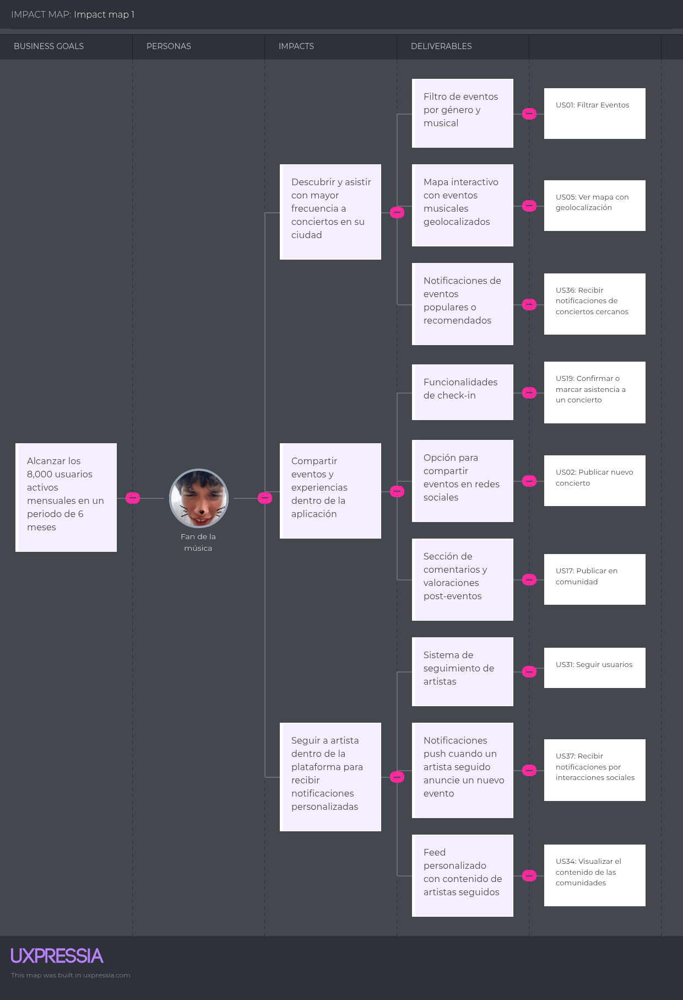

**Artistas emergentes y bandas independientes:**

    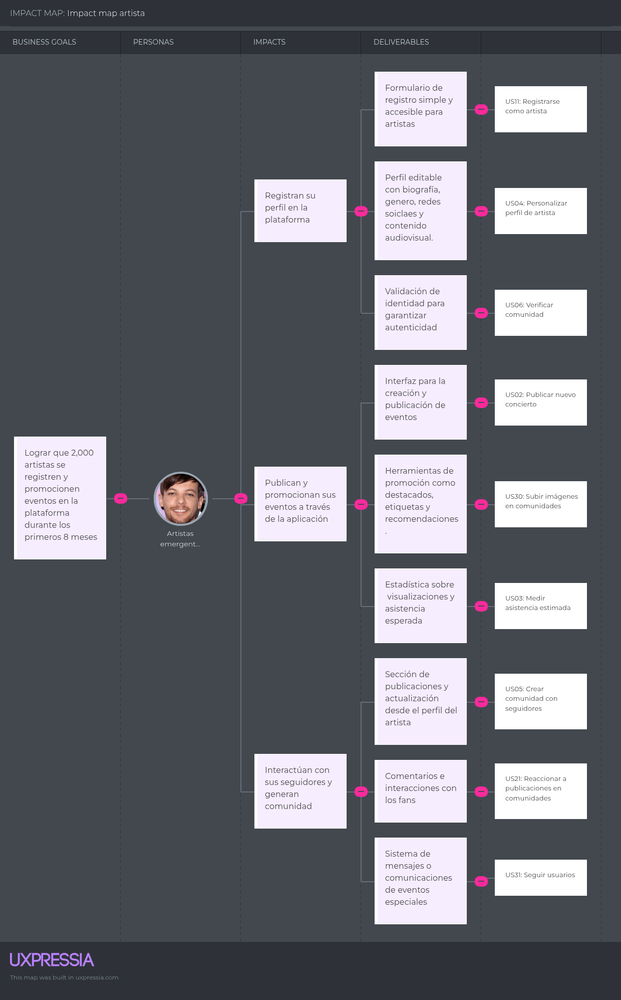

## 3.4. Product Backlog

| # Orden | User Story Id | Título                                        | Descripción                                                                                                                                                                                       | Story Points (1 / 2 / 3 / 5 / 8) |
| ------- | ------------- | --------------------------------------------- | ------------------------------------------------------------------------------------------------------------------------------------------------------------------------------------------------- | -------------------------------- |
| 1       | US31          | Ver beneficios para fans                      | Como usuario del segmento fan, quiero conocer los beneficios de la app para mí, para decidir registrarme.                                                                                         | 3                                |
| 2       | US32          | Ver beneficios para artista                   | Como usuario del segmento artista, quiero ver cómo la app me ayuda a promocionar mis eventos.                                                                                                     | 3                                |
| 3       | US33          | Acceder a testimonios                         | Como usuario, quiero leer testimonios de usuarios reales para aumentar mi confianza en la app.                                                                                                    | 2                                |
| 4       | US03          | Personalizar perfil de artista                | Como artista, quiero personalizar mi perfil con mi nombre artístico y fotografía para conectar mejor con el público.                                                                              | 5                                |
| 5       | US06          | Buscar conciertos                             | Como usuario, quiero buscar conciertos por nombre para encontrarlos fácilmente.                                                                                                                   | 3                                |
| 6       | US07          | Buscar comunidades                            | Como usuario, quiero buscar comunidades por nombre para unirme a las que me interesen.                                                                                                            | 3                                |
| 7       | US18          | Ver comunidades accedidas                     | Como usuario, quiero visualizar en el apartado "Comunidades" las comunidades a las que me he unido.                                                                                               | 2                                |
| 8       | US19          | Reaccionar a publicaciones en comunidades     | Como usuario, quiero poder reaccionar a publicaciones dentro de las comunidades.                                                                                                                  | 3                                |
| 9       | US20          | Acceder a perfil de otros usuarios            | Como usuario, quiero poder acceder al perfil de otros usuarios para conocer más sobre ellos.                                                                                                      | 2                                |
| 10      | US21          | Ver publicaciones con like                    | Como usuario, quiero ver una lista de publicaciones a las que les he dado "like" en mi perfil.                                                                                                    | 2                                |
| 11      | US30          | Ver información detallada del evento asociado | Como fan, quiero ver la información completa de un evento para decidir si asistir.                                                                                                                | 3                                |
| 12      | US01          | Filtrar conciertos por género musical         | Como fan, quiero filtrar conciertos por género para ver solo los que me interesan.                                                                                                                | 3                                |
| 13      | US02          | Publicar nuevo concierto                      | Como artista, quiero crear un evento para promocionar mi presentación.                                                                                                                            | 5                                |
| 14      | US04          | Crear comunidad                               | Como usuario, quiero crear una comunidad temática para reunir a otros usuarios en torno a intereses compartidos.                                                                                  | 5                                |
| 15      | US05          | Ver mapa con geolocalización                  | Como fan, quiero ver un mapa con mi ubicación y los conciertos cercanos marcados para explorar visualmente las opciones disponibles.                                                              | 8                                |
| 16      | US08          | Iniciar sesión en la app mobile               | Como usuario registrado, quiero iniciar sesión desde la aplicación móvil para acceder a mi cuenta.                                                                                                | 3                                |
| 17      | US09          | Registrarse como artista                      | Como nuevo usuario, quiero registrarme como artista para promocionar mis conciertos.                                                                                                              | 3                                |
| 18      | US10          | Registrarse como fan                          | Como nuevo usuario, quiero registrarme como fan para participar en la comunidad y explorar conciertos.                                                                                            | 3                                |
| 19      | US13          | Ver información detallada del concierto       | Como fan, quiero ver la información completa de un concierto para decidir si asistir.                                                                                                             | 3                                |
| 20      | US24          | Ver eventos asociados                         | Como usuario de GigMap, quiero ver un apartado de eventos relacionados en el perfil de un concierto, para conocer actividades cercanas en tiempo y lugar (Renion/AfterParty) que podría realizar. | 5                                |
| 21      | US34          | Crear evento asociado                         | Como usuario, quiero crear eventos asociados para conocer más gente que compartan mis gustos y poder ir juntos a más conciertos.                                                                  | 2                                |

# Capítulo IV: Product Architecture Design

## 4.1. Desing Concepts, ViewPoints & ER Diagrams

### 4.1.1. Principles Statements

GigMap se construye sobre un conjunto de principios que orientan cada decisión de diseño y desarrollo, asegurando que la plataforma responda de forma coherente a las necesidades reales de quienes buscan descubrir conciertos y conectar con la escena musical local. Estos principios reflejan el compromiso de StayBits con la accesibilidad, la comunidad y la experiencia del usuario.

Principios de GigMap:

- **Centralización del Descubrimiento Musical:** La plataforma integra en un solo entorno digital las funciones principales para explorar conciertos, seguir artistas, unirse a comunidades y recibir notificaciones, eliminando la dependencia de herramientas dispersas o redes generales.
- **Simplicidad y Accesibilidad:** Fans y artistas deben poder realizar acciones clave como buscar conciertos, registrarse o publicar eventos en pocos pasos, sin necesidad de capacitación previa ni conocimientos técnicos.
- **Transparencia y Confianza:** Toda interacción relacionada con eventos, asistencias y publicaciones debe ser clara y accesible para los usuarios autorizados, fortaleciendo la confianza dentro de la comunidad musical.
- **Seguridad en el Acceso y los Datos:** La plataforma protege la información personal de los usuarios mediante autenticación con JWT y control de acceso por roles, garantizando un entorno confiable para todas las operaciones.
- **Disponibilidad Continua:** El sistema debe estar disponible las 24 horas desde dispositivos móviles, permitiendo que los usuarios accedan a su información y realicen operaciones en cualquier momento sin interrupciones.

### 4.1.2. Approaches Statements Architectural Styles & Patterns

El diseño de GigMap no solo responde a necesidades de negocio, sino que se fundamenta en principios de ingeniería de software que garantizan la robustez técnica del sistema.

**Software Design Principles (SOLID & Others)**

- **Single Responsibility Principle (SRP):** Este principio fundamenta la elección de una Arquitectura de Microservicios. Cada servicio (Concerts, Communities, Users, Notifications) tiene una única razón para cambiar, evitando que la complejidad de un dominio afecte a los demás.
- **Dependency Inversion Principle (DIP):** Aplicado mediante el Repository Pattern, permitiendo que las capas de alto nivel (Dominio) no dependan de las de bajo nivel (Infraestructura/Base de Datos), facilitando la testabilidad y el mantenimiento.
- **Separation of Concerns (SoC):** Se refleja en la adopción de la Layered Architecture dentro de cada microservicio, separando estrictamente la lógica de negocio de los contratos de API y el acceso a datos.
- **Interface Segregation Principle (ISP):** Las APIs de cada microservicio están diseñadas para exponer solo lo necesario para sus consumidores específicos (Fans o Artistas), evitando dependencias innecesarias.

**Approaches Statements**

- **Domain Driven Design (DDD):** Enfoque principal para el modelado, utilizando Bounded Contexts para definir los límites de cada microservicio y asegurar que el código hable el "lenguaje ubicuo" de la administración de conciertos y comunidades musicales.
- **Attribute-Driven Design (ADD):** Metodología utilizada para derivar la arquitectura a partir de los drivers de calidad (Seguridad, Disponibilidad, Escalabilidad). Cada decisión arquitectónica aquí descrita es el resultado de las iteraciones del proceso ADD.

**Tecnologías utilizadas**

| Categoría | Herramienta / Tecnología |
| --- | --- |
| IDE | Visual Studio Code / IntelliJ IDEA |
| Lenguaje / Framework Backend | Java / Spring Boot |
| Framework Frontend | Angular |
| Base de Datos | PostgreSQL |
| Testing | JUnit / Mockito |
| CI / CD | GitHub Actions |
| Gestión de Proyecto | Trello (Tablero Kanban) |
| Comunicación del Equipo | Slack / Discord |

### 4.1.2.1. Selected Architectural Styles & Patterns

Para satisfacer los atributos de calidad definidos en el ADD, se han seleccionado los siguientes estilos y patrones:

**Architectural Styles**

- **Microservices Architecture:** Estilo elegido para lograr escalabilidad independiente y alta disponibilidad. Permite que fallos en un servicio (ej. Comunidades) no interrumpan servicios críticos (ej. Conciertos o Usuarios).
- **Layered Architecture:** Estilo organizativo interno de los servicios (API, Application, Domain, Infrastructure) para promover la mantenibilidad.

**Architectural Patterns**

- **API Gateway Pattern:** Punto de entrada único que centraliza la autenticación (JWT) e identificación de usuarios, además del enrutamiento, resolviendo la restricción de seguridad del sistema.
- **Saga Pattern (Choreography-based):** Utilizado para gestionar la consistencia de datos en transacciones que cruzan múltiples microservicios (como el flujo de registro de asistencia y publicación de eventos) sin utilizar bloqueos de base de datos pesados.
- **CQRS (Command Query Responsibility Segregation):** Aplicado parcialmente para separar las operaciones de actualización de datos (creación de conciertos o publicaciones) de las consultas de reportes complejos (listados de eventos o estadísticas de comunidad).

### 4.1.3. Context Diagram

El diagrama de contexto muestra a GigMap como un sistema que recibe interacciones de dos actores principales y depende de dos servicios externos. Los fans consultan conciertos, utilizan la geolocalización y registran su asistencia. Los artistas administran su perfil y publican eventos. GigMap no almacena directamente los mapas ni envía las notificaciones por sí mismo: delega esas funciones mediante adaptadores para reducir el acoplamiento con los proveedores externos.

  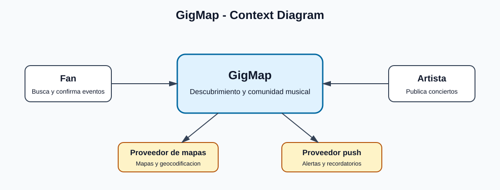

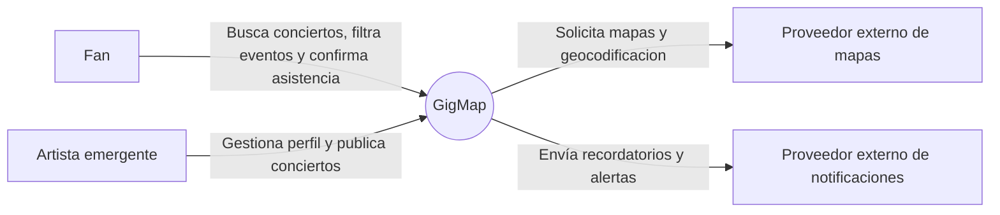
```mermaid
flowchart LR
  Fan[Fan]
  Artist[Artista emergente]
  GigMap((GigMap))
  MapService[Proveedor externo de mapas]
  PushService[Proveedor externo de notificaciones]

  Fan -->|Busca conciertos, filtra eventos y confirma asistencia| GigMap
  Artist -->|Gestiona perfil y publica conciertos| GigMap
  GigMap -->|Solicita mapas y geocodificacion| MapService
  GigMap -->|Envía recordatorios y alertas| PushService
```

### 4.1.4. Approach driven ViewPoints Diagrams

Los viewpoints seleccionados permiten observar la arquitectura desde tres perspectivas complementarias: estructura de contenedores, organización interna de un servicio y comportamiento de un flujo crítico.

  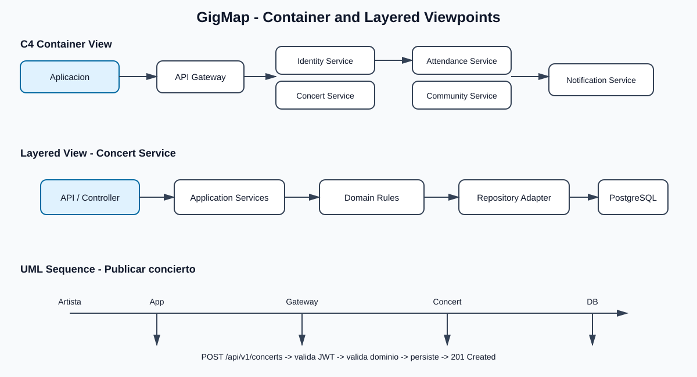

**C4 - Container Viewpoint**

Este viewpoint muestra los contenedores principales de GigMap y sus relaciones. Todos los clientes ingresan mediante el API Gateway; los servicios internos administran sus responsabilidades y utilizan PostgreSQL mediante repositorios.

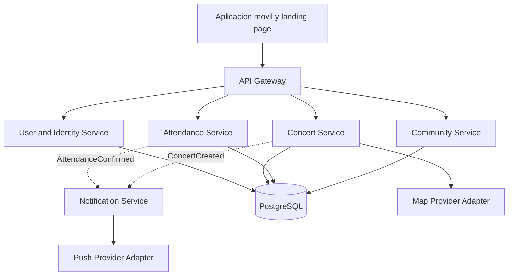
```mermaid
flowchart TB
  Client[Aplicacion movil y landing page]
  Gateway[API Gateway]
  Identity[User and Identity Service]
  Concert[Concert Service]
  Attendance[Attendance Service]
  Community[Community Service]
  Notification[Notification Service]
  Database[(PostgreSQL)]
  Maps[Map Provider Adapter]
  Push[Push Provider Adapter]

  Client --> Gateway
  Gateway --> Identity
  Gateway --> Concert
  Gateway --> Attendance
  Gateway --> Community
  Identity --> Database
  Concert --> Database
  Attendance --> Database
  Community --> Database
  Concert --> Maps
  Attendance -.->|AttendanceConfirmed| Notification
  Concert -.->|ConcertCreated| Notification
  Notification --> Push
```

**Layered Viewpoint - Concert Service**

Este viewpoint representa la organización interna que se aplicará dentro de cada microservicio. La dependencia apunta hacia el dominio para que las reglas de negocio no dependan directamente de Spring Data, PostgreSQL o proveedores externos.

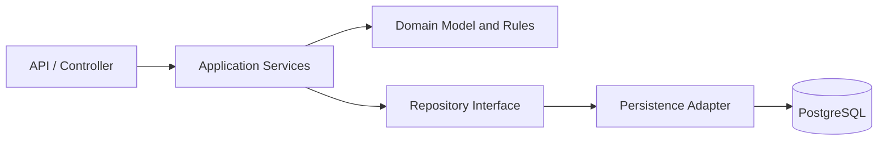
```mermaid
flowchart LR
  Controller[API / Controller]
  Application[Application Services]
  Domain[Domain Model and Rules]
  Repository[Repository Interface]
  Persistence[Persistence Adapter]
  PostgreSQL[(PostgreSQL)]

  Controller --> Application
  Application --> Domain
  Application --> Repository
  Repository --> Persistence
  Persistence --> PostgreSQL
```

**UML Sequence Viewpoint - Publicar concierto**

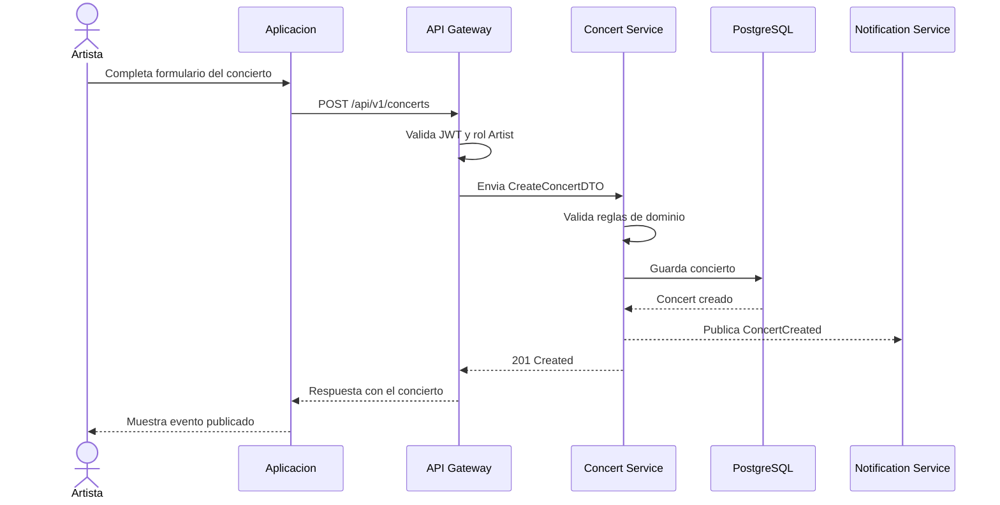
```mermaid
sequenceDiagram
  actor Artist as Artista
  participant App as Aplicacion
  participant Gateway as API Gateway
  participant Concert as Concert Service
  participant DB as PostgreSQL
  participant Notification as Notification Service

  Artist->>App: Completa formulario del concierto
  App->>Gateway: POST /api/v1/concerts
  Gateway->>Gateway: Valida JWT y rol Artist
  Gateway->>Concert: Envia CreateConcertDTO
  Concert->>Concert: Valida reglas de dominio
  Concert->>DB: Guarda concierto
  DB-->>Concert: Concert creado
  Concert-->>Notification: Publica ConcertCreated
  Concert-->>Gateway: 201 Created
  Gateway-->>App: Respuesta con el concierto
  App-->>Artist: Muestra evento publicado
```

### 4.1.5. Relational/Non Relational Database Diagram

En esta primera versión se selecciona un modelo relacional en PostgreSQL porque GigMap necesita mantener relaciones consistentes entre usuarios, artistas, conciertos, comunidades y asistencias. La base de datos se presenta como un modelo lógico común para documentar el dominio; en una implementación de microservicios, cada servicio deberá ser responsable de sus propias tablas y no acceder directamente a las tablas internas de otro servicio.

  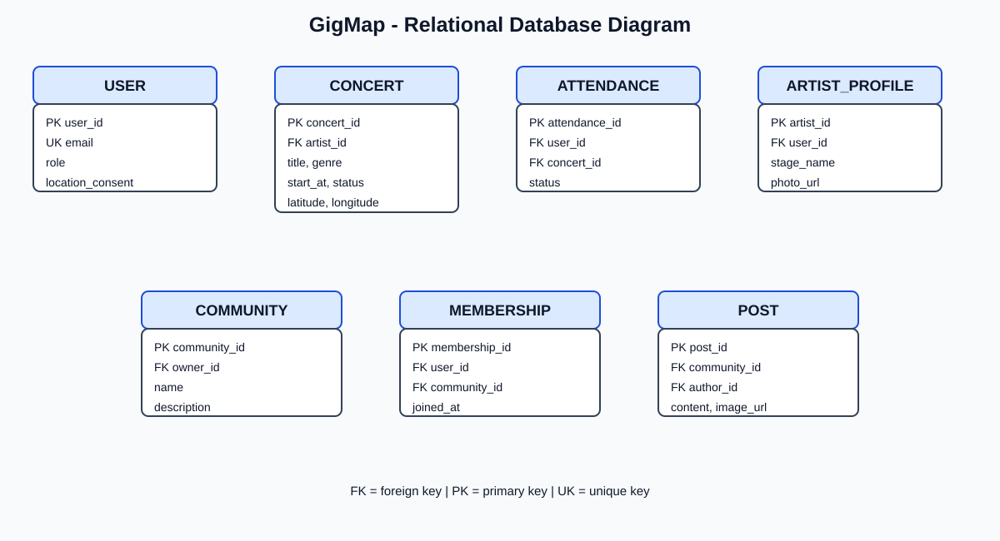

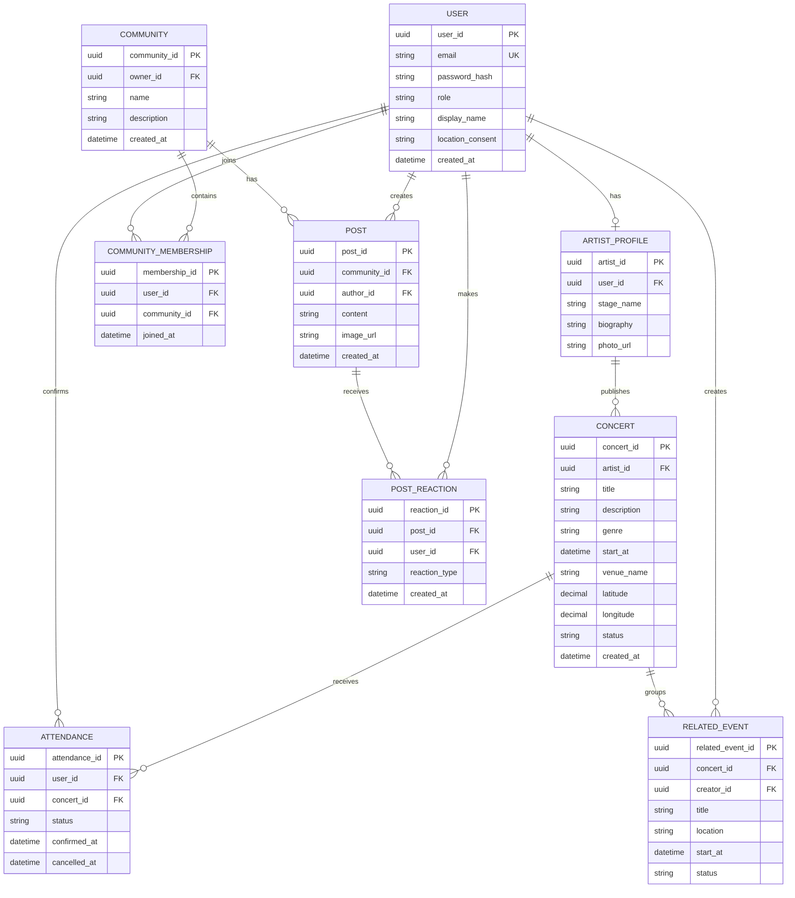
```mermaid
erDiagram
  USER ||--o| ARTIST_PROFILE : "has"
  USER ||--o{ ATTENDANCE : "confirms"
  CONCERT ||--o{ ATTENDANCE : "receives"
  ARTIST_PROFILE ||--o{ CONCERT : "publishes"
  USER ||--o{ COMMUNITY_MEMBERSHIP : "joins"
  COMMUNITY ||--o{ COMMUNITY_MEMBERSHIP : "contains"
  COMMUNITY ||--o{ POST : "has"
  USER ||--o{ POST : "creates"
  POST ||--o{ POST_REACTION : "receives"
  USER ||--o{ POST_REACTION : "makes"
  CONCERT ||--o{ RELATED_EVENT : "groups"
  USER ||--o{ RELATED_EVENT : "creates"

  USER {
    uuid user_id PK
    string email UK
    string password_hash
    string role
    string display_name
    string location_consent
    datetime created_at
  }

  ARTIST_PROFILE {
    uuid artist_id PK
    uuid user_id FK
    string stage_name
    string biography
    string photo_url
  }

  CONCERT {
    uuid concert_id PK
    uuid artist_id FK
    string title
    string description
    string genre
    datetime start_at
    string venue_name
    decimal latitude
    decimal longitude
    string status
    datetime created_at
  }

  ATTENDANCE {
    uuid attendance_id PK
    uuid user_id FK
    uuid concert_id FK
    string status
    datetime confirmed_at
    datetime cancelled_at
  }

  COMMUNITY {
    uuid community_id PK
    uuid owner_id FK
    string name
    string description
    datetime created_at
  }

  COMMUNITY_MEMBERSHIP {
    uuid membership_id PK
    uuid user_id FK
    uuid community_id FK
    datetime joined_at
  }

  POST {
    uuid post_id PK
    uuid community_id FK
    uuid author_id FK
    string content
    string image_url
    datetime created_at
  }

  POST_REACTION {
    uuid reaction_id PK
    uuid post_id FK
    uuid user_id FK
    string reaction_type
    datetime created_at
  }

  RELATED_EVENT {
    uuid related_event_id PK
    uuid concert_id FK
    uuid creator_id FK
    string title
    string location
    datetime start_at
    string status
  }
```

**Restricciones principales del modelo:**

- `USER.email` debe ser único.
- La combinación `ATTENDANCE.user_id` y `ATTENDANCE.concert_id` debe ser única para evitar asistencias duplicadas.
- La combinación `COMMUNITY_MEMBERSHIP.user_id` y `COMMUNITY_MEMBERSHIP.community_id` debe ser única.
- La combinación `POST_REACTION.post_id` y `POST_REACTION.user_id` debe ser única.
- `CONCERT.artist_id`, `ATTENDANCE.user_id`, `ATTENDANCE.concert_id`, `POST.community_id` y `POST.author_id` deben tener claves foráneas válidas.
- Las coordenadas de `CONCERT` solo deben almacenarse cuando el usuario u organizador haya proporcionado información de ubicación válida.

### 4.1.6. Design Patterns

En esta sección se describen los patrones de diseño aplicados en el desarrollo de GigMap. Estos patrones fueron seleccionados con base en las necesidades específicas de cada módulo del sistema, con el objetivo de promover un código más organizado, reutilizable y fácil de mantener, alineado con los principios y estilos arquitectónicos definidos para la plataforma.

**Repository Pattern:** Se aplica en todos los microservicios para desacoplar la lógica de dominio de la infraestructura de persistencia (PostgreSQL). Esto permite que las reglas de negocio de GigMap no dependan directamente de las consultas SQL, facilitando la realización de pruebas unitarias y permitiendo cambiar el motor de base de datos en el futuro sin afectar el núcleo del sistema.

**Data Transfer Object (DTO):** Utilizado para el intercambio de información entre el API Gateway y los microservicios, así como entre las capas internas de cada servicio. El uso de DTOs asegura que solo se exponga la información necesaria hacia el cliente, protegiendo datos sensibles de los usuarios y optimizando el ancho de banda.

**Factory Pattern:** Implementado principalmente en el Notification Service y el Report Service. Permite crear diferentes tipos de notificaciones (Push, Email) o formatos de reporte (JSON, PDF) de manera dinámica según los parámetros de la solicitud, sin acoplar la lógica de creación con la de ejecución.

**Dependency Injection (DI):** Fundamental para la arquitectura de GigMap. Se utiliza para gestionar las dependencias entre servicios, repositorios y controladores. Esto facilita la inversión de control, permitiendo que los componentes sean más modulares y fáciles de testear mediante el uso de mocks.

**Adapter Pattern:** Se aplica en servicios de integración con APIs externas (por ejemplo, mapas o notificaciones). El adaptador traduce la interfaz de la API externa a una interfaz propia del sistema GigMap, actuando como una capa de protección (Anti-Corruption Layer) ante cambios en el servicio de terceros.

### 4.1.7. Tactics

En esta sección se describen las tácticas arquitectónicas aplicadas en el diseño de GigMap. Estas tácticas representan decisiones técnicas concretas que permiten alcanzar los atributos de calidad definidos para la plataforma, considerando las restricciones del sistema, los escenarios de calidad identificados y las preocupaciones arquitectónicas que deben ser atendidas.

**1. Escalabilidad**

Escenario: Cuando la cantidad de conciertos publicados, comunidades activas y usuarios registrados en GigMap crece de forma progresiva, el sistema debe mantenerse estable y responder en menos de 3 segundos sin necesidad de rediseñar su arquitectura base.

Tácticas:

- Arquitectura basada en microservicios: Cada módulo del sistema (conciertos, comunidades, usuarios, notificaciones) opera de forma independiente, permitiendo escalar únicamente los componentes con mayor demanda sin afectar al resto.
- API Gateway como punto de entrada único: Centraliza el enrutamiento de solicitudes hacia los microservicios correspondientes, distribuyendo la carga de manera ordenada y permitiendo incorporar nuevos servicios sin modificar los existentes.
- Base de datos relacional con modelo optimizado: El uso de PostgreSQL con relaciones bien definidas entre entidades permite manejar grandes volúmenes de registros sin comprometer la integridad ni el rendimiento de las consultas.

**2. Seguridad**

Escenario: Cuando un usuario intenta acceder a información o ejecutar operaciones que no corresponden a su rol, como un fan intentando eliminar un evento o acceder a datos de otros artistas, el sistema debe rechazar la solicitud de forma inmediata y registrar el intento.

Tácticas:

- Autenticación mediante JWT: Cada solicitud al sistema debe incluir un token válido que identifique al usuario y su rol antes de permitir cualquier operación.
- Autorización por roles en cada endpoint: El API Gateway y cada microservicio validan que el rol del usuario coincida con los permisos requeridos para ejecutar la operación solicitada.
- Cifrado de contraseñas y datos sensibles: Las contraseñas se almacenan cifradas y la información personal se protege tanto en tránsito como en reposo.
- Aislamiento del servicio de autenticación: La lógica de registro e inicio de sesión se encapsula en un servicio dedicado que maneja validaciones y errores de forma controlada.

**3. Disponibilidad**

Escenario: Cuando múltiples fans y artistas acceden simultáneamente a la plataforma para explorar conciertos, unirse a comunidades o revisar notificaciones, el sistema debe mantenerse operativo y responder sin interrupciones, garantizando una alta disponibilidad.

Tácticas:

- Separación de servicios independientes: Al estar cada módulo desacoplado, un fallo en el servicio de notificaciones o en la integración con servicios externos no afecta el funcionamiento de los módulos de conciertos o usuarios.
- Manejo controlado de fallos externos: Ante la indisponibilidad de servicios de mapas o notificaciones push, el sistema responde con mensajes claros al usuario y permite que el resto de funcionalidades continúe operando con normalidad.
- Despliegue en infraestructura cloud con contenedores: Los servicios están preparados para ejecutarse en entornos cloud con variables de entorno y configuración externa, facilitando la recuperación ante fallos y el reinicio automático de instancias.

**4. Rendimiento**

Escenario: Cuando varios usuarios realizan consultas simultáneas sobre conciertos disponibles, publicaciones en comunidades o perfiles de artistas, el sistema debe responder en menos de 2 segundos sin generar cuellos de botella en la base de datos.

Tácticas:

- Paginación de resultados: Las consultas de conciertos, publicaciones y listas de usuarios se devuelven en páginas para reducir el volumen de datos transferidos en cada solicitud.
- Distribución de carga mediante API Gateway: Al centralizar el enrutamiento, el API Gateway permite distribuir las solicitudes entre los microservicios disponibles, evitando que un solo servicio concentre toda la carga.
- Almacenamiento de imágenes en servicio externo: Las fotografías de eventos y perfiles se guardan en un servicio de almacenamiento separado, y la base de datos PostgreSQL solo conserva la URL correspondiente, reduciendo el peso de las consultas.

**5. Usabilidad**

Escenario: Cuando un usuario accede por primera vez a GigMap, debe poder buscar un concierto, unirse a una comunidad o consultar su perfil sin necesidad de capacitación previa, completando estas acciones de forma exitosa en su primer intento.

Tácticas:

- Flujos simplificados por rol: La interfaz presenta únicamente las opciones correspondientes al rol del usuario (fan o artista), evitando sobrecarga de información y reduciendo la curva de aprendizaje.
- Notificaciones push como guía de acción: Los recordatorios de eventos, confirmaciones de asistencia y alertas de nuevas publicaciones orientan al usuario hacia las acciones más relevantes sin necesidad de que navegue activamente por la app.
- Validación inmediata de formularios: Los errores en el registro de conciertos, publicaciones o datos del perfil se detectan y comunican al usuario antes de enviar la solicitud al servidor, evitando frustración y reprocesos.

**6. Integridad de transacciones**

Escenario: Cuando un usuario confirma su asistencia a un concierto o publica un evento asociado, el sistema debe reflejar de inmediato y correctamente el resultado, garantizando consistencia entre el estado registrado y los datos visibles en la aplicación.

Tácticas:

- Estados de asistencia definidos y trazables: Cada confirmación pasa por estados claros (registrada, cancelada), con fecha, usuario responsable y referencia del evento, asegurando trazabilidad completa.
- Validación antes de confirmar operaciones: El servicio correspondiente verifica la existencia y disponibilidad del recurso antes de actualizar el estado, evitando registros incorrectos ante fallos en la comunicación con otros servicios.
- Restricciones en base de datos: Se aplican constraints relacionales en PostgreSQL para evitar inconsistencias entre conciertos, asistencias y usuarios, garantizando coherencia en la información almacenada.

## 4.2. Architectural Drivers

### 4.2.1. Design Purpose

El propósito del diseño arquitectónico de GigMap es definir una estructura que permita conectar a fans de la música con conciertos y artistas emergentes de forma segura, rápida y confiable. La arquitectura debe soportar el descubrimiento de eventos mediante geolocalización, la publicación de conciertos por parte de artistas, la interacción en comunidades y el envío de notificaciones personalizadas.

El diseño busca equilibrar las necesidades funcionales del producto con sus atributos de calidad. En particular, debe proteger los datos personales y de ubicación, mantener tiempos de respuesta adecuados, permitir el crecimiento progresivo de usuarios y eventos, y conservar la consistencia de operaciones como la confirmación de asistencia. El alcance de esta arquitectura comprende la aplicación cliente, el API Gateway, los servicios de usuarios, conciertos, comunidades y notificaciones, sus integraciones externas y la persistencia de datos.

### 4.2.2. Primary Functionality (Primary User Stories)

Las siguientes historias de usuario se consideran funcionalidades primarias porque representan el flujo principal de valor de GigMap o generan decisiones arquitectónicas relevantes:

| Historia | Funcionalidad principal | Relevancia arquitectónica |
| --- | --- | --- |
| US05 | Ver mapa con geolocalización | Requiere integrar una API de mapas, manejar permisos de ubicación y consultar eventos cercanos de forma eficiente. |
| US02 | Publicar nuevo concierto | Requiere autenticación, autorización por rol, validación de datos y persistencia de información del evento. |
| US08 | Iniciar sesión en la aplicación móvil | Requiere un mecanismo seguro de autenticación, emisión de tokens y control de acceso a recursos protegidos. |
| US13 | Ver información detallada del concierto | Requiere recuperar información consistente del evento y exponerla mediante un contrato estable para los clientes. |
| US17 | Confirmar o cancelar asistencia | Requiere evitar registros duplicados y mantener consistencia entre usuarios, conciertos y asistencias. |
| US28 | Recibir notificaciones de conciertos cercanos | Requiere procesar la ubicación y las preferencias del usuario sin bloquear las operaciones principales de la aplicación. |
| US04 | Crear comunidad | Requiere gestionar comunidades, membresías y permisos de publicación para usuarios autenticados. |

Estas historias serán utilizadas como referencia para seleccionar los elementos que se refinarán durante la primera iteración ADD. Las demás historias podrán reutilizar los componentes y contratos definidos para estas funcionalidades primarias.

### 4.2.3. Quality Attribute Scenarios

Los atributos de calidad se expresan mediante escenarios verificables para que las decisiones arquitectónicas puedan evaluarse con medidas concretas.

| Atributo | Fuente y estímulo | Respuesta esperada | Medida |
| --- | --- | --- | --- |
| Seguridad | Un usuario intenta eliminar un concierto que no le pertenece. | El sistema valida el token y el rol, rechaza la operación y registra el intento. | Respuesta `403 Forbidden` en menos de 1 segundo; ningún dato modificado. |
| Rendimiento | Cientos de usuarios consultan conciertos cercanos simultáneamente. | El sistema devuelve resultados paginados sin bloquear otras operaciones. | El 95% de las consultas responde en menos de 2 segundos. |
| Disponibilidad | El proveedor externo de notificaciones deja de responder. | La consulta de conciertos y perfiles continúa disponible; las notificaciones se reintentan o quedan pendientes. | Las funciones no dependientes del proveedor mantienen una disponibilidad mínima de 99%. |
| Escalabilidad | Aumenta la cantidad de usuarios, eventos y publicaciones. | Los servicios con mayor demanda pueden escalar de manera independiente. | El sistema mantiene el tiempo de respuesta objetivo al duplicar la carga de consultas. |
| Integridad | Un usuario intenta confirmar dos veces su asistencia al mismo concierto. | El sistema conserva una sola asistencia y rechaza la operación repetida. | Una asistencia por combinación `userId-concertId`; respuesta `409 Conflict` o código equivalente. |
| Privacidad | Un usuario deniega el permiso de ubicación. | La aplicación continúa permitiendo búsqueda manual y no almacena la ubicación sin consentimiento. | No se persiste la ubicación denegada y el usuario recibe una alternativa funcional. |
| Usabilidad | Un usuario utiliza GigMap por primera vez para buscar un concierto. | Puede encontrar un evento y consultar su detalle sin capacitación. | La tarea se completa en un máximo de 3 minutos y con hasta 5 pasos principales. |

### 4.2.4. Constraints

El diseño arquitectónico está condicionado por las siguientes restricciones del proyecto:

- El backend se desarrollará con Java y Spring Boot.
- La comunicación entre los clientes y el backend se realizará mediante una API REST versionada.
- PostgreSQL será el sistema principal de persistencia relacional.
- La solución debe incluir una aplicación móvil y una landing page como canales de interacción con el producto.
- La autenticación debe utilizar contraseñas protegidas y tokens JWT para acceder a operaciones privadas.
- La geolocalización y la visualización de mapas dependen de un proveedor externo y de los permisos del dispositivo.
- El sistema debe respetar el consentimiento del usuario para el uso de datos de ubicación y proteger la información personal.
- El desarrollo se realizará dentro del alcance, tiempo y recursos disponibles para el curso.
- El código, la documentación y los cambios del equipo se gestionarán mediante repositorios y herramientas colaborativas del proyecto.
- Las decisiones deben permitir pruebas automatizadas con las herramientas definidas por el equipo, como JUnit y Mockito.

Estas restricciones deben registrarse antes de seleccionar componentes, porque limitan las alternativas tecnológicas y afectan el costo, la complejidad y la mantenibilidad de la solución.

### 4.2.5. Architectural Concerns

Las siguientes preocupaciones arquitectónicas representan asuntos que deben resolverse o detallarse durante la Iteración 0 y las iteraciones posteriores:

| Preocupación | Riesgo para GigMap | Aspecto que debe resolverse |
| --- | --- | --- |
| Límites de los servicios | Una separación incorrecta puede producir servicios muy acoplados o difíciles de mantener. | Definir responsabilidades y propiedad de datos para usuarios, conciertos, comunidades y notificaciones. |
| Consistencia de asistencias | Una falla o reintento puede crear asistencias duplicadas. | Usar validaciones, restricciones únicas y una estrategia clara para operaciones repetidas. |
| Seguridad por roles | Un fan podría ejecutar operaciones reservadas para artistas u organizadores. | Centralizar autenticación y aplicar autorización también dentro de cada servicio protegido. |
| Privacidad de ubicación | La ubicación puede revelar información sensible sobre los usuarios. | Solicitar consentimiento, minimizar la retención y evitar exponer coordenadas innecesarias. |
| Dependencias externas | La caída o el cambio de una API de mapas o notificaciones puede afectar la experiencia. | Aplicar Adapter Pattern, timeouts, reintentos y respuestas alternativas. |
| Consultas geográficas | Las búsquedas cercanas pueden volverse lentas al aumentar la cantidad de eventos. | Definir índices, paginación y una estrategia de consulta por ubicación. |
| Comunicación entre servicios | Las llamadas síncronas pueden propagar fallos o aumentar la latencia. | Identificar qué operaciones requieren respuesta inmediata y cuáles pueden procesarse de forma asíncrona. |
| Evolución de contratos | Cambios en los endpoints pueden romper la aplicación móvil o la landing page. | Versionar la API y documentar contratos de solicitud y respuesta. |
| Observabilidad | Los errores distribuidos serían difíciles de diagnosticar. | Definir logs, métricas, correlación de solicitudes y alertas para los servicios críticos. |

Estas preocupaciones no son todavía soluciones definitivas. Funcionan como entradas para la toma de decisiones de arquitectura: en la Iteración 0 se seleccionarán las más prioritarias, se refinarán los elementos involucrados y se documentarán las decisiones adoptadas.

## 4.3. ADD Iterations

Las iteraciones ADD permiten transformar los drivers arquitectónicos en una solución progresivamente más detallada. Para esta entrega se desarrollará una única primera iteración.

### 4.3.1. Iteration 0: Initial Architecture

#### 4.3.1.1. Architectural Design Backlog 1

El backlog arquitectónico reúne los aspectos que deben resolverse primero porque tienen mayor impacto en la estructura de GigMap. La prioridad se define considerando el riesgo técnico y la relación con las funcionalidades principales.

| ID | Driver o preocupación | Historias relacionadas | Prioridad | Resultado esperado |
| --- | --- | --- | --- | --- |
| ADB-01 | Autenticación y autorización por roles | US02, US08, US09, US10 | Alta | Definir un acceso seguro para fans y artistas, con permisos diferenciados. |
| ADB-02 | Descubrimiento geolocalizado de conciertos | US05, US06, US13, US22 | Alta | Definir cómo se consultan eventos cercanos y cómo se integra el proveedor de mapas. |
| ADB-03 | Consistencia de asistencias | US17, US25 | Alta | Evitar asistencias duplicadas y mantener consistencia entre usuarios y eventos. |
| ADB-04 | Rendimiento y escalabilidad | US01, US05, US06, US28 | Alta | Soportar consultas concurrentes mediante paginación, índices y escalamiento independiente. |
| ADB-05 | Disponibilidad de integraciones externas | US05, US27, US28 | Media | Aislar fallos de mapas y notificaciones mediante adaptadores, timeouts y reintentos. |
| ADB-06 | Evolución de contratos REST | TS-01, TS-04, TS-05, TS-22, TS-23 | Media | Mantener contratos versionados para que los clientes puedan evolucionar sin romperse. |

#### 4.3.1.2. Establish Iteration Goal by Selecting Drivers

El objetivo de la Iteración 0 es establecer una arquitectura inicial para el flujo principal de GigMap: un usuario inicia sesión, consulta conciertos cercanos y revisa el detalle de un evento; además, un fan puede confirmar su asistencia y un artista puede publicar un concierto.

Para alcanzar este objetivo se seleccionan los siguientes drivers:

- **Seguridad:** proteger el acceso mediante JWT y autorización por roles.
- **Rendimiento:** responder las consultas de conciertos en menos de 2 segundos para el 95% de las solicitudes.
- **Integridad:** impedir asistencias duplicadas y validar la existencia de los recursos antes de modificarlos.
- **Escalabilidad:** permitir que el servicio de conciertos crezca sin escalar innecesariamente los servicios de usuarios o comunidades.
- **Disponibilidad:** evitar que la caída de mapas o notificaciones inutilice la consulta principal de conciertos.

El resultado de esta iteración será una vista inicial de componentes, responsabilidades, interfaces y relaciones entre los servicios principales. Las funcionalidades sociales y las notificaciones avanzadas se mantendrán como preocupaciones para iteraciones posteriores, aunque sus puntos de integración quedarán identificados.

#### 4.3.1.3. Choose One or More Elements of the System to Refine

El elemento seleccionado para refinar es la **plataforma GigMap**, representada inicialmente como un sistema único. Este elemento se descompone en los siguientes contenedores lógicos:

| Elemento a refinar | Responsabilidad inicial | Drivers atendidos |
| --- | --- | --- |
| Aplicación móvil/web | Presentar mapas, formularios, listados y detalles de conciertos. | Usabilidad, rendimiento y privacidad. |
| API Gateway | Recibir solicitudes, validar tokens, aplicar límites y enrutar peticiones. | Seguridad, evolución de contratos y disponibilidad. |
| User and Identity Service | Registrar usuarios, iniciar sesión y administrar roles y perfiles. | Seguridad e integridad. |
| Concert Service | Crear, consultar, filtrar y actualizar conciertos. | Rendimiento, escalabilidad e integridad. |
| Attendance Service | Registrar y cancelar asistencias de fans. | Integridad y consistencia. |
| Community Service | Gestionar comunidades, membresías y publicaciones. | Evolución y mantenibilidad. |
| Notification Service | Preparar y enviar recordatorios y alertas cercanas. | Disponibilidad y procesamiento asíncrono. |
| PostgreSQL | Persistir usuarios, conciertos, asistencias y comunidades. | Integridad y trazabilidad. |
| Map Provider | Proporcionar mapas y geocodificación. | Integración externa y disponibilidad. |

La selección de estos elementos permite refinar primero el flujo de mayor valor para GigMap sin intentar diseñar todos los detalles de la plataforma en una sola iteración.

#### 4.3.1.4. Choose One or More Design Concepts That Satisfy the Selected Drivers

| Driver seleccionado | Concepto de diseño | Justificación |
| --- | --- | --- |
| Seguridad | API Gateway, JWT y autorización por roles | Centraliza la validación inicial y evita que las operaciones privadas se expongan sin identidad y permisos válidos. Cada servicio también valida las reglas de autorización que le corresponden. |
| Rendimiento | API REST versionada, paginación e índices geográficos | Reduce el volumen de datos por consulta y permite que la búsqueda de eventos cercanos utilice índices adecuados. |
| Integridad | Repository Pattern, constraints únicas y validación de dominio | Mantiene las reglas de negocio separadas de PostgreSQL y evita más de una asistencia para el mismo usuario y concierto. |
| Escalabilidad | Microservicios con responsabilidades delimitadas | Permite escalar Concert Service o Notification Service según su demanda sin replicar toda la plataforma. |
| Disponibilidad | Adapter Pattern, timeouts y reintentos controlados | Aísla la dependencia de proveedores externos y permite que las funciones principales continúen cuando una integración falla. |
| Mantenibilidad | Arquitectura por capas y DTOs | Separa API, aplicación, dominio e infraestructura, y evita exponer directamente las entidades internas. |
| Comunicación eventual | Eventos internos para notificaciones | La confirmación de asistencia no debe esperar a que termine el envío de una notificación; esta puede procesarse de forma asíncrona. |

En esta primera iteración no se aplicará CQRS ni Saga a todos los flujos. Se mantienen como alternativas para escenarios que realmente requieran separación de lecturas y escrituras o coordinación entre varios servicios. Esto evita agregar complejidad antes de validar la necesidad.

#### 4.3.1.5. Instantiate Architectural Elements, Allocate Responsibilities, and Define Interfaces

La siguiente asignación convierte los conceptos de diseño en elementos concretos de la arquitectura:

| Elemento | Responsabilidades | Interfaces principales |
| --- | --- | --- |
| Aplicación móvil/web | Gestionar interacción, permisos de ubicación, navegación y presentación de respuestas. | HTTPS con `/api/v1/auth`, `/api/v1/concerts` y `/api/v1/attendances`. |
| API Gateway | Validar JWT, aplicar autorización inicial, enrutar solicitudes y uniformizar errores. | API pública REST `/api/v1/*`. |
| User and Identity Service | Registrar usuarios, autenticar credenciales, emitir JWT y administrar perfiles. | `POST /api/v1/auth/register`, `POST /api/v1/auth/login`, `GET/PUT /api/v1/users/{userId}`. |
| Concert Service | Crear, listar, filtrar, consultar, actualizar y eliminar conciertos autorizados. | `GET/POST /api/v1/concerts`, `GET/PUT/DELETE /api/v1/concerts/{concertId}`. |
| Attendance Service | Confirmar o cancelar la asistencia y evitar duplicados. | `POST/DELETE /api/v1/concerts/{concertId}/attendees`. |
| Community Service | Crear comunidades, administrar membresías y gestionar publicaciones. | `/api/v1/communities` y `/api/v1/posts`. |
| Notification Service | Consumir eventos internos, crear recordatorios y entregar notificaciones. | Consumidor de eventos `ConcertCreated` y `AttendanceConfirmed`; adaptador de proveedor push. |
| PostgreSQL | Persistir datos con claves foráneas, índices y restricciones únicas. | Repositorios internos de cada servicio; no se expone directamente a los clientes. |
| Map Provider Adapter | Traducir la API externa de mapas a una interfaz propia de GigMap. | `getNearbyEvents(latitude, longitude, radius)` y `geocode(address)`. |

Las interfaces REST deben intercambiar DTOs, utilizar códigos HTTP consistentes y transportar el identificador del usuario autenticado a partir del JWT. Las entidades de dominio y las credenciales no se exponen directamente. Para la asistencia, la combinación `userId` y `concertId` deberá ser única en la persistencia.

#### 4.3.1.6. Sketch Views (C4 & UML) and Record Design Decisions

Los siguientes diagramas están escritos en Mermaid para que puedan visualizarse en GitHub y en editores compatibles. Representan las vistas iniciales de contexto, contenedores y un flujo UML de confirmación de asistencia.

**C4 - Context View**

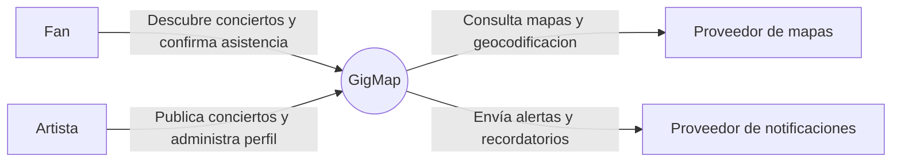
```mermaid
flowchart LR
  Fan[Fan]
  Artist[Artista]
  GigMap((GigMap))
  MapProvider[Proveedor de mapas]
  PushProvider[Proveedor de notificaciones]

  Fan -->|Descubre conciertos y confirma asistencia| GigMap
  Artist -->|Publica conciertos y administra perfil| GigMap
  GigMap -->|Consulta mapas y geocodificacion| MapProvider
  GigMap -->|Envía alertas y recordatorios| PushProvider
```

**C4 - Container View**

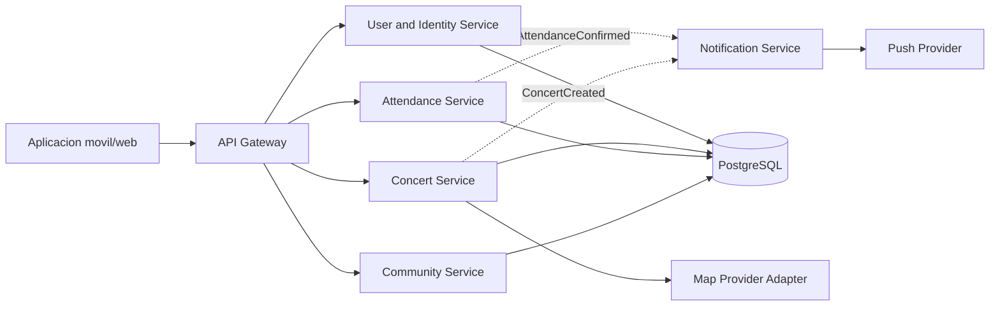
```mermaid
flowchart LR
  Client[Aplicacion movil/web]
  Gateway[API Gateway]
  Identity[User and Identity Service]
  Concerts[Concert Service]
  Attendance[Attendance Service]
  Communities[Community Service]
  Notifications[Notification Service]
  Database[(PostgreSQL)]
  Maps[Map Provider Adapter]
  Push[Push Provider]

  Client --> Gateway
  Gateway --> Identity
  Gateway --> Concerts
  Gateway --> Attendance
  Gateway --> Communities
  Identity --> Database
  Concerts --> Database
  Attendance --> Database
  Communities --> Database
  Concerts --> Maps
  Attendance -.->|AttendanceConfirmed| Notifications
  Concerts -.->|ConcertCreated| Notifications
  Notifications --> Push
```

**UML - Confirmar asistencia**

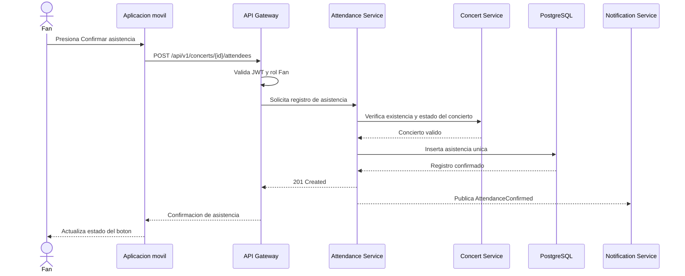
```mermaid
sequenceDiagram
  actor Fan
  participant App as Aplicacion movil
  participant Gateway as API Gateway
  participant Attendance as Attendance Service
  participant Concert as Concert Service
  participant DB as PostgreSQL
  participant Notify as Notification Service

  Fan->>App: Presiona Confirmar asistencia
  App->>Gateway: POST /api/v1/concerts/{id}/attendees
  Gateway->>Gateway: Valida JWT y rol Fan
  Gateway->>Attendance: Solicita registro de asistencia
  Attendance->>Concert: Verifica existencia y estado del concierto
  Concert-->>Attendance: Concierto valido
  Attendance->>DB: Inserta asistencia unica
  DB-->>Attendance: Registro confirmado
  Attendance-->>Gateway: 201 Created
  Attendance-->>Notify: Publica AttendanceConfirmed
  Gateway-->>App: Confirmacion de asistencia
  App-->>Fan: Actualiza estado del boton
```

**Design Decisions**

| ID | Decisión | Driver atendido | Consecuencia |
| --- | --- | --- | --- |
| ADR-01 | Usar API Gateway como entrada única para los clientes. | Seguridad y evolución de contratos. | Simplifica el acceso externo, pero introduce un componente crítico que debe monitorearse. |
| ADR-02 | Separar Concert Service y Attendance Service. | Escalabilidad e integridad. | Permite evolucionar ambos dominios, pero exige contratos claros entre servicios. |
| ADR-03 | Mantener PostgreSQL como persistencia principal en esta iteración. | Integridad y restricciones del proyecto. | Facilita relaciones y constraints; una futura separación de bases requerirá resolver consistencia distribuida. |
| ADR-04 | Procesar notificaciones mediante eventos internos. | Disponibilidad y rendimiento. | La confirmación no queda bloqueada por el proveedor push, pero se requieren reintentos y monitoreo. |

#### 4.3.1.7. Analysis of Current Design and Review Iteration Goal (Kanban Board)

La primera iteración alcanza su objetivo porque define los elementos principales, sus responsabilidades, las interfaces iniciales y los diagramas necesarios para el flujo de autenticación, consulta y asistencia a conciertos. También relaciona cada decisión con los drivers arquitectónicos seleccionados.

| Pendiente | Estado | Próximo paso |
| --- | --- | --- |
| Refinar el modelo entidad-relación por servicio | Por hacer | Detallar tablas, claves, índices y restricciones de PostgreSQL. |
| Validar proveedor de mapas | Por hacer | Comparar costo, cobertura, límites y facilidad de integración. |
| Definir contratos completos de la API | Por hacer | Documentar cuerpos de solicitud, respuestas y errores. |
| Diseñar comunidades y publicaciones | Por hacer | Crear una vista específica para el Community Service. |
| Definir observabilidad | Por hacer | Seleccionar logs, métricas, trazas y alertas. |

La siguiente iteración deberá concentrarse en el modelo de datos, la integración geográfica y la comunicación entre servicios. Los resultados de esta revisión alimentan nuevamente el Architectural Design Backlog.